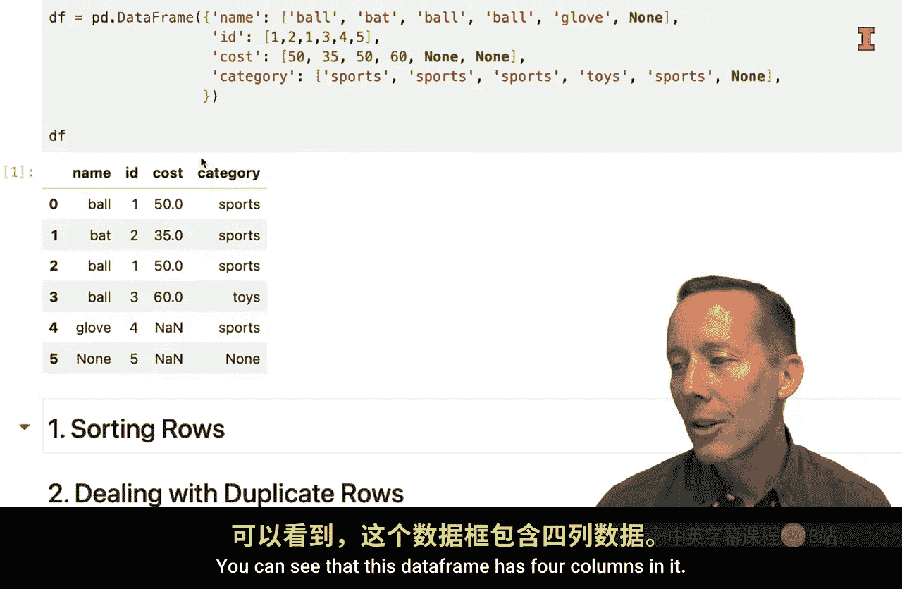
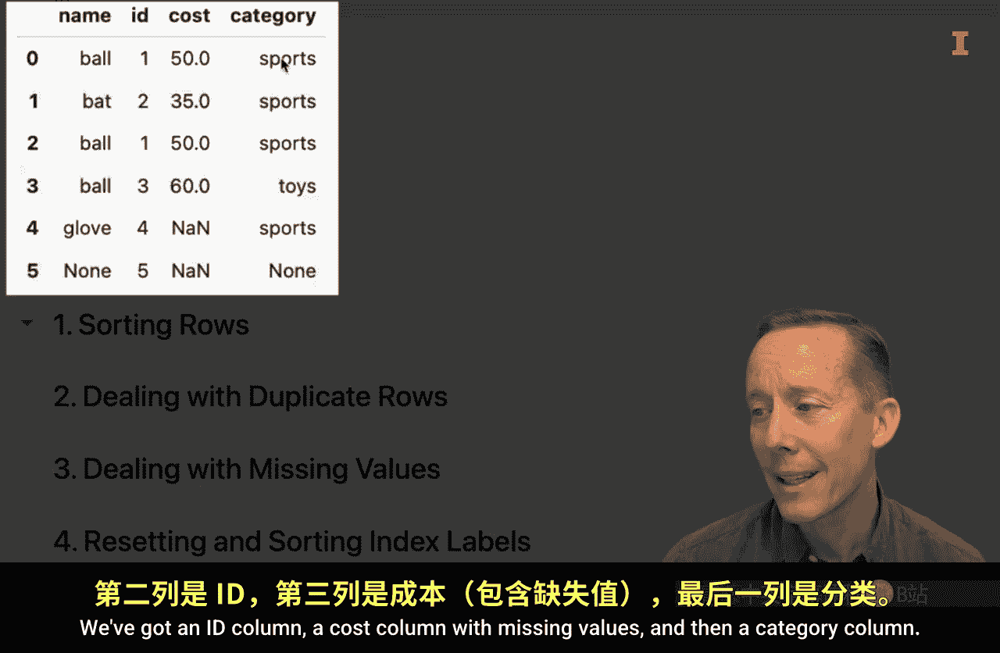
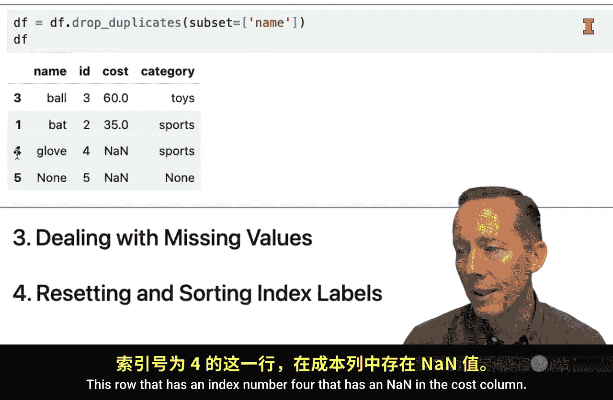
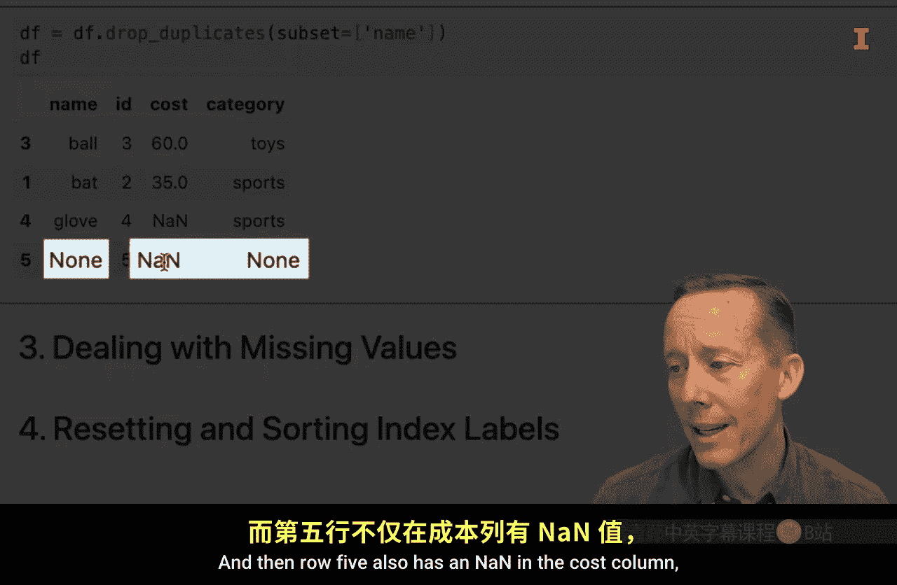
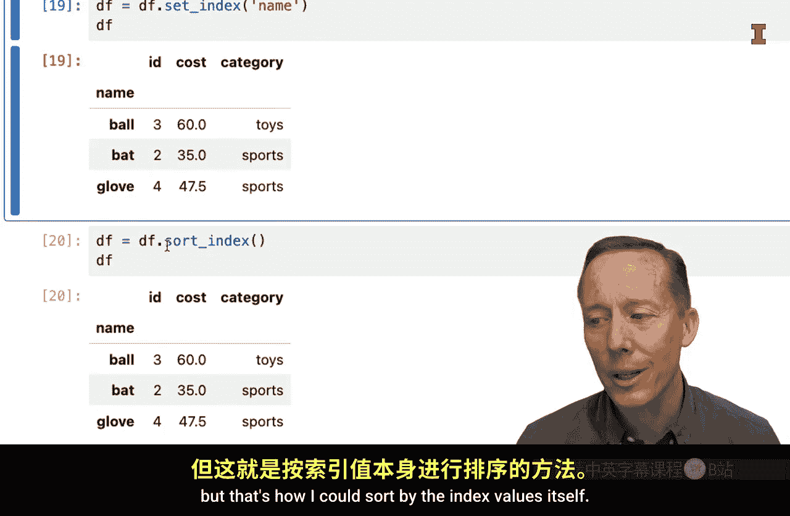

#  050：数据框行的通用数据清洗任务 🧹


在本节课中，我们将学习针对数据框（DataFrame）行进行数据清洗的几种通用任务。具体包括：如何对行进行排序、如何处理重复值、如何处理缺失值，以及如何重置和排序索引标签。掌握这些技能是进行有效数据分析的基础。

## 数据排序 📊

上一节我们介绍了数据清洗的重要性，本节中我们来看看如何对数据框的行进行排序。排序可以帮助我们更好地组织和理解数据。





Pandas 提供了一个名为 `sort_values` 的方法，使用起来非常简单。你只需要指定想要依据哪一列进行排序即可。

以下是使用 `sort_values` 方法的基本步骤：

*   **按单列排序**：`df.sort_values(by='列名')`
*   **降序排序**：使用 `ascending=False` 参数。
*   **按多列排序**：`by` 参数接受一个列名列表。`ascending` 参数也可以是一个布尔值列表，分别对应每一列的排序顺序。

例如，如果我们有一个名为 `df` 的数据框，包含 `name` 和 `ID` 列，我们可以这样操作：

```python
# 按 name 列升序排序
df_sorted = df.sort_values(by='name')

# 按 name 列降序排序
df_sorted_desc = df.sort_values(by='name', ascending=False)

# 先按 name 升序，再按 ID 降序排序
df_sorted_multi = df.sort_values(by=['name', 'ID'], ascending=[True, False])
```

## 处理重复值 🔍

数据中经常会出现重复的行，这可能会影响分析结果的准确性。因此，识别和处理重复值是数据清洗的关键一步。

Pandas 提供了 `duplicated` 方法来识别重复行，以及 `drop_duplicates` 方法来删除它们。

以下是处理重复值的常用方法：

*   **识别重复行**：`df.duplicated()` 返回一个布尔序列，标记每一行是否为重复行（从第二次出现开始标记）。
*   **提取重复行**：可以通过布尔索引来查看所有重复的行。
*   **删除所有重复行**：`df.drop_duplicates()` 会删除所有列值完全相同的重复行，只保留第一次出现的行。
*   **基于特定列删除重复行**：使用 `subset` 参数指定要检查重复的列。

例如：

```python
# 检查重复行
duplicate_rows = df.duplicated()

# 查看所有重复的行
df_dupes = df[df.duplicated()]

# 删除所有完全重复的行
df_no_dupes = df.drop_duplicates()

# 仅基于 ‘name’ 列删除重复行
df_unique_names = df.drop_duplicates(subset=['name'])
```



## 处理缺失值 ⚠️



缺失值是数据集中常见的问题。Pandas 使用 `NaN`（Not a Number）来表示缺失值。处理缺失值主要有两种策略：删除包含缺失值的行，或用其他值（如均值、中位数）进行填充。

Pandas 的 `dropna` 方法用于删除缺失值，`fillna` 方法用于填充缺失值。

以下是处理缺失值的两种主要方式：

*   **删除包含缺失值的行**：`df.dropna()` 会删除任何列中包含 `NaN` 的行。
*   **删除特定列包含缺失值的行**：使用 `subset` 参数指定要检查的列。
*   **填充缺失值**：`df.fillna()` 可以用指定的值填充缺失值。常见做法是用该列的均值进行填充。

例如：

```python
# 删除任何列包含缺失值的行
df_cleaned = df.dropna()

# 仅删除 ‘name’ 和 ‘category’ 列同时为缺失值的行
df_partial_clean = df.dropna(subset=['name', 'category'])

# 用 ‘cost’ 列的均值填充该列的缺失值
mean_cost = df['cost'].mean()
df_filled = df.fillna({'cost': mean_cost})
```

## 重置与排序索引 🔢

在对数据框进行多次操作（如排序、删除行）后，行索引可能会变得不连续或混乱。为了使索引更规整，或者为了将某一列设置为新的索引，我们需要进行索引操作。

Pandas 的 `reset_index` 方法用于重置索引，`set_index` 方法用于将某一列设置为索引，`sort_index` 方法用于按索引排序。

以下是操作索引的常用方法：

*   **重置索引**：`df.reset_index(drop=True)` 会将索引重置为从0开始的连续整数。`drop=True` 参数可以避免将旧索引保存为新列。
*   **设置新索引**：`df.set_index(‘列名’)` 可以将指定列的值设置为数据框的新索引。
*   **按索引排序**：`df.sort_index()` 可以依据索引值对数据框进行排序。

例如：

```python
# 重置索引，不保留旧索引
df_reset = df.reset_index(drop=True)

# 将 ‘name’ 列设置为索引
df_indexed = df.set_index('name')

# 按索引（现在是 ‘name’ 列的值）进行排序
df_sorted_by_index = df_indexed.sort_index()
```




本节课中我们一起学习了数据框行数据清洗的四个核心任务：排序、去重、处理缺失值以及管理索引。这些是使用 Pandas 进行数据预处理的基础操作，熟练掌握它们将为后续的数据分析和建模打下坚实的基础。记住，干净、规整的数据是获得可靠分析结果的前提。