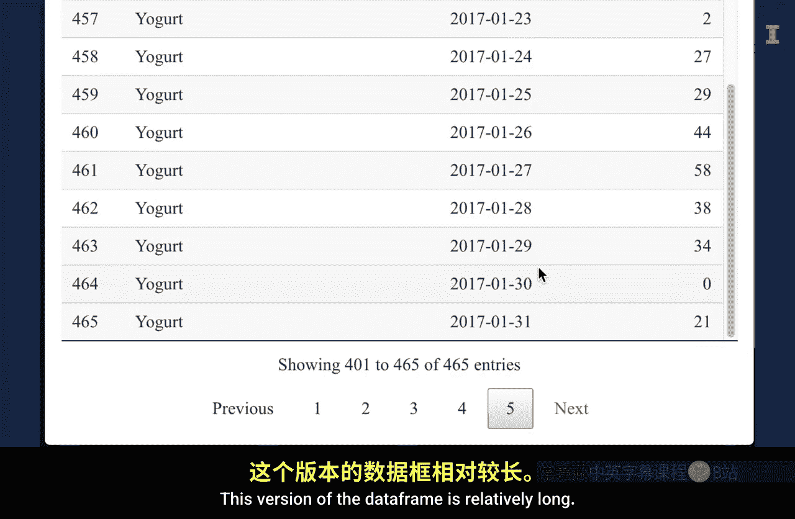
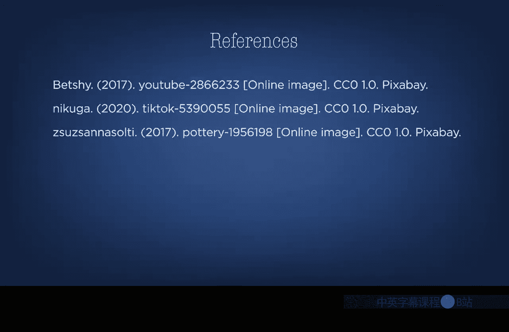

#  053：宽格式与长格式 📊

在本节课中，我们将学习数据框的形状，即宽格式与长格式的概念。理解这两种格式的区别以及如何根据分析需求进行转换，是数据预处理的关键步骤。

## 概述

数据框的形状由其行数和列数决定。这类似于人们录制视频时选择横屏或竖屏，取决于最终播放的平台。在商业分析中，数据的“长度”和“宽度”同样取决于你计划使用的分析工具。

## 数据长度与宽度的定义

在整洁的数据框中，每一行代表一个观测值，每一列代表观测值的一个特征。

*   **数据框的长度**：指数据框的行数，即观测值的数量。
*   **数据框的宽度**：指数据框的列数，即特征的数量。

因此，当我们谈论一个**长数据框**时，指的是拥有许多行（观测值）的数据框。相反，一个**宽数据框**则拥有许多列（特征）。

## 格式选择取决于分析工具

上一节我们定义了数据形状，本节中我们来看看如何选择。数据的形状并非固定不变，选择哪种格式通常取决于你计划使用的分析工具。

以下是不同工具对数据格式的典型偏好：

*   **可视化软件和仪表板**：通常更依赖**长格式**的数据。这种格式便于按不同维度（如类别、时间）进行分组和绘图。
*   **算法和供人阅读的表格**：通常更依赖**宽格式**的数据。许多机器学习算法要求每个观测值（行）的特征（列）是固定的。

## 数据格式转换示例

让我们通过一个例子来具体理解宽格式与长格式的转换。

假设我们有一个销售数据框，其中每一行代表一个产品线，第一列是产品线名称，其余31列分别代表一月份每一天的销售量。

*   **原始宽格式**：
    *   行数：15（15个产品线）
    *   列数：32（1列名称 + 31列日销量）
    *   特点：数据框较**宽**，每个产品线的所有日期销量都横向排列。

我们可以通过数据透视操作，将这个宽格式数据转换为长格式。

*   **转换后的长格式**：
    *   每一行代表一个产品线在特定日期的销售记录。
    *   列数减少为3列：`产品线`、`日期`、`销售量`。
    *   行数增加：15个产品线 × 31天 = 465行。
    *   特点：数据框变得非常**长**，但结构更简洁，便于按日期或产品线进行分析。

用伪代码表示，转换的核心是从：
`数据框[产品线, 第1天销量, 第2天销量, ..., 第31天销量]`
变为：
`数据框[产品线, 日期, 销量]`

## 总结与数据预处理流程

本节课中，我们一起学习了数据框的宽格式与长格式。

总结来说，当你为计算准备数据时，第一步是**整理数据**，包括填补缺失值、确保每列数据格式一致。

获得整洁的数据框后，下一步是**预处理数据**，使其格式符合你提出的分析问题。这包括两个关键元素：

1.  确保数据聚合的层级与分析问题一致。
2.  将数据透视成最适合你计划使用的分析工具的**长度和宽度**。

记住，就像为不同平台选择视频比例一样，为分析任务选择正确的数据格式，能让后续工作更加高效。

---

