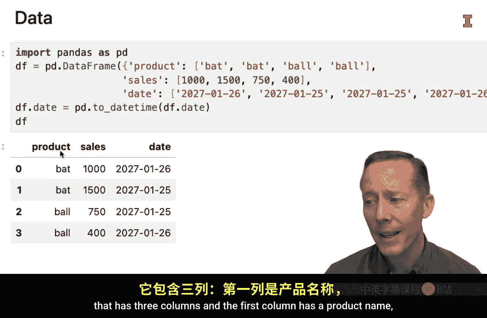
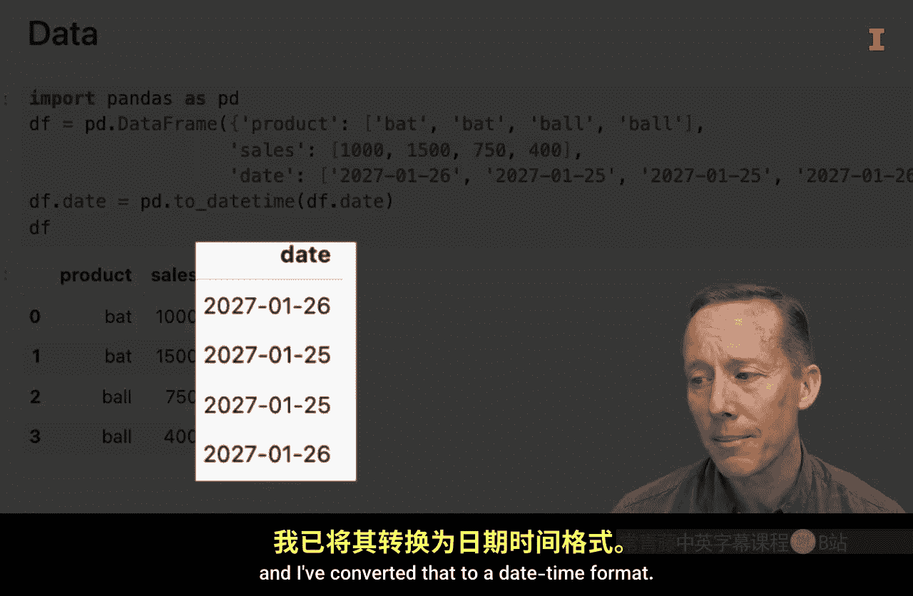
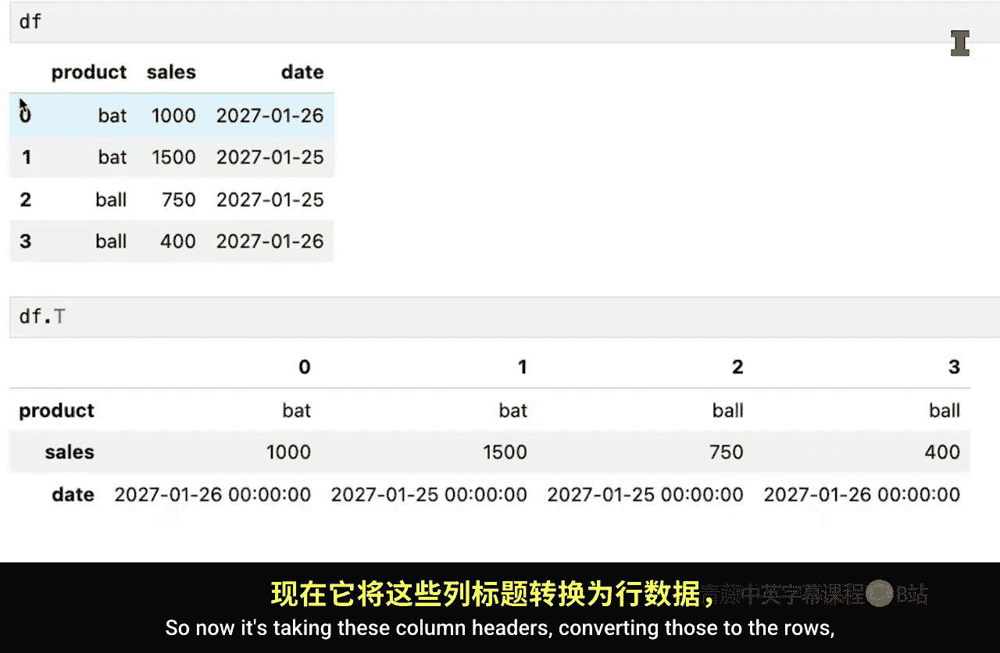

#  054：更改数据框的形状 📊


在本节课中，我们将要学习如何使用Pandas库来重塑数据框的形状。具体来说，我们将探讨如何将数据从“长格式”转换为“宽格式”，反之亦然，以及如何对数据框进行转置。这些操作在数据整理和准备阶段至关重要，能够使数据更适合后续的分析或可视化。



## 数据重塑概述

上一节我们介绍了数据框的基本概念，本节中我们来看看如何改变数据框的结构。数据重塑指的是改变数据在数据框中的排列方式，例如将多行数据转换为多列，或者将多列数据合并为单列。这在处理时间序列数据、创建数据透视表或准备绘图数据时非常有用。



## 从长格式到宽格式：`pivot`方法

有时，为了便于阅读或报告，我们希望将数据从长格式转换为宽格式。长格式通常指数据有较多的行和较少的列，而宽格式则相反，有较多的列和较少的行。Pandas提供了`pivot`方法来实现这一转换。

假设我们有一个简单的数据框，包含三列：产品名称、销售额和日期。数据可能如下所示：

```python
import pandas as pd

data = {
    'product': ['bat', 'bat', 'ball', 'ball'],
    'sales': [1500, 1000, 750, 400],
    'date': pd.to_datetime(['2023-01-25', '2023-01-26', '2023-01-25', '2023-01-26'])
}
df = pd.DataFrame(data)
print(df)
```

为了将日期作为列标题，产品作为行索引，销售额作为单元格值，我们可以使用`pivot`方法：

```python
df_wide = df.pivot(index='product', columns='date', values='sales')
print(df_wide)
```

执行上述代码后，数据框将变为宽格式，其中行索引是产品名称，列是日期，单元格内是对应的销售额。`pivot`方法会自动处理数据的排序和重组。

## 从宽格式到长格式：`melt`方法

如果我们想将宽格式的数据框恢复为长格式，可以使用`melt`方法。这个过程通常涉及将多列“融化”为单列，同时保留其他列作为标识符。

以下是使用`melt`方法的关键步骤：

1.  首先，如果行索引是我们想要保留的标识符，需要先使用`reset_index`方法将其转换为普通列。
2.  然后，使用`melt`方法指定标识符列和需要融化的值列。

```python
# 假设df_wide是我们的宽格式数据框，且‘product’是索引
df_wide_reset = df_wide.reset_index()
df_long = df_wide_reset.melt(id_vars='product', value_name='sales')
print(df_long)
```

执行后，数据将恢复为长格式，包含产品、日期和销售额三列。数据的顺序可能与原始顺序不同，但内容一致。

## 数据框转置：`T`属性或`transpose`方法

转置操作是将数据框的行和列进行互换。在Pandas中，我们可以使用`.T`属性或`.transpose()`方法来实现。

转置操作非常简单：

```python
# 使用.T属性
df_transposed = df.T
print(df_transposed)

# 或使用.transpose()方法
df_transposed = df.transpose()
print(df_transposed)
```

转置后，原来的列名会成为新的行索引，原来的行索引会成为新的列名。这个操作在处理某些需要行列互换的分析场景时非常有用。

## 总结




本节课中我们一起学习了三种重塑Pandas数据框形状的方法。我们首先使用`pivot`方法将数据从长格式转换为宽格式，使数据更易于人类阅读和报告。接着，我们使用`melt`方法将宽格式数据恢复为长格式，适用于需要多行少列的数据结构。最后，我们介绍了如何使用`.T`属性或`.transpose()`方法对数据框进行转置，即交换行和列。掌握这些数据重塑技巧，将帮助你更灵活地准备和分析数据，为后续的商业分析任务打下坚实基础。