#  055：合并数据框 📊


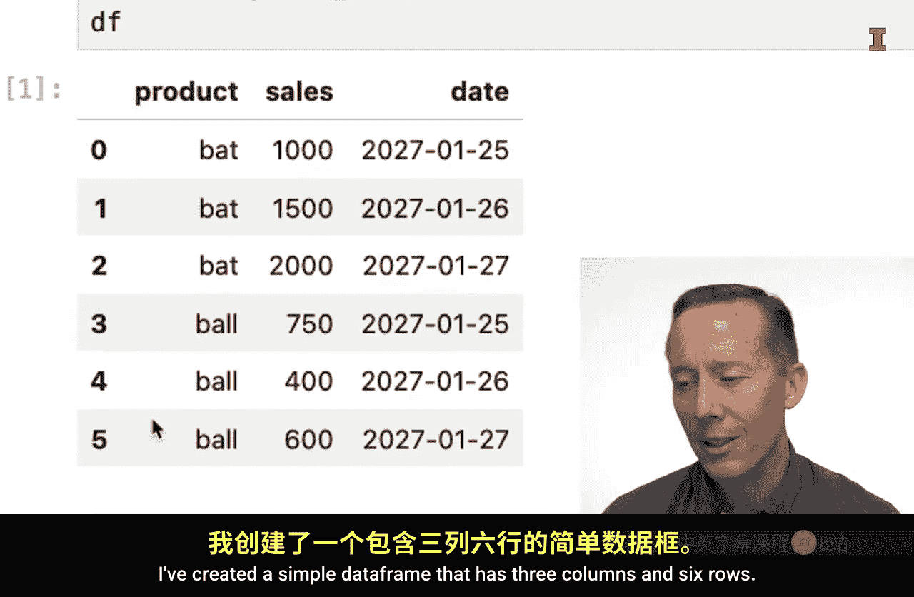

在本节课中，我们将学习如何使用Pandas库将两个不同的数据框（DataFrame）合并在一起。我们将探讨不同的合并场景，包括按行合并和按列合并，并介绍`concat`和`merge`函数的具体用法。

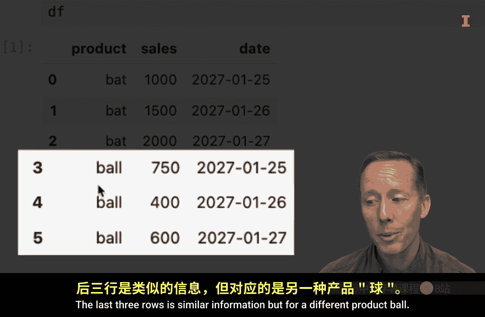

## 数据准备

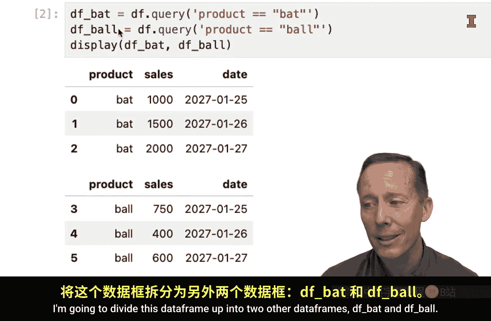

首先，我们创建一个简单的数据框，它包含三列（产品名称、销售额、日期）和六行数据。前三行是关于“球棒”（bat）的数据，后三行是关于“球”（ball）的数据。

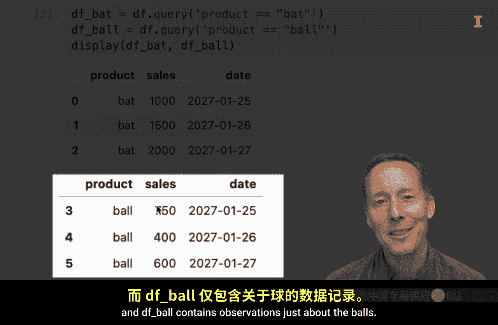

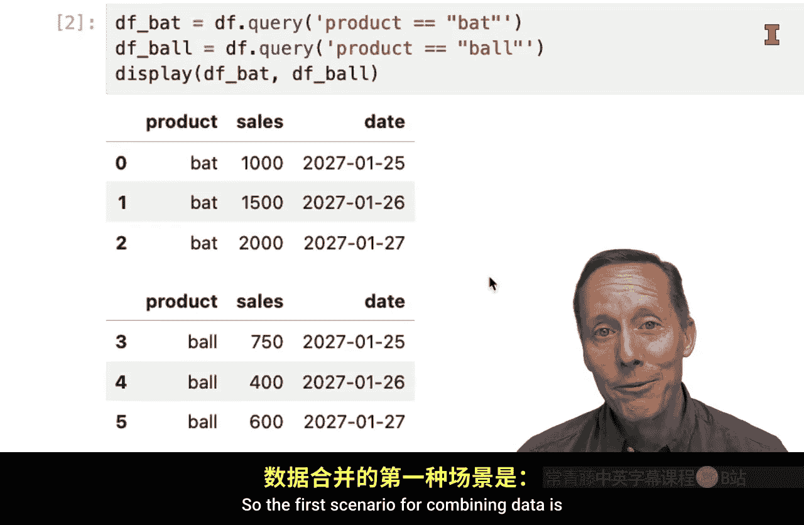

为了演示合并操作，我们将这个原始数据框拆分成两个独立的数据框：`df_bat`（仅包含球棒数据）和`df_ball`（仅包含球数据）。

```python
import pandas as pd

# 原始数据
data = {
    ‘product‘: [‘bat‘, ‘bat‘, ‘bat‘, ‘ball‘, ‘ball‘, ‘ball‘],
    ‘sales‘: [100, 150, 200, 50, 75, 100],
    ‘date‘: [‘2023-01-25‘, ‘2023-01-26‘, ‘2023-01-27‘, ‘2023-01-25‘, ‘2023-01-26‘, ‘2023-01-27‘]
}
df = pd.DataFrame(data)

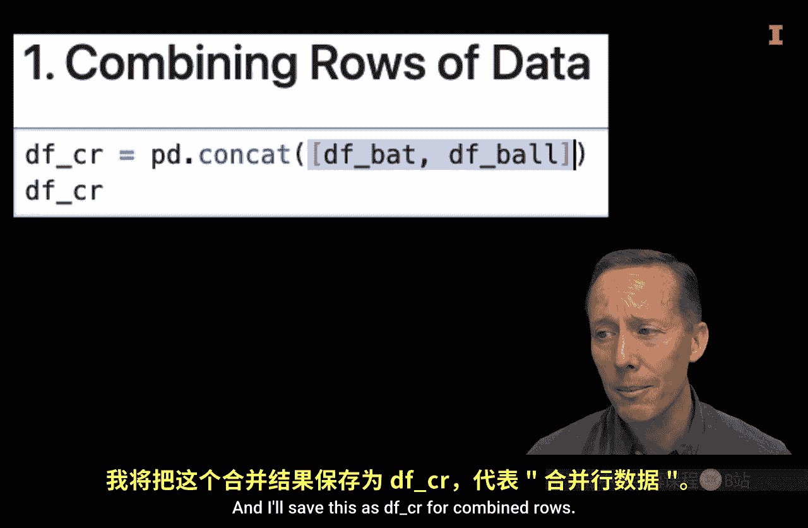

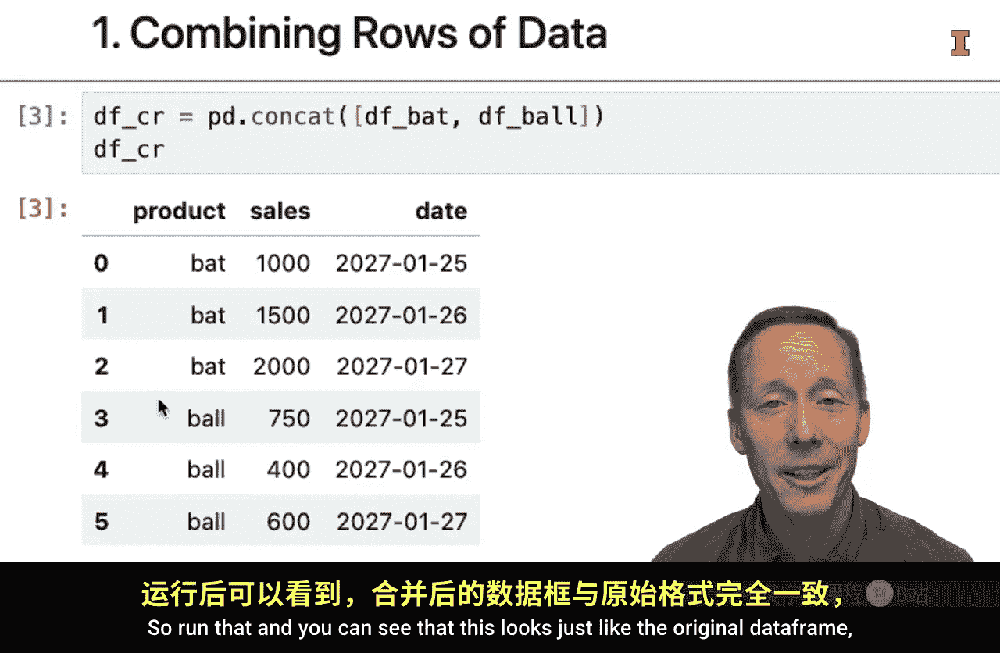

# 拆分为两个数据框
df_bat = df[df[‘product‘] == ‘bat‘].reset_index(drop=True)
df_ball = df[df[‘product‘] == ‘ball‘].reset_index(drop=True)
```

## 按行合并数据

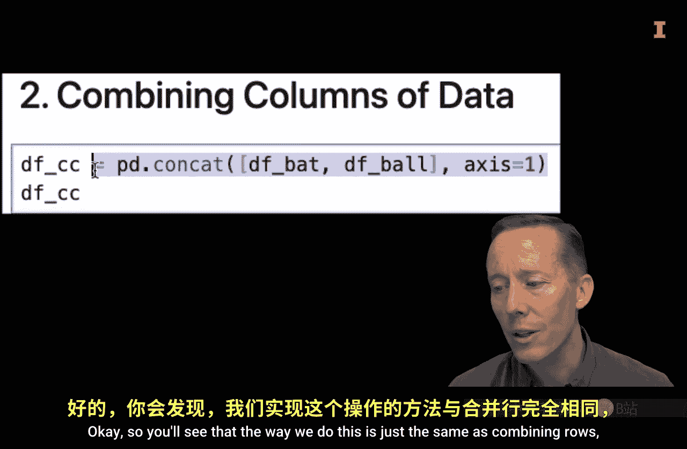

当您拥有格式完全相同的新数据，并希望将其添加到现有数据下方进行分析时，就需要按行合并数据。这可以通过Pandas的`concat`函数轻松实现。

以下是使用`concat`函数按行合并数据框的步骤：

1.  在`pd.concat()`函数中，传入一个包含所有待合并数据框的列表。
2.  默认情况下，`axis`参数为0，表示按行合并。

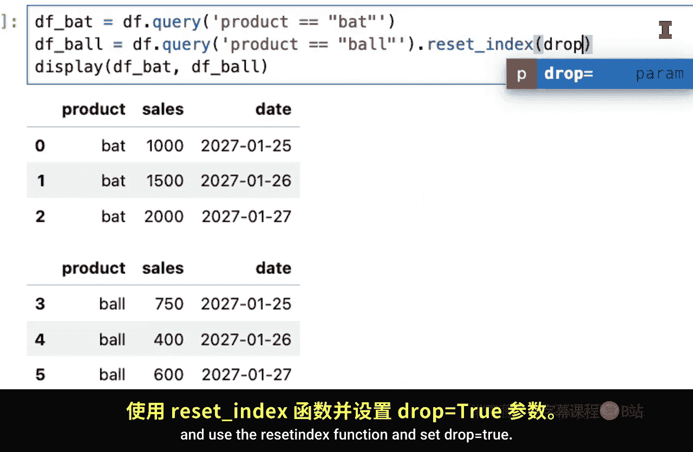

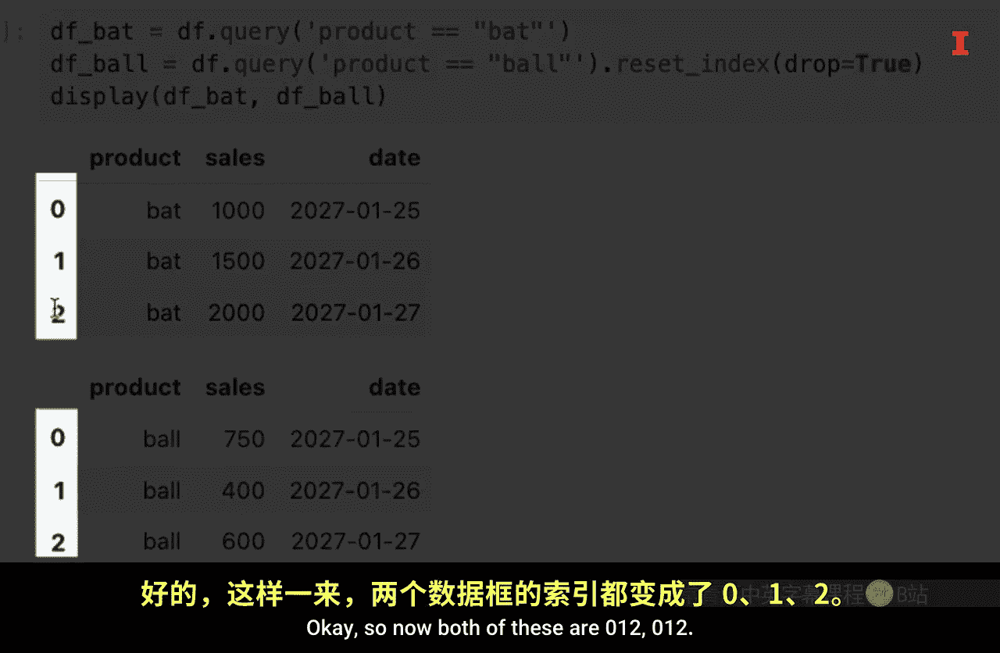

```python
# 按行合并数据框
df_combined_rows = pd.concat([df_bat, df_ball], axis=0)
print(df_combined_rows)
```
执行后，`df_combined_rows`将恢复为与原始`df`数据框相同的样子。

## 按列合并数据

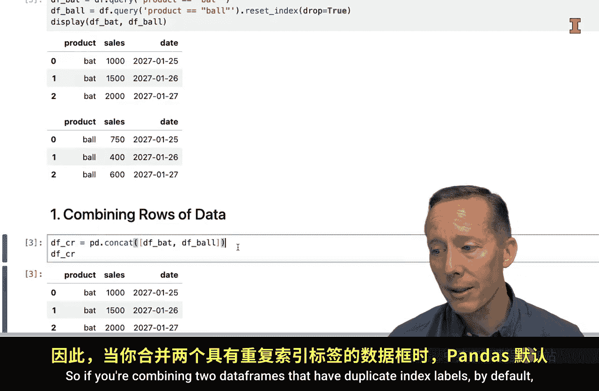

当您希望将新的数据列（例如模型预测结果）添加到现有数据框旁边时，就需要按列合并数据。其操作与按行合并类似，但需要设置`axis=1`。

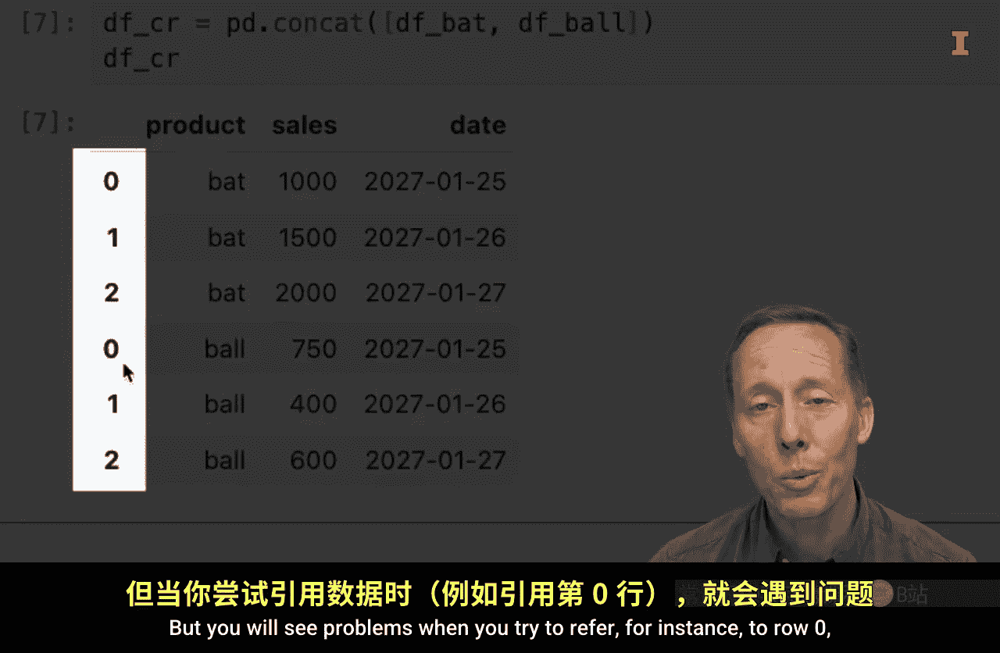

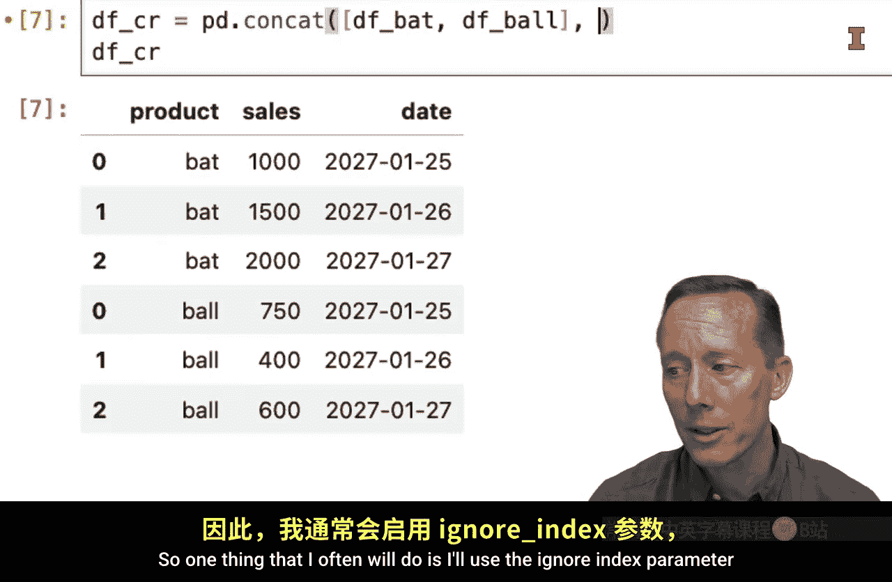

然而，直接按列合并可能会出现问题。默认情况下，`concat`函数会根据索引标签（index label）来对齐数据。如果两个数据框的索引标签不一致，就会产生大量缺失值（NaN）和重复的列名。

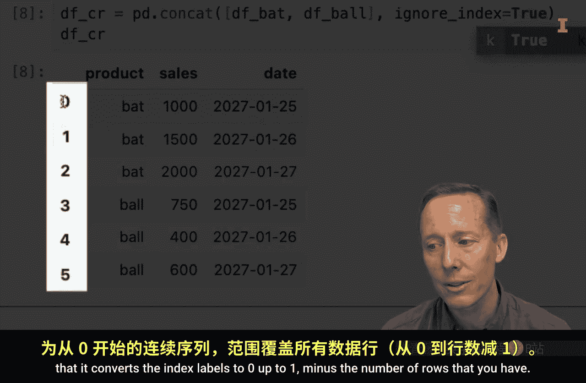

为了避免这个问题，在合并前需要确保两个数据框具有**相同的索引标签**。通常，我们可以使用`reset_index(drop=True)`来重置索引。

```python
# 确保两个数据框索引一致（已在拆分时使用reset_index）
# 按列合并数据框
df_combined_cols = pd.concat([df_bat, df_ball], axis=1)
print(df_combined_cols)
```
现在，数据框会并排显示，这是我们期望的结果。

关于索引的另一个注意事项是，在按行合并时，如果原始数据框存在重复的索引标签，Pandas默认会保留它们，但这可能导致后续引用特定行时产生歧义。一个常见的做法是使用`ignore_index=True`参数，让Pandas自动生成新的连续索引。

```python
# 按行合并并忽略原始索引
df_combined_rows_ignore = pd.concat([df_bat, df_ball], axis=0, ignore_index=True)
```

## 使用Merge函数合并数据

当需要根据一个或多个关键列（key columns）来匹配和合并两个数据框时，`merge`函数更为强大和灵活。这在数据不完全对齐时非常有用，例如为销售数据添加天气或单位数量等信息。

假设我们有一个新的数据框`df_units`，记录了不同产品和日期的销售数量，但它的行与原始销售数据框`df`并不完全对应。

```python
# 创建单位数量数据框
df_units = pd.DataFrame({
    ‘product‘: [‘bat‘, ‘ball‘, ‘ball‘],
    ‘units‘: [60, 400, 500],
    ‘date‘: [‘2023-01-25‘, ‘2023-01-25‘, ‘2023-01-01‘] # 注意最后一个日期在df中不存在
})
```

`merge`函数的核心参数包括：
*   `left`/`right`：待合并的左右两个数据框。
*   `how`：指定合并类型，如`‘left‘`, `‘right‘`, `‘outer‘`, `‘inner‘`。
*   `on`：指定用于匹配的列名。

以下是四种主要合并类型的区别：

**左连接 (Left Join)**
保留左侧数据框（`df`）的所有行，只从右侧数据框（`df_units`）添加匹配的行，不匹配的则显示为NaN。
```python
df_left_merge = pd.merge(df, df_units, on=[‘product‘, ‘date‘], how=‘left‘)
```

**右连接 (Right Join)**
保留右侧数据框（`df_units`）的所有行，只从左侧数据框（`df`）添加匹配的行。
```python
df_right_merge = pd.merge(df, df_units, on=[‘product‘, ‘date‘], how=‘right‘)
```

**外连接 (Outer Join)**
保留两个数据框中的所有行，无论是否匹配。不匹配的位置用NaN填充。
```python
df_outer_merge = pd.merge(df, df_units, on=[‘product‘, ‘date‘], how=‘outer‘)
```

**内连接 (Inner Join)**
只保留两个数据框中都能匹配上的行。这是最严格的合并方式。
```python
df_inner_merge = pd.merge(df, df_units, on=[‘product‘, ‘date‘], how=‘inner‘)
```

## 重要注意事项与总结

在使用合并函数时，务必提前思考合并后的数据框应该是什么样子，并在操作完成后仔细检查结果是否符合预期。如果用于匹配的列指定不正确（例如忘记指定`date`列），可能会导致数据错误膨胀、产生重复列（如`date_x`, `date_y`）等问题。

本节课我们一起学习了Pandas中合并数据框的两种主要方法：
1.  **`concat`函数**：用于简单地将数据框按行（`axis=0`）或按列（`axis=1`）堆叠。使用时需注意索引对齐问题。
2.  **`merge`函数**：用于根据一个或多个关键列，以数据库连接（join）的方式合并数据框。通过`how`参数可以灵活控制左连接、右连接、外连接和内连接。

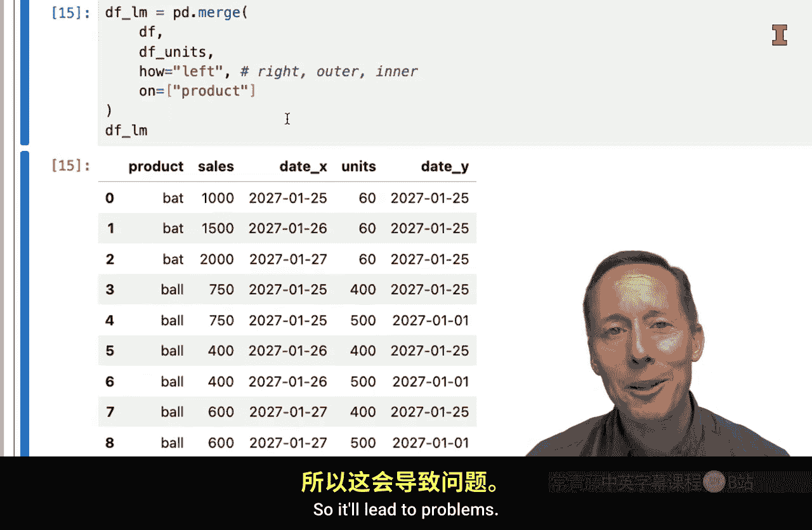


掌握这些数据合并技巧，是进行数据清洗、特征工程和构建分析数据集的基础。请务必在实践后验证数据形状和内容，确保合并操作正确无误。