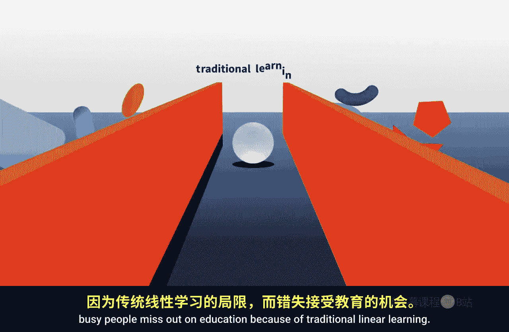
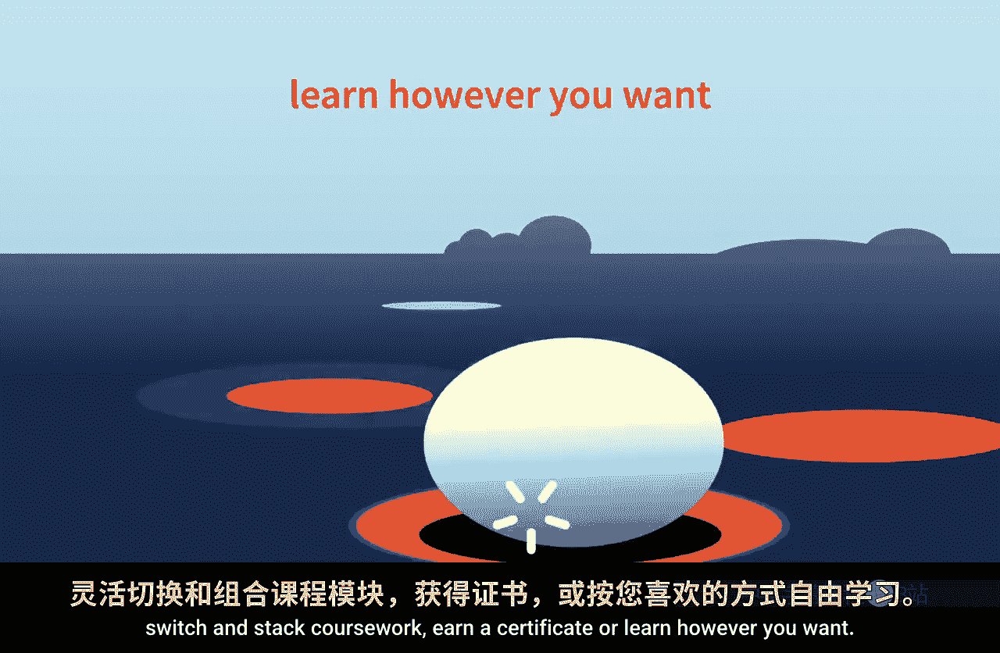
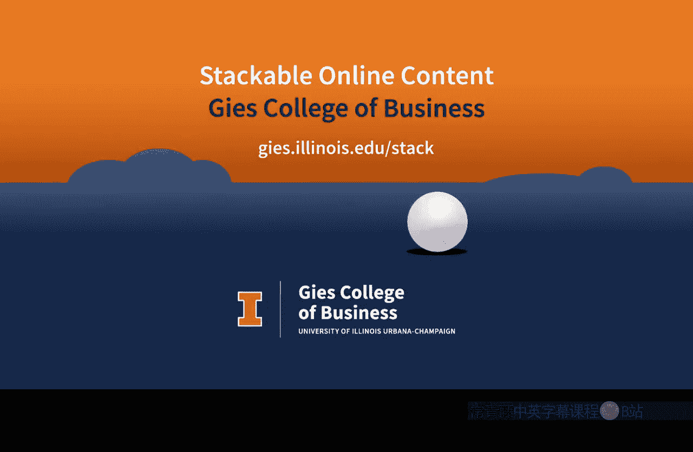

#  059：自主学习课程

在本节课中，我们将了解吉斯商学院提供的灵活在线学习模式，它旨在帮助忙碌的学习者突破传统线性教育的限制。

## 概述

传统线性学习模式常常让聪明、勤奋但忙碌的人们错失教育机会。吉斯商学院通过提供可堆叠的在线内容，让学习者能够按照自己的节奏和方式学习。

## 学习模式的灵活性

上一节我们提到了传统学习的局限性，本节中我们来看看吉斯商学院提供的具体解决方案。其核心在于提供高度灵活的学习路径，适应不同学习者的需求。

以下是几种主要的学习方式：

*   **自定进度课程**：学习者可以完全控制学习速度。
*   **获取可转录学分**：完成课程可获得正式认可的学分。
*   **暂停与继续**：可以根据个人安排随时暂停或恢复学习。
*   **转换与堆叠课程**：允许在不同课程或项目间转换，并将已完成的学习成果堆叠起来。
*   **获取证书**：完成特定系列课程后可获得专业证书。
*   **自定义学习路径**：支持学习者以任何自己想要的方式进行学习。

## 教育内容与支持

无论学习者在教育旅程的哪个阶段，都能获得专家引领的教育。这些教育内容以不同的增量提供，既可以是系统性的“大块”知识，也可以是便于消化的“小块”内容。

## 最佳开始时机

关于何时开始学习，其核心理念可以用一个简单的公式表示：
**最佳开始时机 = 你的时间**
这意味着，最适合开始学习的时刻完全由学习者个人决定。

## 总结

本节课中，我们一起学习了吉斯商学院商业分析专项课程中倡导的自主学习模式。这种模式通过提供**自定进度**、**可堆叠学分**和**灵活路径**，打破了传统教育的线性束缚，让教育能够真正适配每位忙碌学习者的个人时间与目标。记住，开始学习的最佳时机永远是你准备好的那一刻。