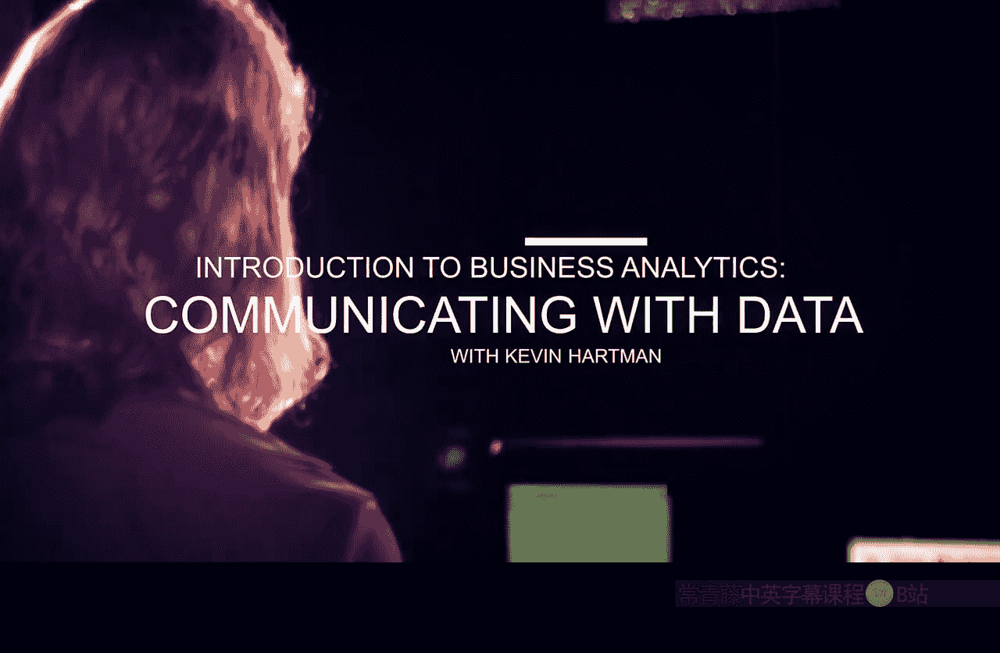
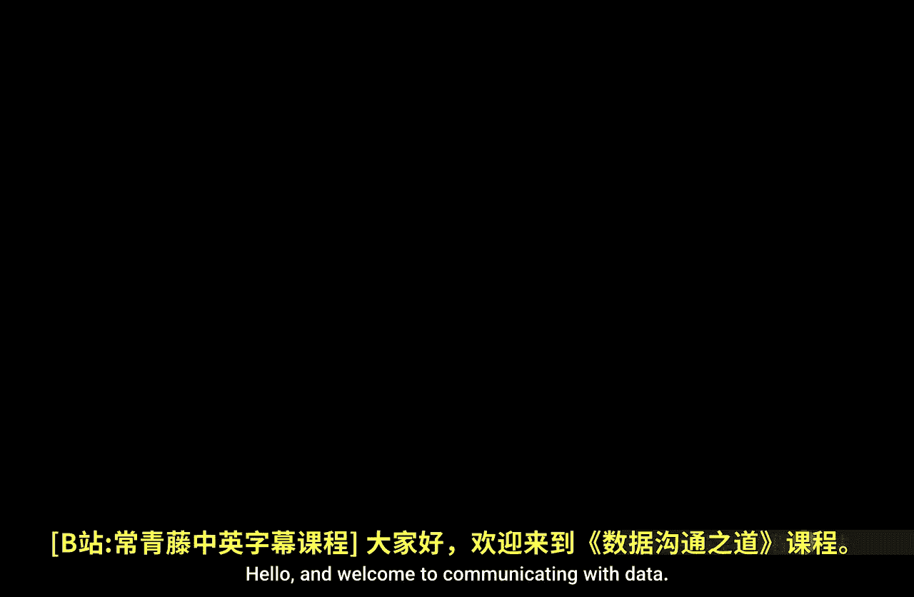
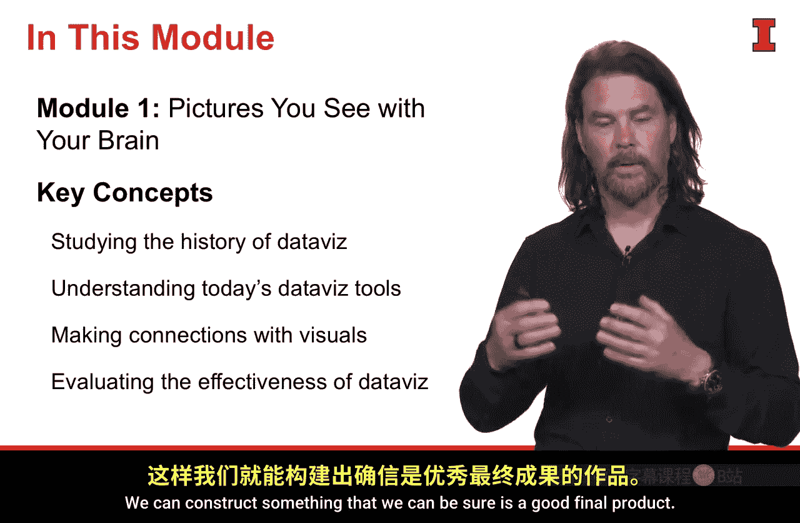
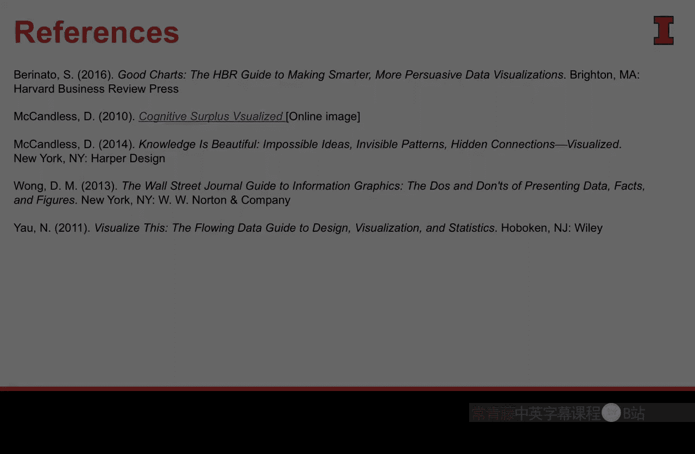

#  061：用数据沟通 📊

在本课程中，我们将学习如何有效地利用数据进行沟通。我们将从整体流程出发，探讨如何构思、开发并最终呈现数据可视化作品，而不仅仅是关注如何制作美观的图表。

我是凯文·哈特曼，谷歌分析部门负责人，也是本课程的讲师。数据可视化以及用数据沟通的实践是我非常热衷的领域。我们将以长远的视角来审视这一实践，涵盖从开始到结束的整个过程，探讨如何开发数据可视化并有效地传达信息。

---

## 课程结构 📚

我们将本课程分为四个模块。

上一节我们介绍了课程的整体目标，本节中我们来看看具体的课程结构安排。

以下是四个模块的主要内容：

1.  **背景与基础**：我们将探讨大脑的工作原理，回顾数据可视化的历史，并为我们作为数据可视化从业者设定背景，理解这一实践的本质以及如何高效地进行创作。
2.  **流程与方法**：我们将详细审视数据收集、故事构建、目标识别等整个流程的所有重要组成部分，这些对于完成最终能有效传达见解的数据可视化作品至关重要。
3.  **洞察与模式**：我们将开始研究那些能够传达意义和洞察的图像与视觉元素。我们将寻找数据中的模式，并向你展示识别这些模式的技巧和提示。
4.  **优化与呈现**：最后，我们将通过关注大量细节和技巧，将我们的数据可视化作品从“良好”提升到“卓越”。课程结束时，我们将掌握从构思到最终有效呈现数据可视化的完整沟通流程。

---

## 核心资源 📖

为了帮助你更好地学习，我们将使用一些核心资源。

以下是本课程将使用的主要参考资料：

*   **《Good Charts》**：作者斯科特·贝里纳托。这本书深入探讨了创建数据可视化的过程，与本课程一样，它从长远视角审视这一实践。我们将从中汲取一些非常重要的概念。
*   **《The Wall Street Journal Guide to Information Graphics》**：作者唐娜·王。唐娜·王在创建数据可视化的指南和所需的高度细节关注方面付出了巨大努力。这本书将教你如何运用技巧，将原本尚可的图表优化为出色的图形，例如利用前注意属性、恰当使用颜色和字体等。

此外，我还推荐以下资源以拓宽你的视野：

*   **大卫·麦克坎德莱斯的作品**：他的著作如《信息是美丽的》、《知识是美丽的》等，将在数据可视化创作方面给我们带来灵感。
*   **《Visualize This》**：作者内森·姚。内森·姚和他的网站“Flowing Data”在通过基于R的案例研究和课程来创建可视化方面做得非常出色。这本书结合其网站，为你如何使用工具（主要是R）实际创建可视化提供了深刻的见解。

---

## 核心理念与挑战 💡

在深入学习之前，我想提供一个核心理念，以便你了解我们看待数据可视化的角度。

你可能听过米开朗基罗的这句话：“每一块石头内部都藏着一尊雕像，雕塑家的任务只是凿去多余的部分，直到雕像显现。” 用数据有效沟通和创建可视化的实践与此非常相似，唯一的区别在于，**我们的“石头”是数据**。

我们收集的信息中包含了大量不必要的内容。我们的工作是找到那些至关重要的部分。本课程中讨论的指南和规则将帮助你做到这一点。但这并非易事。

正如大卫·麦克坎德莱斯所言，**可视化数据是他做过的最难的事情之一**。部分原因在于，一个成功的数据可视化包含了太多要素。

本课程将逐一探讨所有这些要素。这不仅仅是一门教你制作漂亮图片的课程。我们将讨论数据可视化周围的所有背景和元素，确保你构建的视觉作品基础扎实、沟通正确，并最终能让你有效地向利益相关者传达数据洞察。

---

## 优秀案例与习惯 ✏️

大卫·麦克坎德莱斯创作了许多极其美观且富有洞察力的可视化作品。其中一个我特别喜欢的例子是，他运用对比手法展示了美国人每年看电视所花费的时间，与之形成鲜明对比的是创建维基百科这样的优秀资源所需的时间。这强烈对比了我们作为一个国家是如何分配时间的。

这样的可视化运用了许多我将教你使用的元素。此外，一个我们做得还不够的重要习惯是**草图构思**。上图来自大卫随身携带并记录想法的素描本。这是我们所有人都应该养成的习惯，这是该领域大师们实际的工作方式。它能让我们更有创造力、更高效、节省时间，并最终产生更好的成果。

---

## 第一模块预览 🔍

在第一个模块中，我们将讨论多个主题。

以下是本模块将涵盖的核心概念：

*   **数据可视化历史回顾**：我们将回顾人类7000年来通过数据表达自我的经验，并从中汲取教训。
*   **现代工具概览**：审视当前动态多变的数据可视化工具市场，并为你提供一种评估这些工具的方法。
*   **受众认知原理**：理解你的受众如何从生理上解读你呈现的视觉信息，了解他们思维的工作原理，将帮助你构建符合他们认知方式的视觉作品。
*   **优秀可视化框架**：我们将建立一个框架，来回答“什么造就了优秀的数据可视化”这个问题。通过理解这个框架和“优秀”的定义，我们可以朝着这个目标构建，确保最终产品是优秀的。

---

本节课中，我们一起学习了“用数据沟通”课程的总体介绍、结构、核心资源、核心理念以及第一模块的预览。我们明确了本课程将采取全面、深入的视角，而不仅仅是专注于图表的美观性。在接下来的课程中，我们将从历史、工具和原理开始，逐步构建有效数据沟通的完整知识体系。