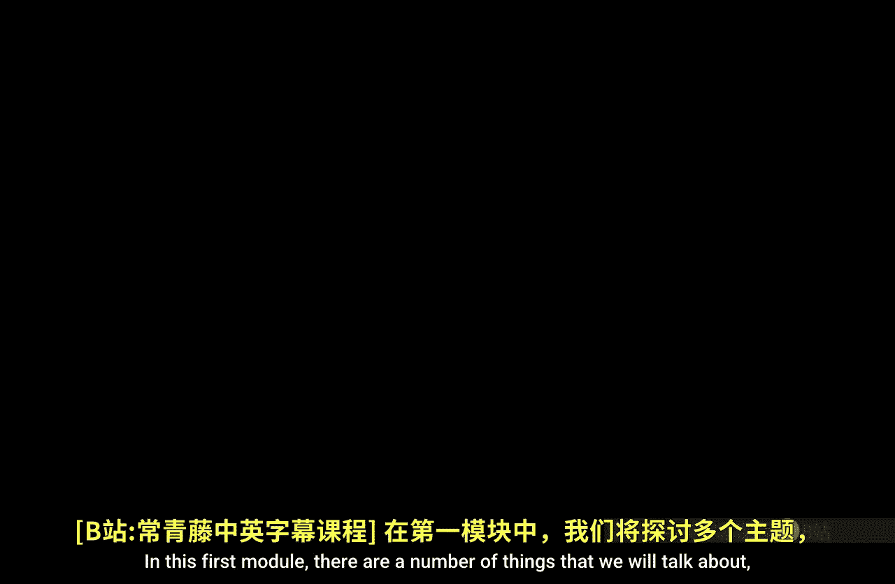
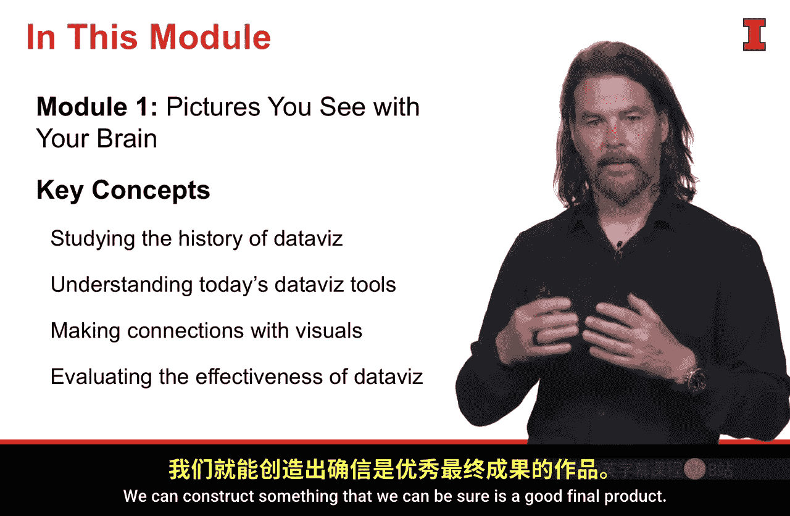

#  062：数据可视化模块概述 📊

在本模块中，我们将探讨数据可视化的核心概念。我们将回顾数据可视化的历史，审视当前使用的工具，理解观众如何解读视觉信息，并最终学习一个评估数据可视化质量的框架。

## 历史回顾：七千年的数据表达 📜

上一节我们介绍了本模块的整体内容，本节中我们来看看数据可视化的历史。我们将回顾人类七千年来通过数据表达自我的经验。

从这段漫长的历史经验中，我们可以学到以下几点：
*   人类很早就开始尝试用图形化的方式记录和传达信息。
*   数据可视化的形式随着技术和社会需求的变化而不断演进。
*   历史上的优秀案例揭示了有效沟通数据的基本原则。

## 现代工具：动态变化的市场 🛠️

了解了历史背景后，本节我们将目光转向当下。我们将审视当今使用的数据可视化工具，这是一个非常动态且不断变化的市场。

以下是评估和思考这些工具的一种方法：
*   **功能性**：工具能创建哪些类型的图表？（例如，`ggplot2` 适用于复杂的统计图形，`Tableau` 擅长快速交互式仪表盘）。
*   **学习曲线**：工具是否易于学习和使用？
*   **集成与协作**：工具是否能与其他数据分析流程（如使用 `Python` 的 `pandas` 库进行数据处理）顺畅集成，并支持团队协作？
*   **成本与可及性**：工具是开源（如 `Matplotlib`）还是商业软件？其定价模式如何？

## 理解观众：视觉的生理与认知解读 👁️

掌握了工具概览，我们需要理解这些工具产出的内容是为谁服务的。接下来，我们将探讨你所面对的观众是如何从生理和认知层面解读你呈现给他们的视觉图像的。

理解观众思维的工作方式，将帮助你构建出符合他们认知习惯、能有效传达信息的可视化作品。核心在于让视觉编码（如位置、长度、颜色）能够被观众快速、准确地解码。

## 评估框架：何为优秀的数据可视化？✅

最后，我们将学习一个框架，用以回答一个核心问题：什么才是优秀的数据可视化？

通过理解这个框架和对“优秀”的定义，我们可以朝着这个目标去构建，确保最终产出的是高质量的作品。该框架通常涵盖以下几个维度：
*   **准确性**：可视化是否真实、无误导地反映了数据？
*   **清晰性**：主要信息是否一目了然？
*   **效率**：观众能否以最小的认知努力获取最多的信息？
*   **美观性**：设计是否在满足功能性的同时具有视觉吸引力？

---

本节课中，我们一起学习了数据可视化模块的四个支柱：从历史中汲取经验，了解现代工具市场，深入理解观众的认知过程，以及掌握评估可视化质量的框架。这些知识将为后续学习如何具体创建有效的数据可视化打下坚实基础。