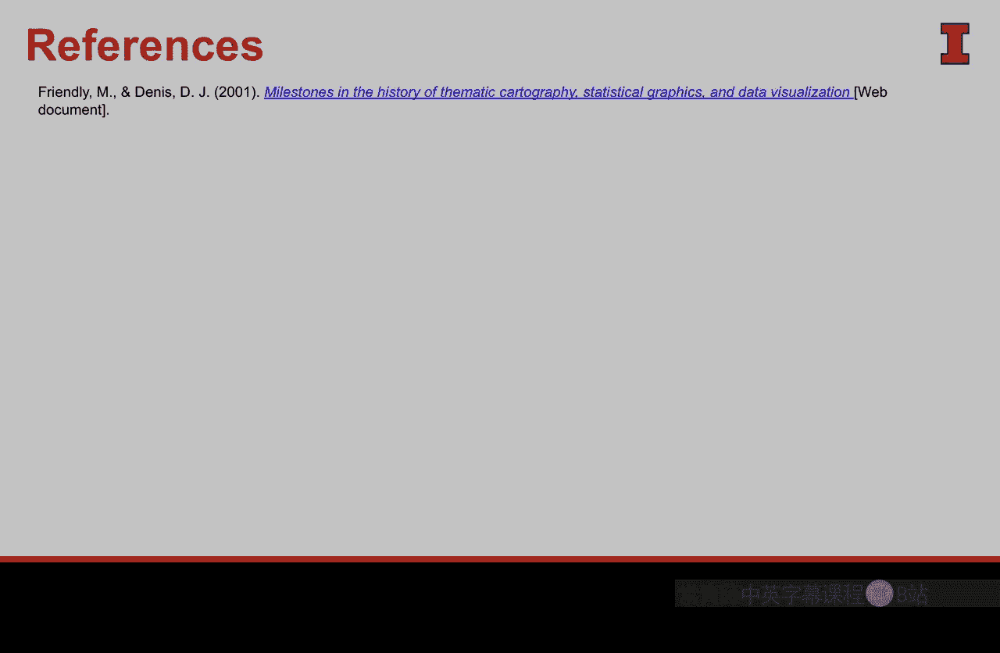

#  063：数据可视化历史研究 📊

在本节课中，我们将追溯数据可视化的漫长而丰富的历史，了解人类如何利用数据进行沟通。我们将看到这门学科如何随时间演变，逐步增加能力，并应对许多至今仍非常熟悉的问题。最终，它真正融合了艺术与科学。

## 概述

数据可视化的历史可以追溯到人类存在的早期，并可以围绕八个不同的时代进行划分。每个时代都存在一个转折点，推动我们从历史的一个阶段进入下一个阶段。

## 八个历史时代

### 时代一：早期地图与图表阶段（1600年以前）

在这个时代，人类使用数据（主要是地图）来理解周围的世界，并通过视觉方式展示，以便分享信息、记录和测量日常生活中的事物。这成为了我们社会互动和理解世界的关键部分。

以下是该时代的特点：
*   人类使用地图来理解世界。
*   视觉展示用于分享信息和记录测量结果。
*   这成为社会互动和认知世界的基础。

### 时代二：测量与理论时代（17世纪）

进入17世纪，随着我们对世界的理解加深，测量能力也在增长。克里斯托弗·沙伊纳的太阳黑子图就是一个很好的例子，它展示了人类开发工具记录数据（太阳黑子），并将其转化为视觉形式来讲述故事。

以下是该时代的进展：
*   测量工具和能力得到发展。
*   数据被转化为视觉形式以传达信息。
*   出现了更多重要的可视化实例。

### 时代三：新视觉形式的探索时代

接下来，熟悉用数据沟通的艺术家们开始探索新的视觉形式。他们使用我们今天所知的**前注意属性**（如颜色、阴影等），以创造性的方式快速向观众传达洞察。

以下是该时代的创新：
*   艺术家探索创造性的数据沟通方式。
*   开始利用**颜色**、**阴影**等前注意属性。
*   目标是让观众快速获得洞察。

### 时代四：现代图形的开端时代

在这个时代，我们开始看到真正意义上的数据可视化扎根。威廉·普莱费尔引入了**饼图**，这至今仍是数据可视化的重要组成部分。**条形图**、**折线图**等视觉形式也在此时代确立，并将持续影响未来。

以下是该时代的标志性贡献：
*   威廉·普莱费尔引入了**饼图**。
*   **条形图**和**折线图**开始普及。
*   现代数据可视化的基础得以建立。

### 时代五：数据分析的黄金时代（19世纪下半叶）

在这个阶段，艺术家们收集数据，并使用可视化来最佳地传达这些数据。一些伟大的例子包括约翰·斯诺对伦敦霍乱和宽街水泵的流行病学研究，他的可视化改变了人们对这种疾病传播方式（从空气传播到水传播）的认识。弗洛伦斯·南丁格尔利用图表有力地说明了英军改善卫生条件的必要性。查尔斯·布斯则用颜色展示了伦敦的贫困状况，抓住了问题的情感核心。

此外，这个时代还诞生了可能是有史以来最伟大的数据可视化作品——描绘拿破仑进军莫斯科及撤退的图表。这幅作品包含了士兵伤亡人数、温度、距离等大量信息，至今仍被视为通过图形传达洞察和故事的最佳典范。

以下是该时代的杰出案例：
*   约翰·斯诺的霍乱疫情地图。
*   弗洛伦斯·南丁格尔的极区图（玫瑰图）。
*   查尔斯·布斯的伦敦贫困地图。
*   查尔斯·约瑟夫·米纳德的拿破仑东征图。

### 时代六：现代黑暗时代与反弹

然而，到了20世纪，我们似乎有些过度热衷于创建图形，导致一些图表变得过于复杂、堆砌，反而模糊了作者的本意。随之而来的是反弹，学术界兴起一股思潮，要求更高的准确性、更多的控制和标准化的语言，为了准确性而限制了创造性。这导致了我们今天所知的**剪贴画**的泛滥——用标准化的图标代表特定数据。

但在这个时期，我们也看到了一些有价值的引入。亨利·贝克的伦敦地铁地图就是一个著名的例子，它简洁优美地描述了一个复杂的系统，更重要的是，它并不追求地理上的绝对精确，这在一定程度上是对学术反弹的反抗，证明了图像即使不精确也能发挥重要作用。

同时，计算机（如哈佛大学的Mark I）在这个时代被引入。尽管其能力还不如我们今天手中的手机，但它为数据可视化艺术家创造了新的可能性。

以下是该时代的矛盾与发展：
*   过度复杂的图形导致意义模糊。
*   学术界强调准确性，催生了**剪贴画**的标准化图标。
*   亨利·贝克的伦敦地铁图是简洁有效的反例。
*   计算机（如**Mark I**）的引入为未来开辟了新道路。

### 时代七：数据可视化的重生时代

在这里，计算机开始扮演更重要的角色。我们可以处理更多数据，进行更复杂的分析，并添加以前没有的元素。随着我们磨练这些技能，我们进入了最后一个时代。

以下是该时代的特征：
*   计算机处理数据的能力增强。
*   可视化变得更加复杂和精细。
*   为进入高清数据分析时代奠定了基础。

### 时代八：高清数据分析时代（当今）

这是我们今天所处的时代。可视化几乎总是由计算机或某些应用程序创建，它们处理海量信息，并利用我们过去在数据可视化中学到的一切知识，来创建高效、有力且强大的视觉作品。

以下是当今时代的特点：
*   可视化由计算机或专业应用生成。
*   能够处理**vast amounts of information**（海量信息）。
*   综合历史经验，创建高效强大的视觉作品。

## 总结

本节课我们一起学习了数据可视化的八个历史时代。这段漫长而丰富的历史展示了人类如何从简单的手绘地图和笔记，发展到今天拥有生成图表的强大能力。有趣的是，现在的工具甚至已经超越了我们的创造力，而在过去，工具常常限制人们用数据沟通的想法。在这段历史长河中，我们应对了数据稀缺、人类政治、数据误用以及**剪贴画**的泛滥等问题，最终达到了我认为艺术与科学最纯粹、最美丽的融合——即通过视觉和数据可视化进行沟通的理念。理解这段历史，有助于我们更好地运用和发展数据可视化这一强大工具。