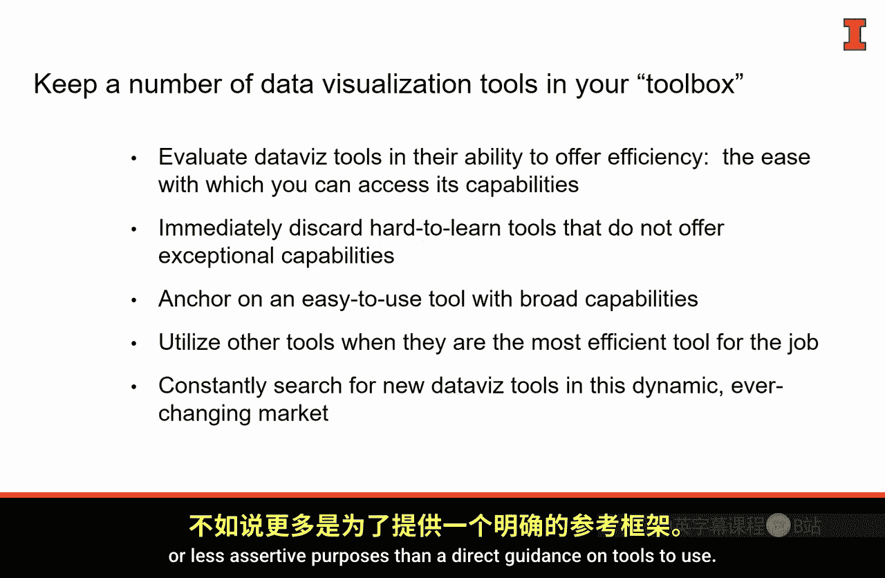

#  064：理解当今的数据可视化工具 📊

在本节课中，我们将要学习如何理解当今快速变化、充满活力的数据可视化工具市场。我们将通过一个简单的框架来梳理这个市场，帮助你选择适合自己需求的工具。

为了清晰地理解数据可视化工具市场，我们可以借助两个关键维度来评估它们：**易用性**和**功能广度**。易用性指学习工具的难易程度、访问所需功能的便捷性以及使用效率。功能广度则指工具是功能全面，还是专注于完成特定任务。

使用这两个维度，我们可以将市场大致划分为一个2x2的矩阵，并识别出不同象限中的工具类别。接下来，我们逐一看看这些象限。

以下是四个象限的具体分析：

*   **左上象限：易用但功能有限**
    这个象限包含的工具非常易于使用，但功能范围有限。它们通常能出色且快速地完成一次性或特定的任务。你应该将这些工具保留在你的“工具箱”中，以备不时之需。

*   **右上象限：易用且功能强大**
    这个象限的工具既强大又易于使用。你应该选择其中一两个作为你大部分数据可视化工作的基础，使其成为你的“主力工具”。Tableau 就是这个象限的一个完美例子，它易于使用、社区庞大，是许多数据可视化从业者的首选工具。你可以将大约75%的工作交给这类工具。

*   **右下象限：功能强大但较难掌握**
    这个象限的工具功能极其强大，但学习曲线相对陡峭，使用起来可能不那么便捷。强大的功能是以牺牲部分易用性为代价的。然而，这并不意味着你应该避开它们。事实上，在分析数据、从信息中发现视觉模式和规律时，这些工具可能至关重要。我个人非常推崇的工具是 **R**。它是一个开源、免费的工具，拥有庞大的社区贡献者，提供了海量的帮助文件、新功能、扩展包和脚本。如果你要在这个象限学习一个工具，我推荐 R。当然，还有其他工具也能满足多种需求，但我认为 R 的效率无与伦比。

*   **左下象限：难用且功能有限**
    任何既难用又没有突出功能的工具，都应该立即从你的工具箱中剔除。没有必要在这样的工具上浪费时间。

以上就是对数据可视化市场的一个高层概览。我提到的具体工具可能并不比我们为这个市场建立的心智框架更重要。我推荐的方法是，根据工具的**易用性**和其提供的**功能广度**来评估它们。任何难学且对你而言没有突出能力的工具，都可以果断放弃，因为在这个快速发展的市场中，你总能找到替代品。

你最高频使用的、作为数据可视化“锚点”的工具，应该来自右上象限——易用且功能强大。而左上象限和右下象限的工具，你将根据具体需求和任务，偶尔使用。

在这个市场中，我们的诀窍是保持警惕。每天都有新工具出现，市场随着我们数据经验的积累而飞速变化，几乎不可能完全跟上。事实上，这里的概览图更多是示意性的，而非直接的使用指南。

因此，作为一名数据沟通者，你应该挑战自己，沉浸在这个市场中，了解新出现的工具。既要拥有你熟悉、使用并喜爱的工具，也要始终对新工具保持开放态度。

本节课中，我们一起学习了如何通过易用性和功能广度两个维度来理解数据可视化工具市场，并了解了不同象限工具的特点和适用场景。记住，选择工具的关键在于匹配你的需求，并保持对市场动态的关注。