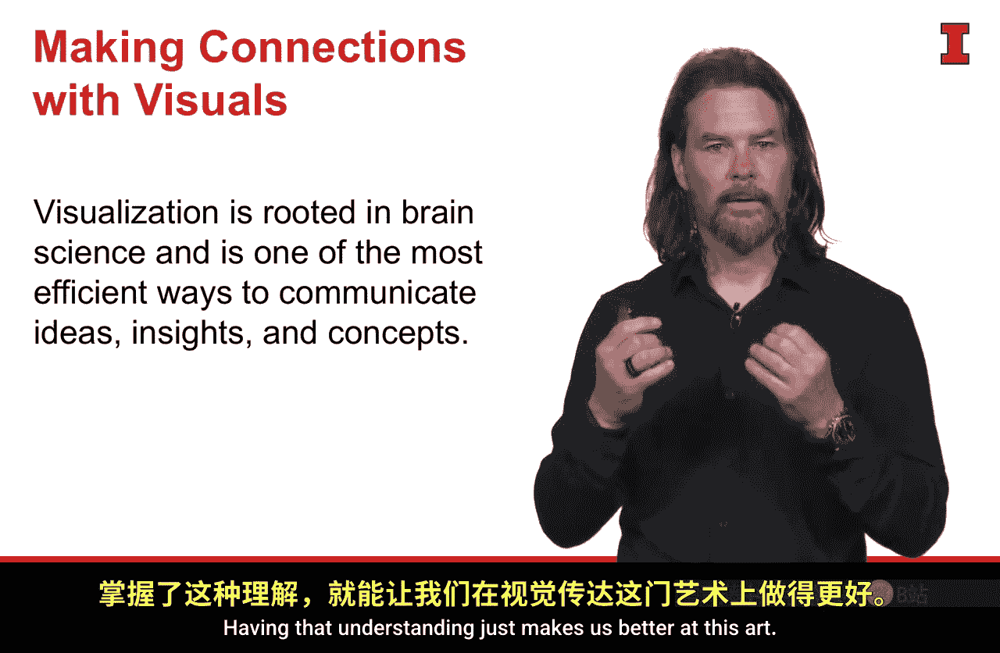
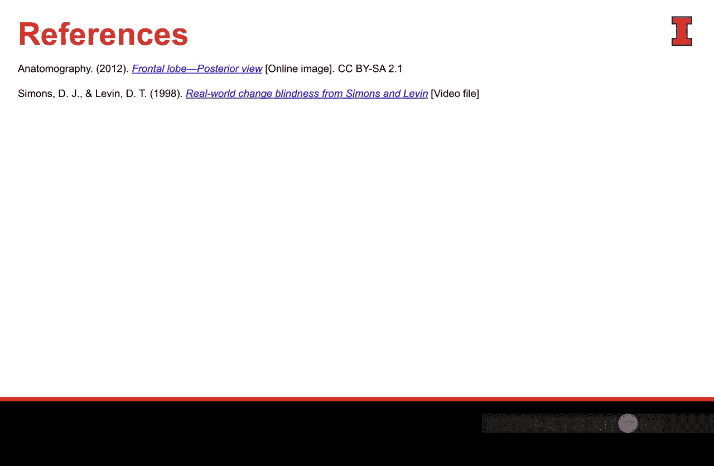

#  065：通过视觉建立联系 👁️

在本节课中，我们将要学习人类如何处理视觉信息，以及如何利用这一认知原理来创建更有效的数据可视化图表。理解受众的思维过程，能帮助我们更好地传递信息，并利用“前注意属性”快速与受众建立联系。

## 视觉感知与大脑处理

上一节我们介绍了视觉沟通的重要性，本节中我们来看看视觉信息是如何被大脑处理的。我们的眼睛是绝佳的工具，但真正“看见”事物的是我们的大脑，而非眼睛。因此，当我们创建用于沟通的视觉图表时，应思考这些图像将如何在受众的大脑中留下印象。人脑是一个复杂且令人困惑的器官。

以下两个研究很好地说明了这一点：

*   **著名的“门”研究**：研究中，一位研究员请公园里的受试者看地图指路。当受试者全神贯注于解读地图（这动用了最复杂的前额叶皮层）时，一群人抬着一扇门从中间穿过，第一位研究员趁机躲到门后，由第二位研究员接替出现。绝大多数受试者完全没有注意到交谈对象已换人，继续指路。这表明，当前额叶皮层高度活跃时，我们会超负荷，从而忽略最简单的事情。
*   **莫伦·瑟夫的“选择解释”研究**：研究员向受试者展示两张异性的照片，询问哪张更有吸引力。在受试者做出选择（这依赖于大脑中更底层、更本能、负责“战或逃”反应的部分）后，研究员将受试者**未选择**的那张照片递给他们，并要求解释选择原因。结果，几乎每次受试者都会继续编造一套复杂的说辞，来解释他们为何选择了自己最初并未选择的人。这说明，如果受众不理解故事脉络或数据，他们就会自行编造信息来填补空白。

## 沟通的挑战与目标

作为数据沟通者，我们面临的危险正在于此：要么让受众过度思考而感到困惑，要么（在极端情况下）导致他们为我们试图讲述的故事编造出自己的叙事。

我们经常思考大脑左右半球的分工，但较少考虑底层大脑（情绪、本能）与前额叶皮层（理性、语言）的差异。作为数据沟通的“艺术家”，我们需要设法绕过前额叶皮层，让它保持平静，转而用能够触动底层大脑（即认知中非常情绪化的部分）的信息和视觉来打动受众。

## 利用前注意属性

人类天生擅长察觉差异，无论是形状还是颜色的差异。在构建数据可视化时，我们有一整套可用的“前注意属性”。

以下是我们可以利用的一些关键前注意属性，以在视觉中传达观点、吸引注意力，真正触及大脑的底层部分：

*   **颜色**：例如，`color = "red"` 用于突出显示关键数据点。
*   **大小**：例如，在散点图中，`size` 可以代表数值大小。
*   **形状**：例如，使用不同的 `marker`（如圆形、方形、三角形）来区分数据类别。
*   **位置**：例如，在坐标轴 `(x, y)` 上的相对位置。
*   **长度/宽度**：例如，在条形图中，条形的 `length` 直接对应数值。
*   **方向**：例如，线条的 `slope`（斜率）表示趋势。
*   ** enclosures**：例如，用方框 `border` 将相关元素分组。

这些技巧看似简单，但如果真是如此，为什么我们仍然会创建出杂乱无效的图表呢？我认为原因在于，我们并不完全理解创建数据可视化、进行数据沟通所需遵循的全部规则和准则。本课程的目的正是帮助你掌握这些。

## 创建有效可视化的核心原则

理解大脑工作原理将帮助我们创建更好的数据可视化。在此过程中，我们需要牢记以下几点：

1.  **以设计和信息为核心**：无论试图沟通什么，都要围绕核心信息进行设计，并将其置于最突出、最中心的位置。
2.  **思考受众的解读方式**：仔细思考受众将如何解读我们呈现给他们的内容、我们试图讲述的故事以及所使用的视觉元素。我们的目标是尽可能让前额叶皮层保持静止和安静。实际上，我们不希望受众思考太多，而是希望传递的信息如此易于理解和解读，以至于他们无需耗费精力启动前额叶皮层来自行填补空白或将注意力从我们的核心信息上移开。
3.  **善用前注意属性**：前注意属性无疑会有所帮助，我们将在课程后续深入探讨。但最重要的是要明白，创建出色的数据可视化并成为有效的数据沟通者，不仅仅在于用好颜色、阴影或任何单一属性。这些只是从数据中提取信息，并以能精准传达给受众的方式进行有效沟通这一庞大而复杂过程中的一环。

本节课中，我们一起学习了人类处理视觉信息的认知基础，明白了让沟通绕过理性的前额叶皮层、直达感性底层大脑的重要性。我们介绍了“前注意属性”这一关键工具，并确立了以受众为中心、以信息为核心的设计原则。掌握这些是成为高效数据沟通者的第一步。