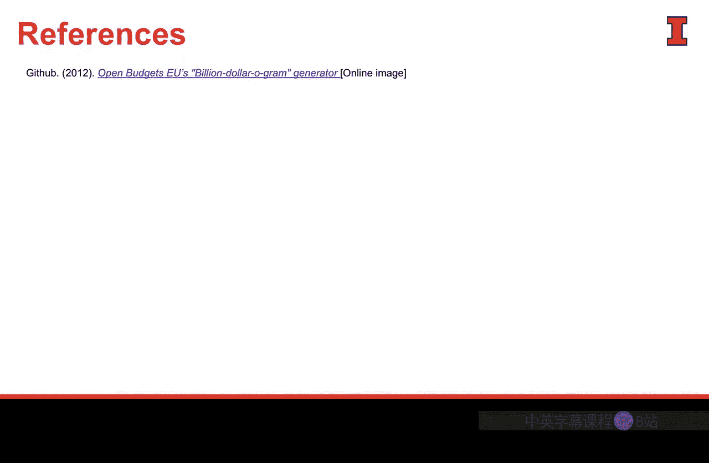

#  066：评估数据可视化的有效性

在本节课中，我们将学习如何评估数据可视化的有效性。我们将通过分析一些优秀的可视化案例，并引入一个实用的定义和框架，来回答“什么是好的数据可视化”这个问题。

## 优秀可视化案例赏析

以下是几个广受赞誉的数据可视化实例，它们有效地传达了信息。

*   **“十亿美元项目”**：由David McCandless创作。他收集了各种涉及“十亿美元”规模的支出数据，并将它们按相对大小呈现在一个图表中。这个图表揭示了不同支出规模的对比关系，非常直观。
*   **麻疹疫苗接种影响图**：这张图展示了美国各州从1928年到21世纪初的麻疹病例发生情况。颜色越深表示病例越多。可以清晰地看到，在20世纪60年代中期引入麻疹疫苗后，病例数量急剧下降。
*   **实物可视化案例**：这是一个“照片数据可视化”的例子。它用冰块来代表北极冰盖的面积：2008年的冰块代表183万平方英里，而四年后的冰块则展示了全球变暖对冰盖面积的影响。这个视觉形式非常有力。

## 有效数据可视化的四要素框架

上一节我们欣赏了几个优秀案例，本节中我们来看看是什么让这些可视化如此成功。一个被广泛认可的框架指出，有效的数据可视化需要四个核心要素协同作用。

当这四个要素齐备时，你才能进行有效的沟通，创造出成功的数据可视化。以下是这四个要素：

1.  **信息**：这是指**数据**本身。我们收集的数据必须准确、深入且可靠。数据质量越高，可视化的基础就越好。如果没有数据作为基础，我们创造的就不是数据可视化，而是其他东西。
2.  **目标**：这是我们所收集数据的**功能目的**，即我们希望通过可视化实现的**客观目标**。这个目标将聚焦我们的故事和数据收集，赋予工作明确的方向。没有目标，数据就会变得杂乱无章，失去意义。
3.  **故事**：**故事**是将数据引向目标的**连接组织**。它通过叙事引导观众。没有故事，我们只是在抛掷事实和数字，很难与观众建立联系。
4.  **视觉形式**：即使具备了前三个要素，仍然不够。数据、目标和故事必须通过**视觉形式**才能有效地传达给观众。否则，我们得到的只是一份充满文字和要点的报告，容易让观众感到乏味或分心。视觉形式是我们与观众沟通的最有力方式。

## 框架的重要性

这个四要素框架之所以重要，有以下几点原因。

*   它为我们提供了“什么是好的数据可视化”这一问题的清晰答案和理解路径。
*   它超越了仅仅评价“漂亮的图片”，涵盖了创作过程的所有环节，迫使作者确保每个要素都坚实可靠。
*   它很好地传达了这些要素共同构成一个和谐整体、相辅相成的理念。

因此，这个框架是我们思考和评估数据可视化有效性、以及在本课程中如何进行数据沟通的正确方法。

## 本章总结

本节课中，我们一起学习了如何评估数据可视化的有效性。我们首先回顾了几个优秀的可视化案例，然后引入并详细阐述了构成有效数据可视化的四要素框架：**信息**、**目标**、**故事**和**视觉形式**。这个框架为我们提供了评估和创建高质量数据可视化的清晰指南。