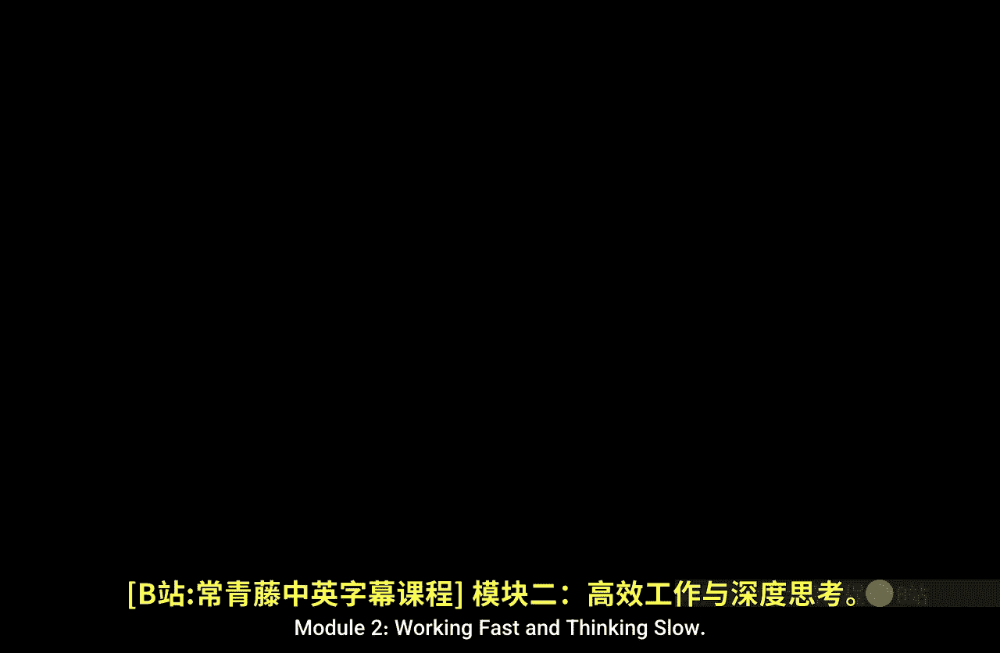
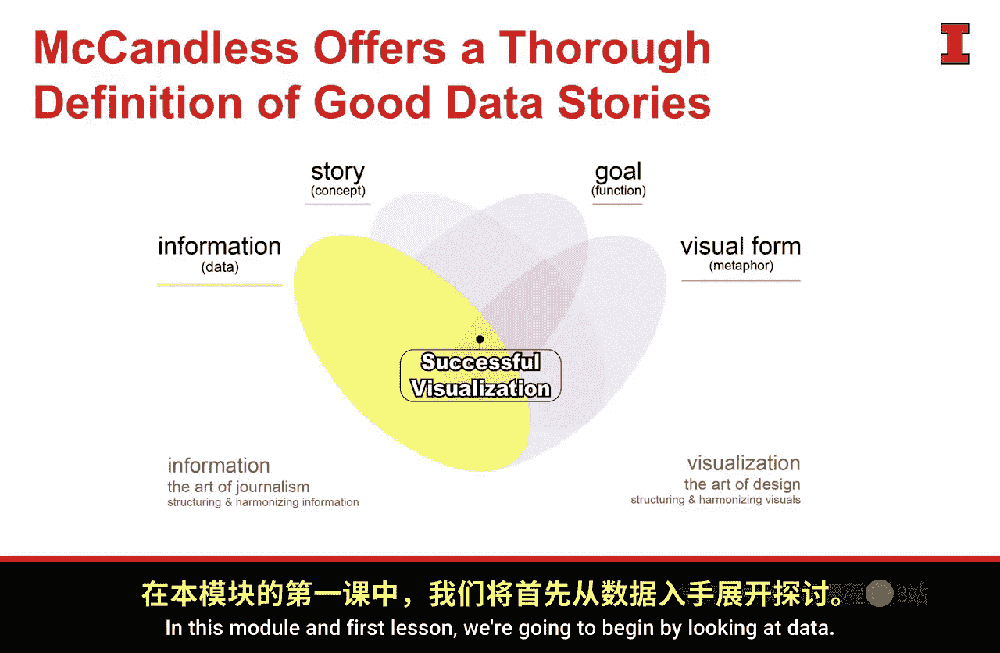

#  067：快速工作与慢速思考概述 🚀🧠

在本模块中，我们将探讨在数据爆炸式增长的时代，如何高效地处理数据并深入思考。我们将学习数据收集与获取的方法，聚焦于沟通目标，并规划如何将数据转化为有说服力的故事。此外，我们将引入一家名为Bellabe的公司作为贯穿本模块的案例，用以具体说明相关概念。

我们将继续沿用成功数据可视化的整体框架。在本模块的第一课，我们将从审视“数据”本身开始。

---

上一节我们介绍了本模块的整体学习目标，本节中我们来看看模块内容的具体构成。

以下是本模块将涵盖的核心概念：

*   **数据的惊人增长**：我们将探讨数据量如何以难以置信的速度膨胀。
*   **数据收集与获取方法**：我们将评估分析师收集和访问数据的不同途径。
*   **聚焦沟通目标**：我们将学习如何围绕一个具体的**目标**或**目的**来规划沟通旅程。
*   **规划数据故事**：我们将讨论如何构建数据故事，它如同**结缔组织**，连接起我们收集的**数据**和我们期望达成的**目标**。
*   **案例公司引入**：我们将介绍**Bellabe**公司，它将在后续的课程视频中作为案例反复出现，帮助我们理解新概念。

---

本节课中我们一起学习了模块“快速工作与慢速思考”的核心内容与学习路径。我们明确了将探讨数据增长、处理方法、沟通聚焦点以及数据故事规划，并认识了案例公司Bellabe。接下来，我们将深入第一个主题：数据的惊人增长。