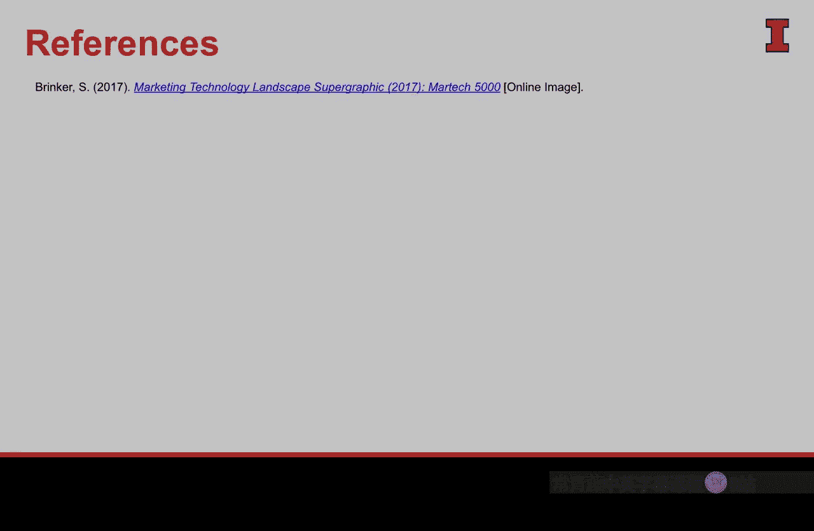

#  068：理解数据增长 📈

在本节课中，我们将要学习数据增长的现状与规模，理解我们正身处一场前所未有的数据爆炸之中，并探讨这对商业分析领域意味着什么。

## 数据爆炸的时代

我们正经历着世界有史以来最大规模的数据扩张。这创造了一个前所未有的环境：**理解如何与数据有效沟通变得至关重要**。仅在过去的两年里，世界上90%的数据被创造出来，这确实非常惊人。

我们周围的数据爆炸有时会让我们失去对数据真实规模的感知。为此，我基于David McCandless的一个概念，制作了这张数据可视化图表。

## 每日数据生成量对比

以下是一张每日数据创造量的对比图，它能让我们直观地看到每天产生的海量数字数据。这些数据可以被移动、访问、分析，并用于讲述故事。

我收集了多个来源的数据，并将它们放入这张图表中，通过调整方框的大小来反映数据的相对规模。这为我们提供了关于数据生成量的良好相对洞察，同时也通过与一些线下数据的对比，显示出数字数据的庞大。

*   **每日45亿次** Facebook点赞。
*   **每日40亿次** YouTube视频观看。
*   **每日35亿次** Google搜索。

对于营销人员而言，这些都是极其丰富和有价值的信息来源，让我们能够了解消费者的喜好、厌恶和需求。这些正在生成的数据，为我们提供了营销史上乃至世界史上从未有过的深刻洞察。

## 数据的相对规模

那么，这些数据到底有多庞大呢？图中那个尚未揭示的棕色方框代表了**全球每日咖啡消费的杯数**。咖啡可以在世界任何地方消费和购买。

而图表中的其他所有数据，仅由全球约40%能够上网的数字人口所生成。右下角那个小小的蓝色方框，则代表了**上一次总统选举的投票总数**，而那是每四年才发生一次的事件。

这一切对比，真正让你感受到每天正在生成多少信息与数据——这些有用、有价值、有洞察力的数据，可以用来讲述精彩的故事。

## 数据催生的行业增长

正因如此，使用和处理这些数据的行业与公司也经历了类似的增长路径。Scott Brinker的一项分析很好地标记了这一点。

2011年，Scott整理了一张信息图，在数据社区中广为传播。他基本上收集了在这个非常新颖、初生的营销技术领域运营的所有公司的标志，并对它们进行了分类。这是人们第一次看到所有在这个数据领域工作的公司，它们处理生成的数据，理解它，并以此开展可行的商业活动。

当时是2011年，这张图非常受欢迎，以至于Scott决定在第二年、第三年持续修订。他发现的结果令人惊讶：

*   **2011年**：**150家**公司。
*   **2012年**：**350家**公司。
*   **2014年**：**1,200家**公司。
*   **2015年/2016年**：这个数字跃升至**3,500家**。2016年发布的图表显示有**5,000家**公司。
*   **2018年**：Scott生成的最新图表显示，目前有近**7,000家**公司在利用这些被创造的数据，从事营销技术领域的工作。

确实，从未有一个时代像今天这样，理解数据并知道如何与数据沟通变得如此重要。

## 变革才刚刚开始

然而，即便有所有这些数字，这可能还不是我想分享的最重要的数字。那个数字也许是这个：**1%**。

这来自麦肯锡最近的一项研究，该研究发现，技术将给我们个人和职业生活带来的变化，我们**仅体验了其中的1%**。我们甚至还没有开始。

因此，面对我们现在已经生成并可以处理的所有数字和数据，我们正处在这场旅程的**起点**。如果说曾经有一个时刻需要理解如何使用数据来沟通，那么现在就是开始学习这些任务和技能的时候。

## 总结

本节课中我们一起学习了数据沟通的重要性。我们正身处一场巨大的数据爆炸之中，正如我们所看到的，每天都有超乎寻常的数据被生成，这些都是有用、丰富、至关重要的信息，可以讲述非常精彩的故事。新的公司、新的行业正从这些数据中涌现，因为它极具价值和丰富性。

然而，我们正在经历的这场革命，**仅仅看到了一个非常、非常微小的开端**。这一切将继续下去，随着时间的推移，我们将看到更大的变革。