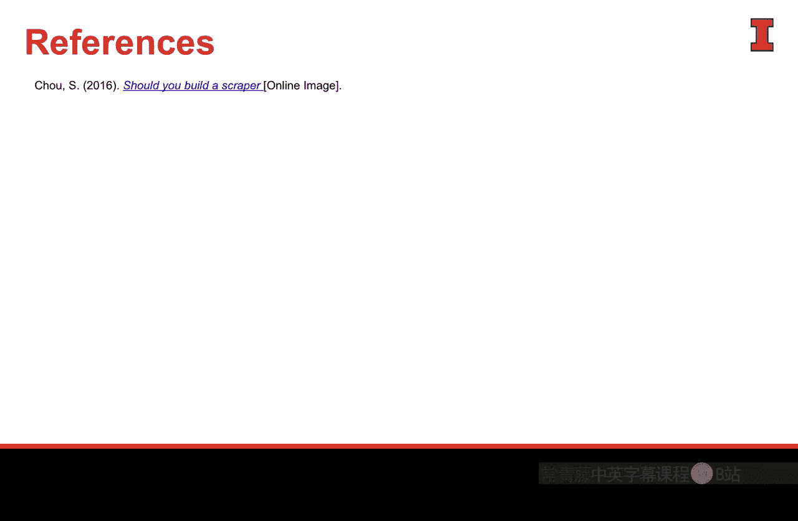

#  069：第二讲 第二部分 数据访问方法的评估


在本节课中，我们将要学习如何评估获取数据的几种主要方法。数据是商业分析的基础，了解如何高效、合规地获取数据至关重要。

上一节我们讨论了数据在商业分析中的重要性及其爆炸式增长。本节中，我们来看看获取这些数据的具体途径。

## 三种主要的数据访问方法

作为分析师，我们主要通过三种方式来获取用于数据沟通和分析的数据：批量下载、应用程序编程接口和网络爬虫。让我们逐一审视。

### 批量下载 📥

批量下载是指数据所有者为你提供了一个专门的地方来收集数据。这是一种受控的数据发布方式，既包括公司内部数据，也包括第三方数据下载站点。

这些批量下载区域通常是通过图形用户界面访问的数据表。这个界面是专门为了让你获取数据而构建的。数据所有者希望你获得这些数据，并为你搭建了获取桥梁。

这种方法使数据所有者能够决定发布哪些数据、保留哪些敏感信息。它还能让数据所有者限制你获取的数据量，并根据你的登录身份来区分访问权限。这是获取数据最简单的方式。

以下是批量下载的一些例子：

*   **美国人口普查数据**：通过“美国事实查找者”网站，可以非常简便地访问大部分人口普查数据。
*   **IMDB（互联网电影数据库）**：虽然隐藏得较深，但它也提供了一个供个人访问数据的批量下载源。
*   **Kaggle**：每周会通过邮件发送有趣的新数据库链接，这本质上也是批量下载。

### 应用程序编程接口 🔌

第二种访问数据的方式是API。API的核心思想是让计算机与计算机对话，建立机器对机器的连接。

为自己建立API连接需要一些脚本语言知识，并使用包含令牌和密钥的命令集进行安全访问。其设计初衷是全自动的机器对机器交互。

虽然分析师可以构建自己的API访问工具来获取数据，但通常我们想要的数据通过批量下载方式获取会更好。不过，API在某些情况下也能很好地工作。

例如，Google Maps API的脚本调用可能如下所示：
```python
import requests
response = requests.get('https://maps.googleapis.com/maps/api/geocode/json?address=YOUR_ADDRESS&key=YOUR_API_KEY')
```

实际上，与其自己编写API调用代码，你可以利用一些对用户友好的API封装网站。例如，**Tweet Binder** 提供了一个漂亮的图形界面来输入信息，它背后会调用Twitter API，获取数据并清洗干净后返回给你。这种方式虽然使用了API，但你是通过别人的图形界面访问的，比自行编写API脚本更高效。

### 网络爬虫 🕷️

第三种访问数据的方式是网络爬虫。在互联网早期，这曾是一种“黑帽”的数据获取方式，即偷偷获取所需数据。

如今，这种方法已不常使用。因为我们周围有如此丰富的信息，许多组织和数据所有者都愿意提供数据，几乎没有理由去爬取那些本不打算给你的数据。

Sophie Cho曾通过一个决策树矩阵来分析是否应该构建网络爬虫，结果几乎所有路径都指向“不要构建”。原因如下：

1.  如果你需要从HTML网页或其他来源爬取数据，通常意味着数据所有者没有为你打包好这些数据。
2.  如果数据所有者希望你拥有这些数据，他们会通过API或批量下载站点提供。
3.  这些数据通常受版权和其他许可协议保护。
4.  虽然有时复制粘贴HTML页面数据很容易，但更常见的情况是需要相当复杂的Python或其他语言编程才能获取你想要的数据，而这些数据可能本就不打算给你。

## 总结

本节课中，我们一起学习了分析师获取数据的三种主要方法：**批量下载**、**API**和**网络爬虫**。




总的来说，**批量下载站点**应该构成我们分析所用数据的绝大部分来源，无论是公开数据还是公司内部数据。**API**在某些情况下可以很好地工作。而**网络爬虫**，作为分析师，我们最好将其留在身后，优先选择更合规、更高效的数据获取方式。