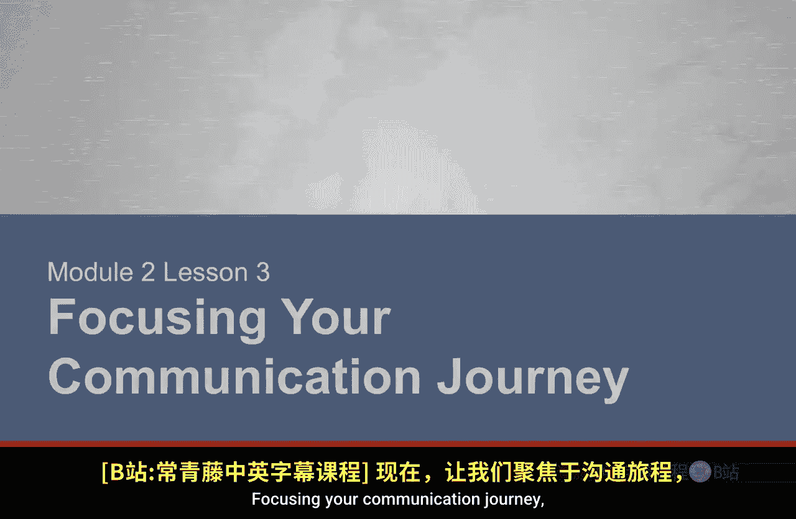
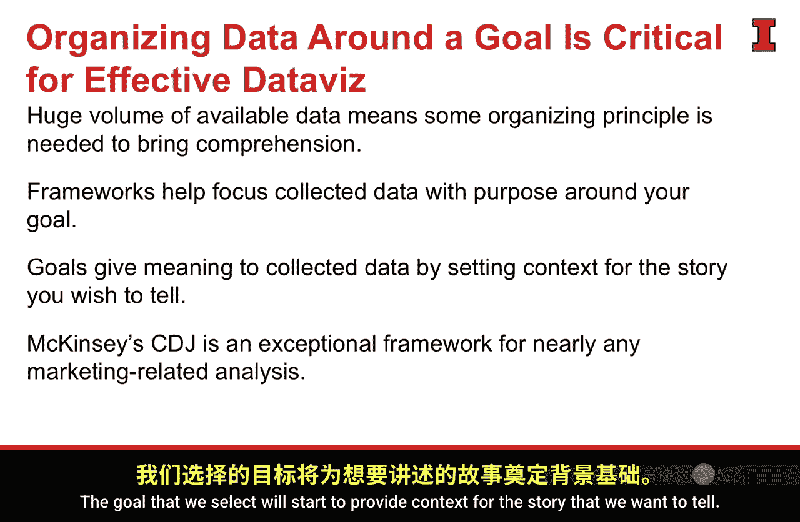

#  070：聚焦你的沟通之旅

在本节课中，我们将学习如何为你的数据可视化沟通设定明确目标，并引入一个强大的框架来组织数据和故事，确保你的分析工作高效且有针对性。

## 确立沟通目标 🎯

上一节我们介绍了沟通的重要性，本节中我们来看看如何为你的数据可视化沟通之旅确立一个清晰的目标。

为你的沟通和数据可视化设定一个目标至关重要。这个目标将使你在收集数据时保持专注。它为你要构建的叙事和故事赋予目的，将数据与最终目标连接起来。最终，这将为你节省大量时间，并让你作为一名分析师更加高效。这个目标，正如我们所见，是评估一个成功数据可视化框架中的关键要素。

## 五大商业目标 📊

作为一名商业分析师，你可以设定多种目标和目的。但总体而言，任何公司都拥有五个广泛的商业目标。这五个目标可以被认为是 **MECE** 的——即相互独立，完全穷尽。每一个目标都与其他目标截然不同，而它们共同构成了我们可能希望达成的所有目标。这些目标层次较高，但当你将世界上所有的商业目标归结为五个时，保持一定的概括性是必要的。

以下是五个核心的商业目标：
*   **建立品牌认知**
*   **影响购买考虑**
*   **优化销售流程**
*   **重塑品牌定位**
*   **培养客户忠诚**

这五个目标的美妙之处在于，它们可以通过一个简单的问题来清晰区分。你可以问自己：消费者是否回忆并认可我的品牌？如果没有达到你的期望，那么你就存在“建立品牌认知”方面的问题，公司应将“建立更好的认知”设为目标。以此类推，你可以为这五个目标中的每一个进行类似的诊断。

这五个目标将成为我们进行任何分析时的焦点。我们通常需要专注于其中**单一**的一个目标。虽然世界上任何公司都可能希望在这五个方面都做得更好，但当我们构建数据故事和叙事并试图保持专注时，选择一个单一目标是明智的。这并不意味着其他目标无关紧要，而是意味着我们当前的分析焦点是集中的。

## 引入组织框架：消费者决策旅程 🧭

有了目标之后，我们仍然需要理解所收集的大量丰富数据。这时，一个组织框架或哲学将大有裨益。当我在处理营销数据或面向商业目标分析消费者时，我最喜欢的框架是 **消费者决策旅程**。

这个框架源自麦肯锡的研究，旨在修订和振兴传统的营销漏斗模型。漏斗模型认为，消费者从众多公司开始，逐渐筛选，最终在购买前选定一家。然而，在数字时代，消费者能够获取海量信息，购买过程变得更加流动。从消费者的视角来看，漏斗模型实际上更像是一个我们称之为“消费者决策旅程”的循环过程。

这个旅程始于某个**触发点**。某件事促使消费者意识到需要一款产品，例如鞋子穿不下了、电脑坏了或汽车出故障了。这促使消费者进入市场购买新产品。

消费者将经历以下几个阶段：
1.  **考虑阶段**：消费者会想到一个“初始考虑集”，即立即浮现在脑海中的几个品牌。例如，想买新运动鞋时，可能会立刻想到阿迪达斯、耐克、彪马等。这并不意味着一定会购买它们，只表明这些品牌认知度最高，进入了初始考虑集。
2.  **评估阶段**：消费者开始评估各个品牌，新的品牌也可能在此阶段进入视野。随着获取新信息，消费者评估的品牌集合会动态变化。
3.  **购买阶段**：消费者最终做出购买决定。
4.  **购后体验阶段**：消费者评估产品是否达到预期，是否满足需求。
5.  **忠诚循环**：如果产品令人满意并成为所爱，品牌的目标就是让消费者进入“忠诚循环”。当下次产生同样需求时，消费者将跳过考虑和评估阶段，直接再次购买该品牌产品，并成为该品牌的倡导者。

这个框架非常有效，适用于任何购买决策，从房屋、汽车到一包口香糖。对于投资较小的商品，这个过程可能更快，但它很好地解释了消费者思考购买决策的方式。

## 目标与框架的结合 🔗

现在，这个框架如何与我们的目标结合呢？你可以将之前介绍的、与每个目标对应的五个问题，直接映射到消费者决策旅程的不同阶段。

例如：
*   如果我发现消费者无法回忆或识别我的品牌，我需要**建立品牌认知**。那么，我需要重点关注**考虑阶段**，让品牌进入消费者的初始考虑集。
*   如果我发现我生产的产品不符合目标消费者的需求，我需要**影响购买考虑**。那么，我需要改善品牌在消费者**评估阶段**的地位。

以此类推，每个目标都能在消费者决策旅程中找到对应的焦点阶段。根据最相关的目标，它能指引我关注旅程中的特定方向。

## 总结与意义 📝

本节课中，我们一起学习了如何为数据沟通设定清晰目标，并利用消费者决策旅程框架来组织分析。

目标与框架的结合，不仅聚焦了我们收集的数据，也聚焦了我们将要进行的分析，并最终聚焦了我们要讲述的故事。通过专注于一个单一目标，并将其与消费者决策旅程中一个非常具体和独特的节点联系起来，我们的工作将变得高效且有力。

这种实践对于有效的数据可视化和数据沟通至关重要。因为我们被海量数据包围，需要某种组织框架来理解它；我们也需要某种焦点来防止偏离轨道。周围的高数据量意味着我们必须建立这些机制。这些框架确实能帮助我们理解非常复杂的数据故事和数据收集过程，对它们进行分类，并最终找到一个可以讲述故事的切入点。同时，我们选择的目标将开始为我们想要讲述的故事提供背景。正如我所提到的，麦肯锡的消费者决策旅程框架，对于任何涉及营销或商业、涉及消费者的分析，都是一个极佳的组织框架，能帮助我理清目标并为分析指明正确方向。