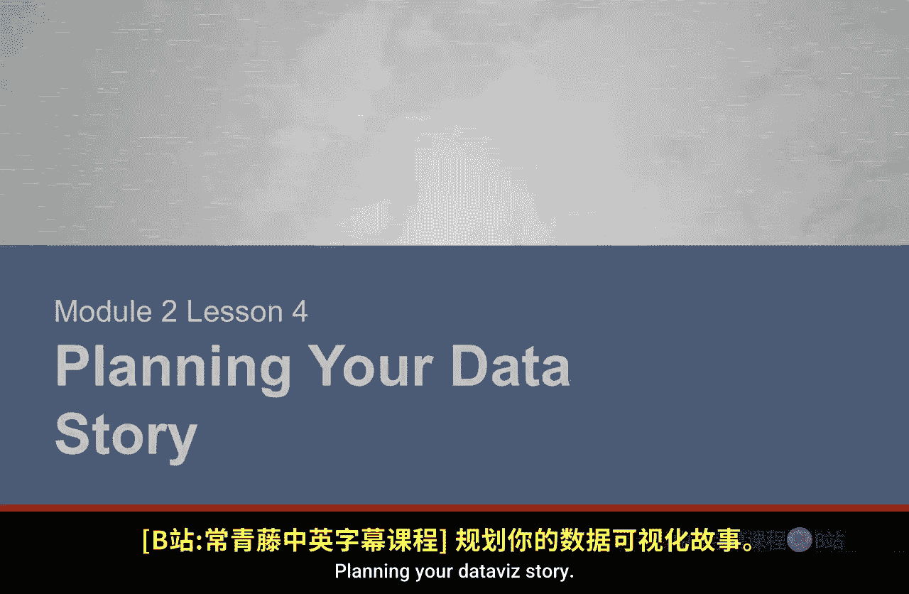
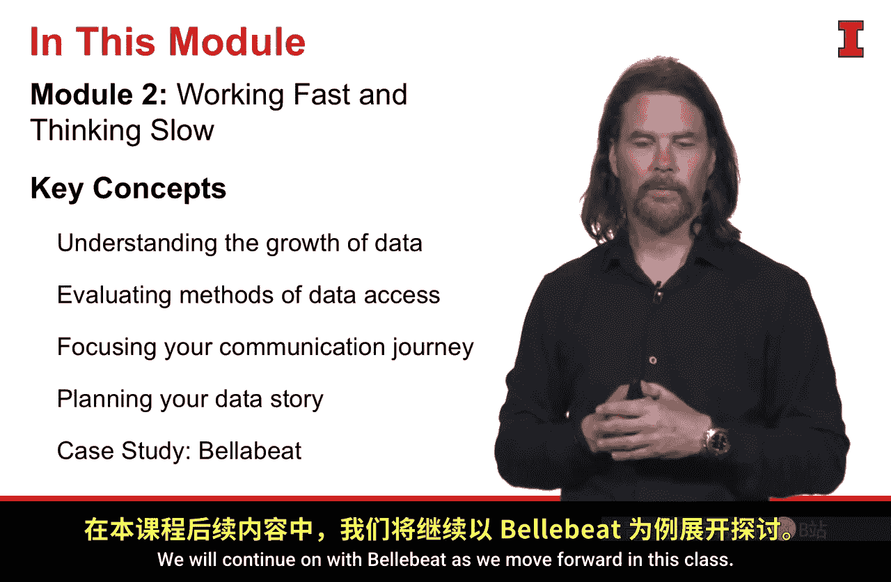

#  071：规划你的数据故事 📊

在本节课中，我们将学习如何规划一个有效的数据可视化故事。我们将探讨如何构建数据与目标之间的逻辑桥梁，并介绍一种强大的组织工具——明托金字塔原理，来帮助我们清晰地构建叙事。

## 从数据到故事

上一节我们讨论了如何设定清晰的目标。本节中，我们来看看如何将收集到的信息与我们的目标连接起来，形成一个连贯的故事。这个故事是创建成功可视化的关键部分，它充当了数据和目标之间的“结缔组织”。

在这里，组织至关重要。我们需要让所讲述的故事条理清晰，以便有效地与受众沟通，并高效地引导他们理解整个叙事。

## 介绍明托金字塔原理 🏛️

为此，我想向你介绍芭芭拉·明托。她是一位麦肯锡顾问，提出了一套出色的概念，称为“明托金字塔原理”。

该原理的核心思想是：**任何陈述都必须有事实支撑，并且该陈述必须是这些事实的完美总结**。

她还有几条具体规则：
*   **第一**，我们做出的陈述，必须是对其下方支撑要素的良好总结。
*   **第二**，用于支撑陈述的那些要素（事实），必须在某些方面具有相似性。它们应该是一个同类群体，例如都是“苹果”，而不是“苹果和橘子”。
*   **第三**，展示事实的顺序，应该让受众感到自然。我们可以按发生时间（从最早到最晚）、按规模大小（从最大到最小）等方式排序，总之要符合逻辑。

我之前使用过这个术语，而“相互独立，完全穷尽”的理念正源于此。明托原理要求我们：**在同一层级上的事实，应该是“相互独立，完全穷尽”的**。

当我们做到这一点时，我们就拥有了一个结构稳健、组织良好的故事。我们应该用这种方式来组织我们要讲述的故事。你不仅可以使用一个金字塔，还可以根据故事中的章节或要点数量使用多个。这种组织方式非常重要。

## 从规划到数据收集

这种组织方式也能在我们开始规划如何收集和使用数据时，为我们提供指引。如果我们还没有一个明确的陈述或一组事实，我们可以将那个陈述替换为我们设定的目标。

我们将目标以陈述的形式表达出来。这样，上一课讨论的目标就成为了我们追求的核心。我们可能还没有事实，但我们有假设和关键问题。因此，我们可以开始思考这些问题是什么，并将它们组合起来。

如果我们能正确地阐述这些问题，并确保整个结构符合“相互独立，完全穷尽”的原则，这将帮助我们构建一个稳健、扎实的故事。我们需要将应用于最终陈述和故事的相同规则，也应用到规划过程中。这将指引我们走向正确的方向，最终产出我们想要的故事。

对于每一个关键问题或我们提出的假设，我们都希望用某种数据来支撑。通过这种方式，我们可以制定计划去收集信息、收集数据，以证明或反驳假设，回答我们提出的关键问题，并最终汇总成某个陈述。所有这些内容都能在一个组织良好的故事中完美地结合在一起。

## 案例分析：Bellabeat公司

这听起来有些复杂，让我用一个例子来说明。为此，我想介绍一家名为Bellabeat的公司。这是一家真实存在的公司，我们将用它来进行说明。

Bellabeat生产高科技、设计精美的仪器，主要面向孕妇。你在这里看到的设备叫做“Shell”，它允许孕妇听到胎儿的心跳，也可以反过来向胎儿播放音乐。

他们还有其他设计精良的产品。左边是“Leaf”，它是一款看起来更像珠宝的活动追踪器。右边是“Balance”，这是一款支持蓝牙的智能体重秤。所有这些产品都设计精良并融合了先进技术，但大多数产品并不为人所知。

无论是Leaf、Balance还是Shell，Bellabeat都面临着一个认知度问题。消费者，尤其是育龄女性，不知道这些产品的存在。尽管这些产品可能满足她们的许多需求，但她们就是不知道。

基于这个目标，我们可以在明托金字塔框架下进行构建。

在金字塔的最顶端，我们放置“提升认知度”这个目标，并以陈述的形式表达：**为了增加Bellabeat的销售额（这是最终产出和目标），首先必须提升其品牌认知度**。这样，我们就以陈述的形式捕捉了我们的目标。

在目标下方，我们开始列出一些关键问题，这些问题将帮助我们确定Bellabeat提升认知度的计划或方法。为了确保我们有一组“相互独立，完全穷尽”的问题，我喜欢做的一件事是：**让一个问题以“是什么”开头，第二个以“如何”开头，第三个以“为什么”开头**。

如果我能就我的陈述回答“是什么”、“如何”和“为什么”的问题，我就知道我得到了一组相互独立的问题，并且对这个陈述有了非常全面和完整的视角。

在本例中，我会问：
*   **是什么**：Bellabeat目前的认知度水平如何？（这显然是重要的信息。）
*   **如何**：Bellabeat的认知度随时间发生了怎样的变化？
*   **为什么**：为什么认知度对Bellabeat的产品采用至关重要？（用以验证我们的前提。）

在每个问题下方，你可以看到，我可以阐明一个数据来源来帮助我回答这个问题。通过这种方式，我形成了一个可视化的提纲，用于规划我将要进行的沟通旅程。我知道我将使用的数据能回答问题，而这些问题将支撑最终的目标。

你可以看到所有这些元素在故事层面是如何完美契合的。

## 总结

本节课中，我们一起学习了如何规划数据故事。

*   我们看到了明托金字塔原理为我们组织数据故事提供了一个极佳的方法。它确保了我们做出的陈述都有事实支撑。
*   它引入了“相互独立，完全穷尽”的概念，确保我们传达的是可靠的观点。
*   其指导原则为任何故事提供了清晰、简洁的组织结构。
*   这也将确保我们收集数据的方法和所做的分析是可靠的，因为它成为了我们开始的计划。

在本模块中，我们探讨了多个方面：我们看到了数据的爆炸式增长，认识到现在正是学习如何用数据进行有效沟通的最佳时机；我们评估了获取数据的方法；我们学习了通过使用目标和目的来聚焦沟通旅程的方法；最后，我们通过明托金字塔原理，学习了如何开始规划数据故事，并以可视化形式勾勒出一个良好的提纲。我们使用Bellabeat的案例来具体说明这些概念，并在后续课程中将继续使用这个案例。