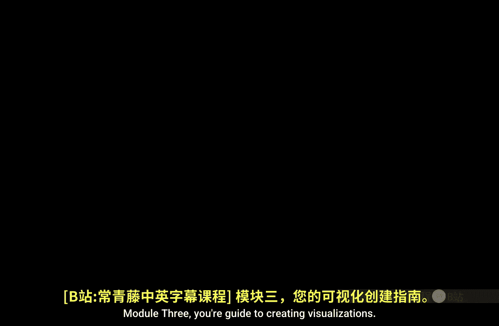
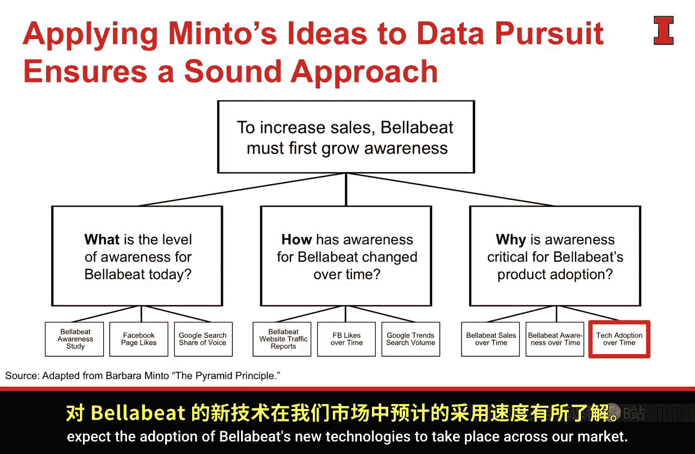
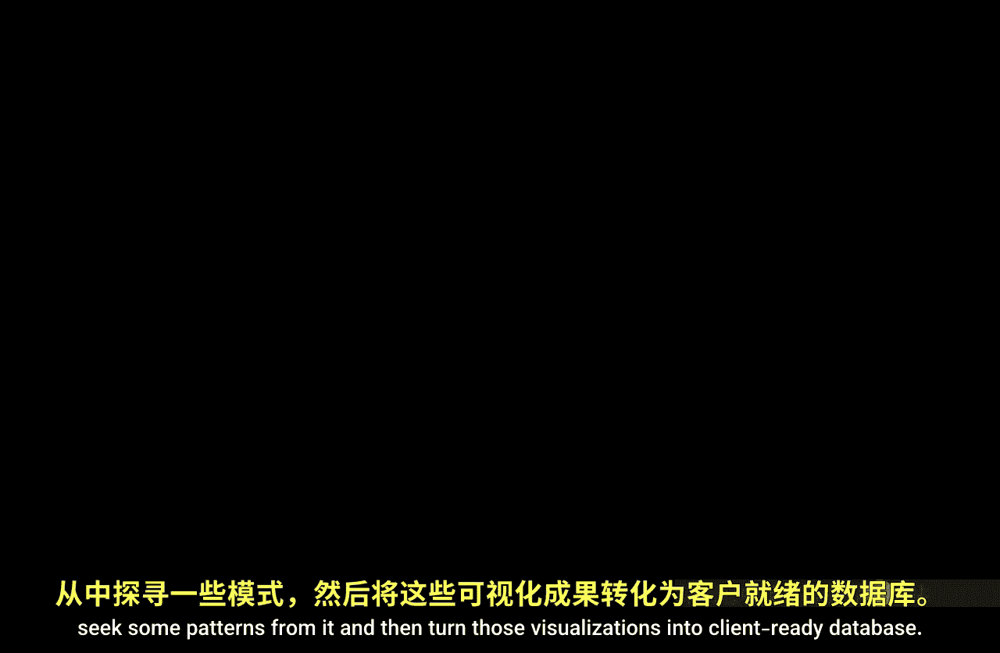

#  072：数据可视化指南 🎨

在本模块中，我们将深入学习如何创建有效的数据可视化。我们已经探讨了定义优秀数据可视化框架的许多要素，现在将重点聚焦于**视觉形式**本身。

## 模块概述

上一模块我们完成了故事框架的构建。现在，我们将利用Bellevby案例研究，专注于分析“技术采用随时间变化”的数据，以回答“为何认知度对Bellevbe产品采用至关重要”这一核心问题。通过本模块的学习，我们希望展示技术随时间的采用如何导致其成功，并为我们预测Bellevbe新技术在市场中的采用速度提供参考。

## 模块学习目标

以下是本模块将涵盖的几个关键概念：

1.  **在数据中寻找模式**：学习如何从数据集中识别有意义的趋势和规律。
2.  **规划可视化方法**：在开始创建图表前，进行有计划的思考和设计。
3.  **理解优秀视觉形式的构成**：掌握构成有效可视化图表的核心组件与原则。
4.  **引入一个分析框架**：使用一个系统性的框架来评估和构建可视化。
5.  **创建引人入胜的数据可视化**：学习如何让图表不仅清晰，而且具有吸引力和说服力。

## 学习路径

本模块将继续沿用之前指导我们的成功数据可视化框架。

在接下来的第一课中，我们将正式开始深入探讨**视觉形式**。从这节课开始，直到模块结束，我们的焦点都将放在视觉呈现上。

回顾Bellevby案例，我们已经完成了以下步骤：
*   确定了分析目标。
*   找到了关键业务问题。
*   为每个问题匹配了相应的数据源。

目前，我们手头拥有“技术采用随时间变化”的数据。我们将从分析这些数据开始，寻找其中的模式，最终将这些分析结果转化为可供客户使用的、专业的数据可视化图表。

---

**总结**：本节课我们一起学习了模块三的总体目标与学习路径。我们明确了本模块的核心是掌握**视觉形式**的设计，并将通过一个完整的案例，逐步学习从数据中发现模式、规划设计到产出专业图表的全过程。接下来，让我们开始第一课，深入探讨优秀视觉形式的构成要素。