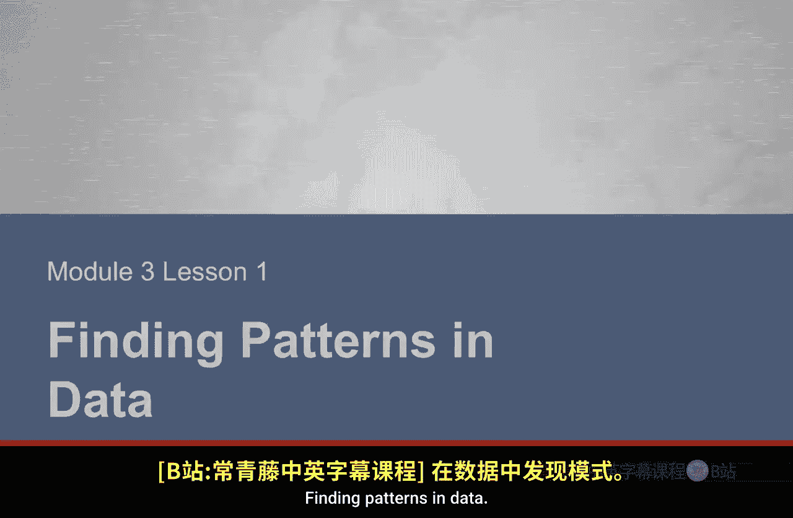
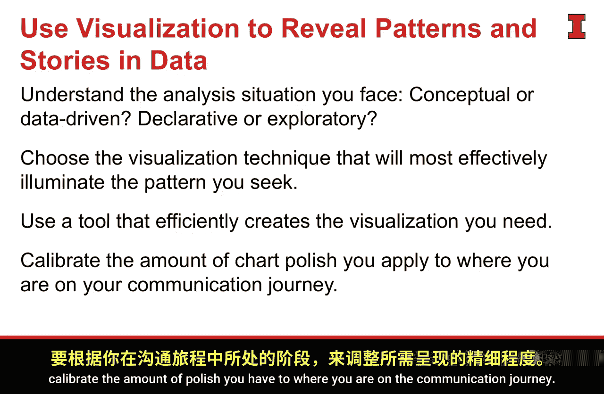

#  073：发现数据中的模式

在本节课中，我们将学习如何从数据中发现有意义的模式。我们将探讨数据可视化的目的，了解不同图表类型的适用场景，并学习如何根据分析阶段选择合适的可视化工具和技术。

---

## 概述：从数据到故事

现在我们已经拥有了数据，我们希望开始识别其中蕴含的“故事”。实现这一目标的最佳方式是**将数据可视化**，观察哪些模式会脱颖而出。通过可视化，我们能发现表格形式数据中难以察觉的信息。

但在深入之前，我们需要理解将要创建的不同图表类型。Baroninato 提出了一个很好的框架，通过回答两个关键问题来评估你处于沟通旅程的哪个阶段，从而决定应使用何种图表。

---

## 沟通旅程的评估框架

以下是两个关键问题：
1.  你目前处于**概念性**阶段还是**数据驱动**阶段？你手头有数据吗？
2.  你目前处于**陈述性**阶段（有明确信息要传达），还是仍在**探索性**阶段（仍在数据中寻找信息）？

根据你对这两个问题的回答，可以确定你在旅程中的位置，进而决定你需要投入的努力类型以及需要创建的图表类型。

---

## 图表类型的四象限框架

这两个问题很好地转化为一个 2x2 矩阵。在每个象限，你都将创建不同类型的图表。

*   **概念性 + 陈述性**：你试图通过概念而非数据来讲述故事。此时创建的图表被称为 **“想法说明”**。
*   **概念性 + 探索性**：仍在探索如何将概念可视化呈现给受众。这被称为 **“想法生成”**。
*   **数据驱动 + 探索性**：我们正在数据集中进行探索，试图寻找故事。这被称为 **“视觉发现”**。
*   **数据驱动 + 陈述性**：基于数据做出陈述性声明，我们有一个故事要讲，并希望呈现给客户或受众。这可以称为 **“日常数据”** 或“客户就绪数据”。

在本课程中，对我们更重要的是这个框架的右侧，即**数据驱动**的部分。我们将主要讨论两个不同阶段：要么处于**探索模式**（有数据但尚未知故事），要么处于**陈述模式**（故事已定，需要沟通）。这将对我们在数据可视化上投入的打磨时间产生重大影响。

---

## 当前目标：寻找模式

我们当前的目标仅仅是**寻找模式**，因此无需打磨这些可视化图表。我们将创建的是**工作产物**，仅供我们自己查看。它允许我们测试假设或回答我们提出的问题。

在寻找模式时，我们将关注五种不同类型的模式：

以下是五种关键的数据模式：
1.  **变化**：随时间的变化趋势或突然变化。
2.  **聚类**：彼此相似但与其他数据点不同的数据点集合。
3.  **相对性**：两个不同数据点之间的相互关系。
4.  **排名**：最好、最差、最高、最低以及中间的一切。
5.  **相关性**：一组数据如何影响或关联另一组数据。

这些模式中的每一种都可能揭示一个故事。

---

## 模式与可视化技术的匹配

当我们寻找这些模式时，某些可视化技术能有效地揭示它们。

例如，如果我们观察随时间的变化，**折线图**是一种很好的识别方式。**饼图**可能擅长描绘相对性，但它无法揭示变化趋势。将数据集放入饼图，无助于回答与变化相关的问题。

作为分析师，**识别用于回答问题的技术，并确保它们与问题相匹配**，这一点至关重要。

这种“变化类别”以及特定视觉形式适合每个独立类别的想法，并非数据独有。它也适用于概念性想法。当我们处理概念时，可能是在寻找描述、分类、结构、评估或流程。对于这些不同的概念性想法，都有一种有效的视觉形式，以及许多其他不适合该特定概念形式的视觉形式。同样，对于分析师而言，如果要揭示或陈述概念性想法，确保使用正确的视觉技术和视觉助记符来阐明观点非常重要。

---

## 案例实践：Bella Baby

让我们看看这个想法如何在实际中应用。我们将使用一直追踪的 Bella Baby 案例研究。目前，我们已拥有数据，并能够开始评估技术随时间的采用情况，以寻求回答“为什么认知度对 Bella Baby 很重要”这个问题。

如果我们获取这些数据并将其投入可视化，我们可能会使用的一种有效的视觉技术是**折线图**。从前面的讨论可知，这与我们的目标相符。该折线图将显示随时间推移的采用情况。从这个点出发，我们可以开始挑选出有趣的故事，这些故事要么能回答我们的关键问题，要么能让我们知道需要重新规划。

---

## 高效的可视化工具

此时，我发现一个有用的工具是 **R 语言**。我之前提到过 R，但 R 在高效处理和可视化大量数据方面表现出色。你可以快速创建箱线图、时间序列图、关系图、直方图等。借助 R 及其开发者社区的力量，你可以找到脚本和新的软件包（例如这里描述的 `GGally` 包），它们能实现其他程序无法做到的事情。在本例中，它可以在单个视觉图表中展示跨多种数据的巨大相关性，让你作为分析师清楚地知道故事在哪里，不在哪里。

---

## 核心要点总结

本节课中我们一起学习了从数据中发现模式的核心流程与原则。

这些对我们很重要，因为获取数据和数据故事最有效、最高效的方式就是**将数据可视化**并开始观察这些模式。要做到这一点，我们需要：
1.  **理解所处阶段**：需要明白我们处理的是概念性事务还是数据驱动事务；需要知道我们是处于陈述故事的状态，还是仍在探索。
2.  **选择匹配的图表**：对这些问题的回答决定了我们使用哪种图表类型。我们应用的视觉技术，无论是为了揭示还是最终传达模式，都需要与该模式相匹配。
3.  **掌握并应用技术**：因此，作为分析师，熟悉可用的技术并知道何时适当地应用它们非常重要。
4.  **选择高效的工具**：我们选择的工具应能非常高效地提供所需的视觉技术。此时，效率至关重要。我们不希望因为工具难以使用而在创建所需可视化时束手无策。学习那些能为你快速工作的工具，以便你能进入评估和分析的下一个阶段。
5.  **校准打磨程度**：最后同样重要的是，根据你在沟通旅程中所处的阶段来校准所需的打磨程度。当我们对数据集进行探索性分析时，视觉效果是否出色并不重要，因为我们不会将这些视觉图表展示给客户或利益相关者，它仅供我们自己查看。

一旦我们开始进入 Baronnato 所称的“日常数据”或“客户就绪数据”阶段，我们才开始应用那些打磨技巧，利用前注意属性，做那些能让信息快速被记住的事情。但在当前探索阶段，这不相关，不必要，只会拖慢我们的速度。