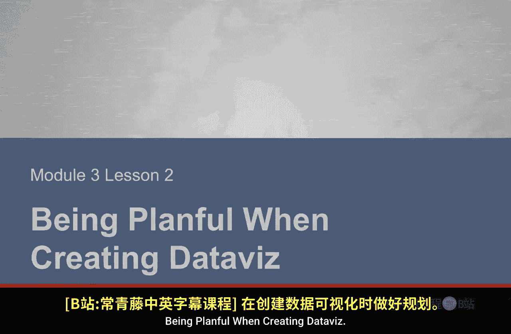
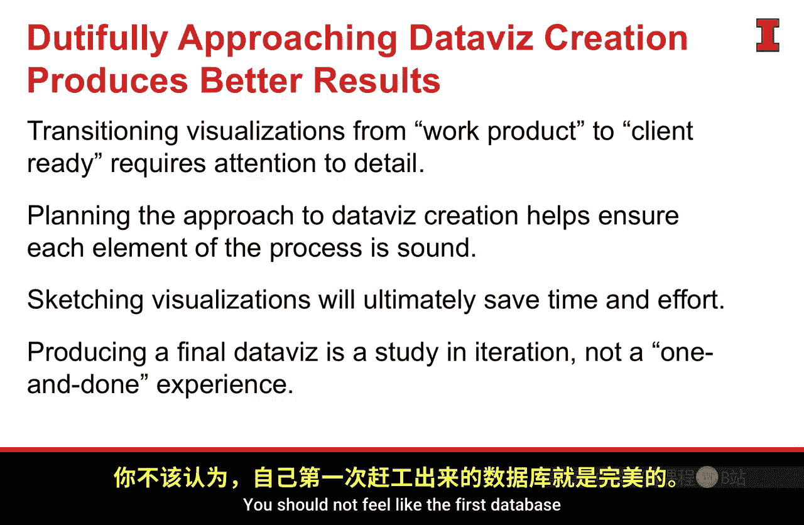

#  074：创建数据可视化的计划性 📊

在本节课中，我们将要学习如何从探索性的数据可视化，过渡到面向客户或利益相关者的“日常数据可视化”。我们将重点介绍一个系统性的计划方法，以确保最终的可视化成果清晰、有效且专业。

上一节我们讨论了数据可视化的基础，本节中我们来看看如何通过周密的计划来提升可视化产出的质量。

## 从探索到交付的转变 🔄

创建数据可视化时需要有计划性。我们现在正从探索性可视化，迁移到日常的、面向客户的数据可视化。

在进行这种转变时，我们的方法需要改变。我们需要开始投入更多注意力到细节上。我们需要为可视化应用更多的润色，因为这是我们将要呈现给利益相关者的成果。因此，在这类可视化上投入的努力需要提升一个档次。

我们正从视觉发现阶段，转向日常数据可视化。Baronnato 提出了一个非常可靠的计划，来指导我们如何完成这个过渡。

## 一小时计划法 ⏳

Baronnato 提出，如果有一小时来创建一个日常数据可视化，他会这样分配时间：

以下是时间分配的具体步骤：

1.  **5分钟准备**：用于创造所需的精神和物理空间，以便高效工作。
2.  **15分钟交谈与倾听**：用于获取更多背景信息，了解受众是谁，并明确需要通过可视化达成的目标。
3.  **20分钟草图绘制**：用于实际动手，在纸上绘制可视化的初步概念。
4.  **20分钟原型制作与改进**：用于在软件中创建原型，并进行迭代优化。

## 详解各阶段任务

上一节我们介绍了整体时间规划，本节中我们来详细看看每个阶段的具体任务。

### 第一阶段：准备 (5分钟)

这最初的5分钟，纯粹用于清空思绪，为接下来的工作做好准备。

### 第二阶段：交谈与倾听 (15分钟)

此阶段的目的是理解你需要达成的目标。你已经有了一个很好的洞察，认为自己有一个好故事，现在需要验证它。与同事合作，确保方向正确、路径无误。一旦确认，就可以开始实际开发。

### 第三阶段：草图绘制 (20分钟)

草图绘制是一项被低估的艺术。我们常常会带着想法，匆忙地打开应用程序，开始用电脑生成图形。然而，如果我们花点时间，用笔和纸将一些想法可视化，我们将不再受限于对软件包、应用程序或其本身功能的理解。我们可以自由设计，只依赖于自己的创造力。

伟大的数据可视化艺术家，如 David McCandless，正是这样做的。他使用笔和纸，起草他创作的每一个数据可视化。这是一个好习惯，能让你更高效，并最终在数据沟通方面做得更好。

### 第四阶段：原型制作与改进 (20分钟)

此阶段的理念是，你创建的第一个可视化不应该是最终版本，而是一个起点。然后，你可以在应用程序中开始逐步改进它。有一些技巧可以应用，让你在过程中逐步将其变得更好。

这一点很重要。我们常常感觉自己在为一个最终的数据可视化投入所有努力，但实际上，我们应该更多地将其视为一个流动的、迭代的过程。

## 核心要点总结 ✅

本节课中我们一起学习了创建高质量数据可视化的计划性方法。

*   **计划至关重要**：在从工作产出转向面向客户的数据时，需要更多关注细节。规划我们的方法并认真执行，能确保流程的每个环节都扎实可靠，最终构建出优秀的数据可视化。
*   **养成草图习惯**：用笔和纸进行草图绘制是一项被低估的艺术，你应该将其培养成个人习惯。这将节省你的时间和精力，最重要的是，当你在思考如何有效可视化数据及讲述数据故事时，它能让你打开创造力。
*   **迭代是常态**：制作最终的数据可视化是一个研究和迭代的过程，而非一蹴而就的经历。你不应觉得第一次做出的可视化就是正确的。发布一个可视化版本，使用它，应用我们将在课程后面讨论的一些工具使其越来越好，真正将其视为一个鲜活的、可迭代的数据可视化。