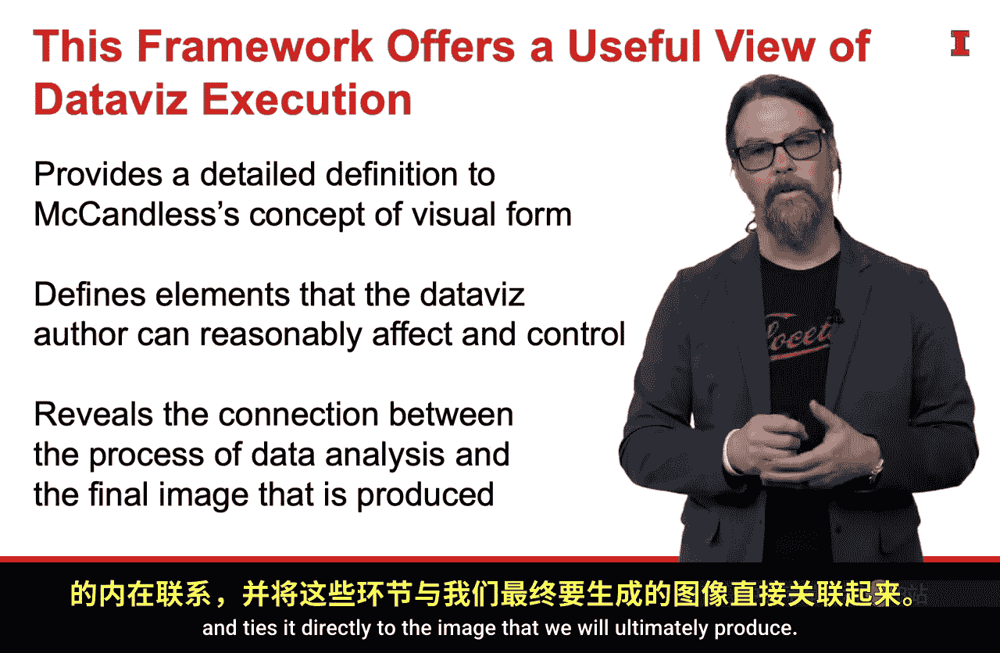

#  075：第三讲 第三部分 视觉形式的构成要素 🎨

在本节课中，我们将要学习构成优秀数据可视化“视觉形式”的三个核心要素。到目前为止，我们一直在使用一个框架来展示成功的数据可视化所需的所有不同元素，但我们尚未深入探讨“好的视觉形式”究竟意味着什么，也未曾给出明确的定义。这正是我们现在要讨论的内容。

## 框架回顾

以下是我们一直在使用的框架。其中每一个元素都至关重要，只有当它们全部存在且都成功实现时，可视化才能发挥作用。

视觉形式这个概念，即我们与受众沟通时所创建的实际图像，非常重要。但到目前为止，我们并不清楚什么构成了好的视觉形式，什么没有。因此，我希望在此提供一个定义。

## 优秀视觉形式的三要素框架 🧩

当我们思考什么造就了好的视觉形式时，一个包含三个部分的框架可以帮助我们回答这个问题。好的视觉形式包含三个不同的要素：

1.  **清晰的含义**
2.  **对比的巧妙运用**
3.  **精致的执行**

上一节我们回顾了整体框架，本节中我们来看看构成优秀视觉形式的具体要素。以下是每个要素的详细说明：

*   **清晰的含义**：它清晰地传达了预期的洞察，即我们费尽心力从数据中提取出的核心见解。
*   **对比的巧妙运用**：它能将受众的注意力吸引到我们希望他们看到的图表元素上，并使其远离那些我们不希望他们花费过多时间的干扰性元素。
*   **精致的执行**：它为视觉呈现增添了许多润色，体现了对细节的高度关注，同时也有助于让受众专注于重要的内容，而不被页面上那些不那么重要的元素分散注意力。

## 框架的重要性与关联 🔗

这个框架之所以重要，有多个原因。我尤其欣赏它如何与最初的麦肯锡五步法框架中的视觉形式要素联系起来。

这种联系非常直接。我们正是选取了麦肯锡框架中的“视觉形式”这一元素，并在其内部定义了构成优秀视觉形式的要素。

此外，该框架还揭示了数据分析过程（数据收集、设定目标等我们迄今讨论的所有重要环节）与我们最终将生成的图像之间的直接联系。

## 总结 📝

本节课中，我们一起学习了评估数据可视化“视觉形式”质量的三个核心要素：**清晰的含义**、**对比的巧妙运用**和**精致的执行**。理解并应用这个三要素框架，能帮助我们将分析过程中的核心洞察，有效地转化为一幅能精准传达信息、引导受众注意力且制作精良的视觉图像。