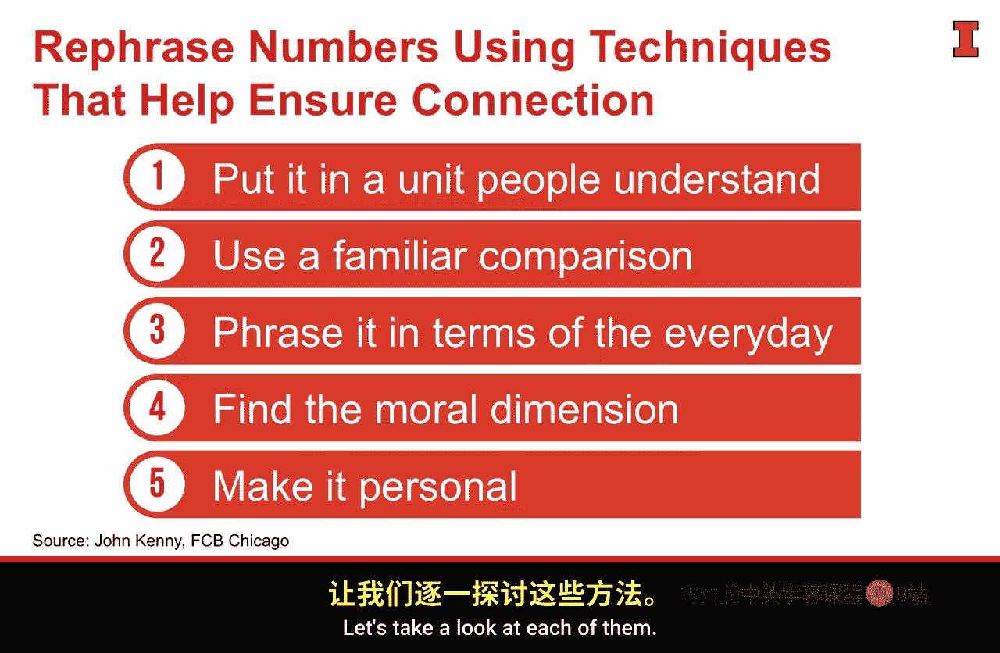
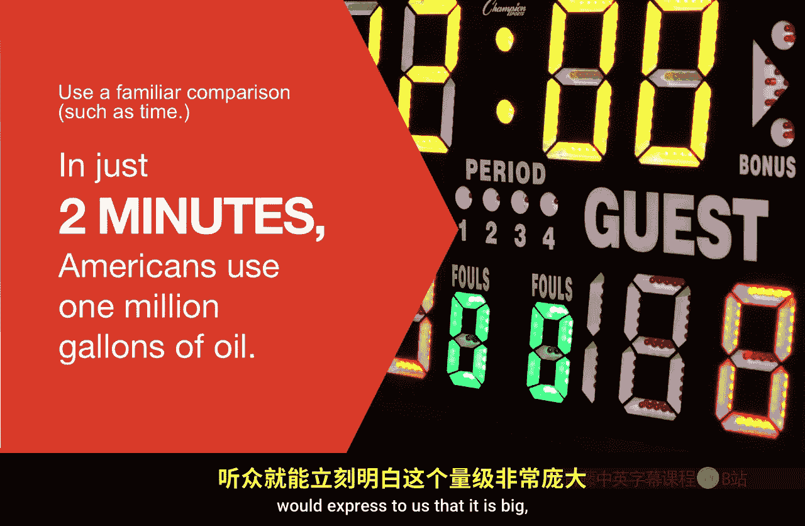

#  076：通过连接丰富内容 📊

在本节课中，我们将学习如何通过建立连接来丰富数据故事和数据可视化的内容。核心在于如何将冰冷的数字转化为能与观众产生情感共鸣的、富有意义的信息。

---

上一节我们讨论了构建数据故事的整体流程。本节中，我们来看看如何确保我们呈现的内容是“丰富”的。正如唐娜·王（Donna Wong）的框架所强调的，好的视觉形式包含多个要素，而“丰富的内容”是其中关键的一环。

安妮·沙利文（Anne Sullivan）有一句名言：“世界上最好、最美的事物，无法被看见或触摸，只能用心去感受。”这句话提醒我们，仅仅向观众罗列事实和数字，无法与他们建立情感连接，也无法产生我们期望的影响力。

我们可以通过发展丰富的内容来实现这种连接。其中，数字的表达方式至关重要，它决定了我们是否能与观众建立深厚的情感联系。让我们看一个例子。

> 美国每年消耗77.1175亿桶原油。

这只是一个纯粹的事实。虽然数字看起来很大，但我们缺乏上下文，难以理解其真正含义。对于大多数人来说，“百万”、“十亿”这些概念是抽象且难以感知的。抛出这样的数字，往往会让听众感到茫然。

因此，我的朋友、芝加哥FB公司的首席策划师约翰·肯尼（John Kenny）提出了五种不同的方法来构建或定位数字，以确保你能建立情感连接，确保我们使用的是丰富的内容。

以下是五种构建数字情感连接的方法：

1.  **使用易于理解的单位**：将数字转化为人们熟悉的物品单位。
    *   **示例**：美国人每天使用的石油足以制造**360亿个塑料水瓶**。

2.  **使用熟悉的比较（距离）**：将数字与众所周知的远近距离进行比较。
    *   **示例**：美国人每天使用的石油足以完成**39次往返太阳的旅程**。

3.  **使用熟悉的比较（时间）**：将数字与一段易于感知的时间框架联系起来。
    *   **示例**：美国人每**两分钟**就消耗**100万加仑**石油。

4.  **关联日常生活**：将数字与人们日常可见或使用的物品进行对比。
    *   **示例**：美国人每天消耗的石油是消耗水量的**48倍**。

5.  **发掘道德维度**：揭示数字背后的伦理或长期影响（需谨慎使用）。
    *   **示例**：不到**四十年**，世界有限的石油供应将**永远耗尽**。

6.  **使数字个人化**：将庞大的总数分解到个人或家庭层面。
    *   **示例**：一个典型的**美国家庭一年**要消耗**70桶**石油。

---

在谈论数字时，运用以上五种技巧之一，可以使数字更易于理解、更具冲击力，从而确保我们确实在使用丰富的内容，并在与观众交流时建立情感连接。

这种情感连接对我们至关重要，因为我们正试图通过建议来影响观众或与他们建立联系，以实现某个目标。事实上，正是情感为图表赋予了意义。孤立的数字很少能做到这一点，也几乎无法承载我们期望的影响力和情感。将**数字**与**情感**结合使用，将对我们的观众产生更深远的影响。

我们之前经历的数据收集、目标确定、故事构建这一流程，本身就有助于确保我们在故事中融入丰富的内容。如果我们拥有深入可靠的数据、清晰的目标和精彩的故事，许多要素就已经具备。然而，运用肯尼介绍的这些技巧，将确保我们在呈现这些数字时，能最好地利用情感和可理解性。

---

本节课中，我们一起学习了通过五种具体方法（使用熟悉单位、距离/时间比较、关联日常、发掘道德维度、个人化）将抽象数据转化为富有情感和意义的“丰富内容”，从而与观众建立更深层的连接，提升数据故事的影响力。