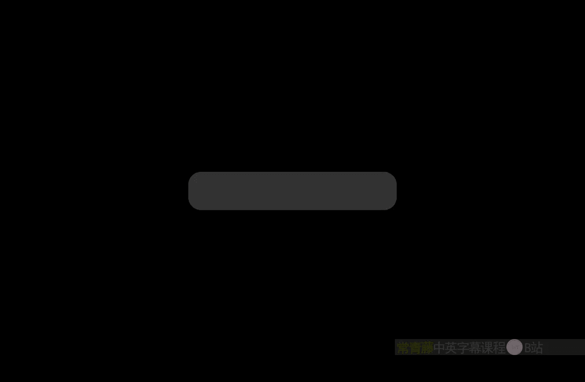
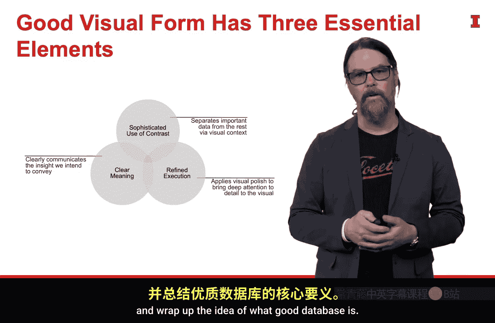

#  077：模块四概述 🎯

在本模块中，我们将学习如何有效地传达数据故事。我们将探讨如何通过对比来丰富内容，运用专业指南提升图表的精致度，并动手优化一个实际图表。最后，我们将介绍一个流程，帮助您进行有影响力的数据可视化演示。

---

上一节我们回顾了数据可视化的核心框架。本节中，我们将深入探讨模块四的具体学习目标。

模块四的核心是“有效传达你的故事”。我们将在此讨论几个重要概念。

第一个概念是**通过对比丰富内容**。其核心思想是：利用对比将观众的注意力引导至我们希望他们关注的元素上，同时使其远离那些分散注意力的干扰元素。

以下是运用对比的关键方法：
*   **颜色对比**：使用显著的颜色突出关键数据点。
*   **大小对比**：放大重要图形元素以强调其重要性。
*   **位置对比**：将核心信息置于视觉中心或显著位置。

接下来，我们将探讨**如何为图表增添精致度**。这里会借鉴Donna Wong提出的一些卓越指南。这些指南能为我们的视觉作品增添大量润色，将其从“良好”提升至“卓越”，并帮助我们更高效地与观众沟通。

然后，我们将进行**实践操作**。我们会选取一个相当糟糕的图表，并逐步改进它。在这个过程中，我们将实际应用之前讨论的所有指南和框架。

最后，我们将聚焦于**数据可视化演示**。我们将介绍一个流程，以确保演示能以 impactful 的方式与观众建立连接，并确保他们能够理解，从而准确传达我们的意图。

---

为了巩固我们讨论过的概念，让我们回顾一下 **Mcans框架**。该框架指出了优秀数据可视化的四个要素。

我们花了大量时间讨论如何收集信息、构建故事、确定目标，并将所有这些整合成一个能够传达信息的视觉形式。然而，该框架的局限在于，它并未深入探讨什么是“良好的视觉形式”。

这一点至关重要，因为在我们的流程中，我们已经完成了视觉探索，并在数据中发现了模式。现在，我们正处于Baronatto所说的“日常数据”阶段，或者可称之为“客户就绪数据”阶段。我们希望向客户展示的视觉作品，能够立即传达我们所发现的洞察。

为了实现这一目标，我们需要了解什么是良好的视觉形式。这正是以下框架发挥作用的地方。

这个三叉框架的核心思想包括：
1.  **清晰的意图**
2.  **精妙的对比运用**
3.  **精致的执行效果**

关于“清晰的意图”，我们已经讨论过。现在，我们将深入探讨这个三叉框架的最后两个要素，并总结优秀数据可视化的要义。

---

本节课中，我们一起学习了模块四“有效传达你的故事”的核心目标。我们明确了将通过对比吸引注意力、运用专业指南提升图表质量、动手优化图表以及学习有效演示流程来达成这些目标。接下来，我们将逐一深入这些主题。