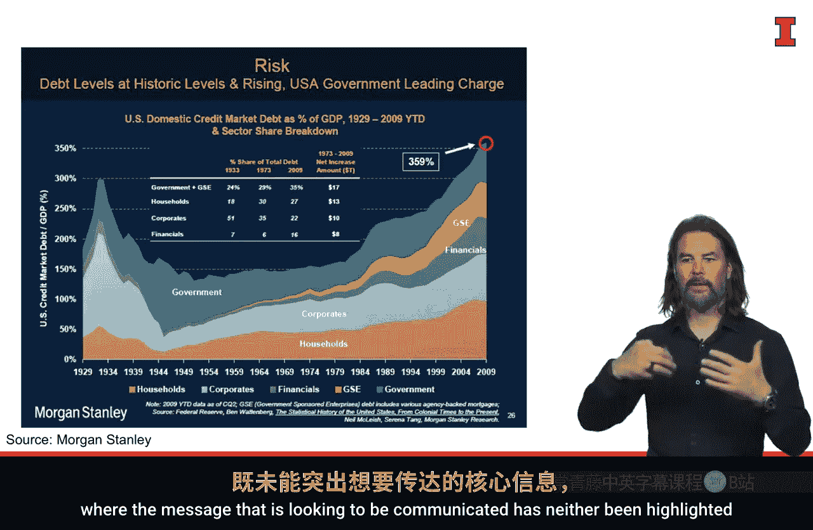
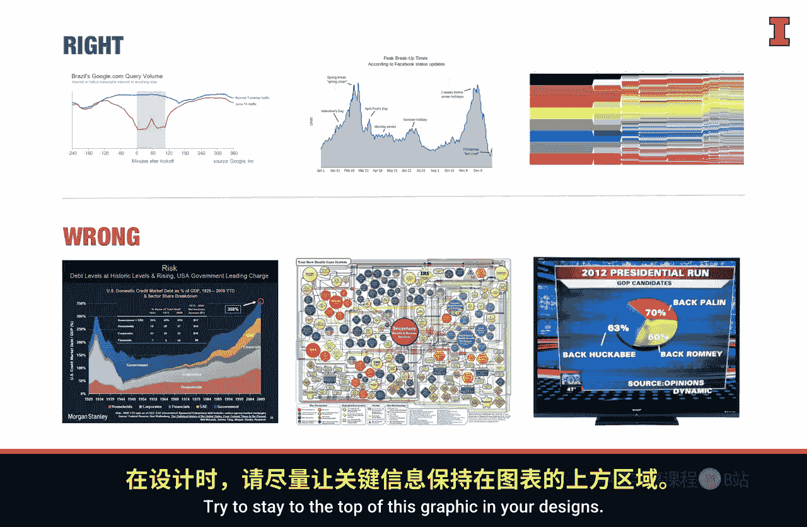
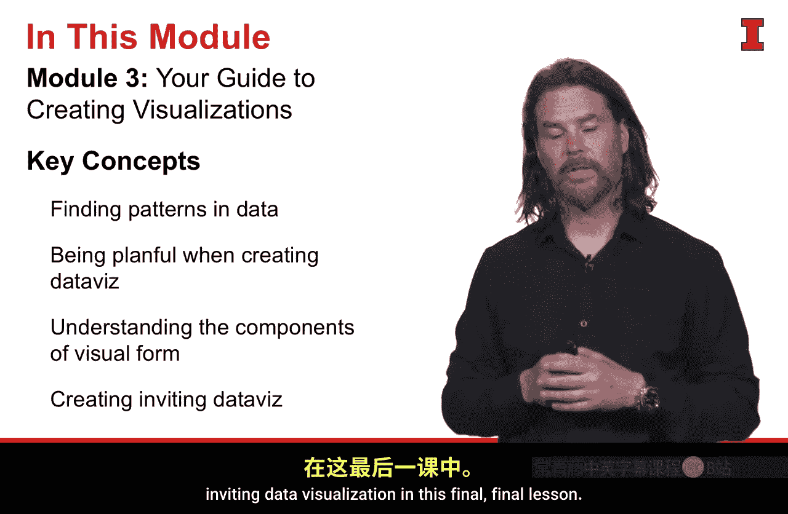

#  078：制作吸引人的数据可视化 📊

在本节课中，我们将学习如何制作吸引人的数据可视化。我们将重点探讨唐娜·王提出的视觉形式构成要素，并深入理解“吸引人的可视化”所遵循的三条核心规则。通过正反案例的对比，你将掌握如何让你的图表更清晰、更有效地传达信息。

---

上一节我们介绍了视觉形式的概念，本节中我们来看看如何制作一个真正“吸引人”的数据可视化。

一个吸引人的数据可视化遵循三条核心规则。这些规则是：
1.  **突出核心信息**。
2.  **消除干扰元素**。
3.  **运用视觉引导和对比**来吸引读者注意力，并引导他们关注数据中的重要部分。

现在，让我们逐一详细探讨这些规则。

## 突出信息与消除干扰 🎯

这条规则要求你的图表必须清晰地传达核心观点，并移除一切无关的视觉元素。

以下是谷歌的一个优秀案例。这张图表非常简洁明了。

它展示了巴西在普通星期二（蓝色线条）与6月15日（世界杯开赛日，橙色线条）的谷歌搜索量对比。图表清晰地突出了你应该关注的信息：在比赛开始和进行期间，搜索量急剧下降；在半场休息和比赛结束后，搜索量又迅速回升。这张图表有效地突出了信息并消除了干扰。

相反，下图是摩根士丹利的一个反面案例。

这张图表包含了太多元素：彩色面积图、内嵌的表格、带框的数字、箭头和文本。过多的信息淹没了读者，核心信息既未被突出，干扰也未被消除。左侧的图表正确示范了如何突出信息，右侧的图表则展示了错误做法，两者的区别非常明显。

## 运用视觉引导 👁️

上一节我们强调了突出核心信息，本节我们学习如何运用视觉线索主动引导观众理解你的洞察。

视觉引导能像路标一样，指引观众的视线，帮助他们快速抓住重点。

以下是运用视觉引导的一个绝佳案例，它使用了Facebook关于状态更新的数据。

图表通过**直接标注**，明确指出了我们应该关注的区域和有趣的数据点。作为观众，我能立刻知道该看哪里、看什么，以及能从中获得什么结论。

下图则是一个完全错误的示范，它展示了一个医疗系统的信息图。

它极其杂乱，没有任何视觉线索能帮助我浏览或解读这张图。我无法知道应该寻找什么洞察。因此，我们应该追求左侧图表的设计，而避免右侧图表的设计。

## 运用对比吸引注意力 ⚡

我们学习了如何引导观众，最后一条规则是利用强烈的视觉对比来第一时间抓住读者的注意力。

对比可以通过**大小**或**颜色**来实现。

以下是蜡笔品牌绘儿乐完美运用颜色和大小对比的案例。

即使不看文字，你也能理解这张图：它展示了从1903年公司成立至今，一盒绘儿乐蜡笔中典型颜色的数量变化。颜色的丰富度和图形的大小形成了鲜明的视觉对比，清晰地传达了信息。

下图则是一个未遵循此规则的案例。

首先，在饼图中仅使用高饱和度的原色并非明智之举，这里的对比过于强烈且刺眼。更重要的是，各扇区的大小非常接近，缺乏足够的**大小对比**来有效运用这一视觉技巧。此外，饼图的各扇区之和应为100%，这也是一个基本要求。因此，这是一个所选视觉技巧与故事本身不匹配的案例。

综上所述，我们看到了正确与错误运用这些规则的案例。

你可以通过关注以下问题，将这些规则融入你的设计习惯中：
*   我是否突出了核心信息？
*   我是否消除了干扰元素？
*   我是否运用了视觉引导来带领观众理解我的洞察？
*   我是否运用了对比？我运用得好吗？

## 案例研究：Bellevbe 📈

现在，让我们看看这些规则如何在Bellevbe的案例研究中得到应用。

我们最初用折线图可视化了数据，并从中发现了一些模式。对于这些数据，我们可以有多种处理方式。正如之前讨论的，我们可以先勾勒出不同的视觉形式草图，看看哪种最能传达信息。

我们可以很容易地通过使用**颜色**来引入一些对比，并通过移除一些杂乱元素来清理图表。

像这样的可视化确实能讲述一个故事，但它是一个宽泛的故事，可能并非我们真正想讲述的那一个。

因此，下图来自Sity.com的方案，以更清晰、更简洁的方式捕捉并表达了我们想要传达的全部含义。

这张图表明显**消除了干扰**。在后续工作中，我们会希望采用这样的可视化来讲述我们想要的故事，并剔除那些与故事无关或对结果没有影响的数据部分。

---

## 总结 📝

本节课中我们一起学习了如何制作吸引人的数据可视化。

在本模块中，我们涵盖了大量内容：
*   我们讨论了从数据中发现模式的能力，以及如何使所使用的视觉技巧与我们寻找的模式类型相匹配。
*   我们谈到了在创建数据可视化时要具有计划性，特别是在制作面向客户的或日常使用的图表时。当我们想要讲述一个故事时，需要投入大量注意力到细节中，而有计划的方**法**能帮助我们做到这一点。
*   我们理解了**视觉形式**的概念及其构成要素，探讨了什么是好的视觉形式，并引入了唐娜·王的框架，该框架指出有三个不同的基本要素。
*   在最后的课程中，我们深入探讨了第一个要素：**创建吸引人的数据可视化**，并学习了实现它的三条具体规则。

通过掌握这些原则并不断实践，你将能够创建出更有效、更引人入胜的数据可视化作品。

