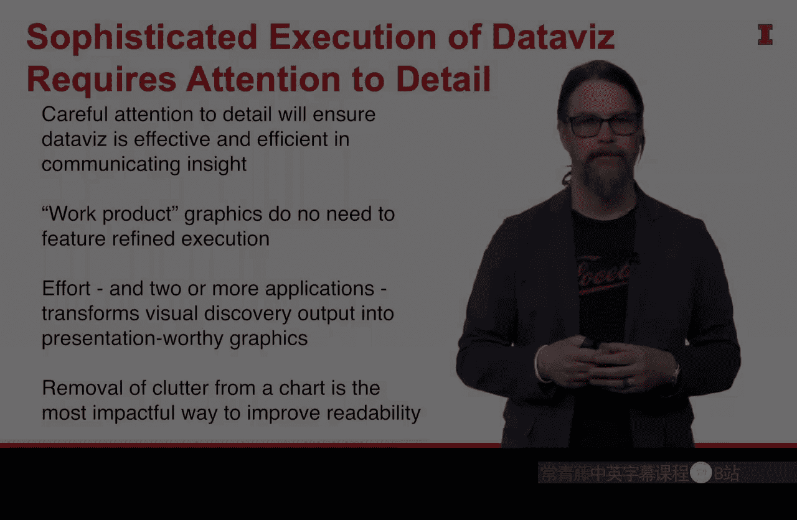

#  079：为图表增添精致感

在本节课中，我们将学习如何通过关注细节，使数据图表在传达洞察时更加有效和高效。我们将深入探讨唐娜·王（Donna Wong）提出的视觉设计准则，这些准则能帮助我们提升图表的视觉表现力。

之前我们讨论了良好视觉形式的两个要素：**清晰的意图**和**巧妙的对比运用**。现在，我们进入第三个要素：**精细的执行**。

## 从探索到呈现：图表的两种形态

当我们处于数据探索模式，试图发现洞察时，R语言是一个极佳的工具。它能快速高效地处理海量数据，并呈现出有助于我们发现故事的规律。

然而，我们绝不应该直接将R生成的原始图表呈现给观众。即使故事对我们自己很清晰，但未参与数据收集和分析过程的观众，可能只会看到一条杂乱的折线，而无法理解其含义。

因此，我们需要对图表进行“润色”，将其转化为巴罗纳托（Baronato）所说的“日常数据”图表，或者我称之为“客户就绪”的数据可视化。R在这个过程中仍扮演重要角色，但通常用于创建更接近下图效果的视觉输出。

上图展示的是伦敦的自行车骑行路线。线条颜色越深，代表该路线的使用频率越高。这张图的核心部分（线条网络）由R生成，R凭借其强大的功能和丰富的扩展包，能够完成这类复杂的分析。

但在获得R的输出后，我们通常会将其导入第二个平台或独立的程序进行清理和增强。例如，在上图中，我们在R生成的骑行路线下方添加了伦敦的地图，这为抽象的线条提供了地理背景。此外，我们还添加了主标题、副标题和其他信息，使图表能更有效地传达信息。

## 学习唐娜·王的视觉准则

掌握这些增强元素需要时间。唐娜·王说得很好：我们并非一开始就能写出社论，而是从学习字母开始。在应用这些视觉准则时，我们也应采取同样的学习态度。

唐娜·王提出的准则非常详尽，它们真正区分了优秀和卓越的视觉作品。有些准则可能与你整个职业生涯中养成的制图习惯相悖，但我想告诉你，如果采纳她的建议，你将能持续创作出出色的数据可视化作品。

唐娜·王的所有建议，核心目标都是提升我们所创图表的**可读性**。这包括：
*   **字体选择**与**文本排版**的方式。
*   我们之前讨论过的**直接标注**理念。
*   创建**简洁的折线图**：避免使用数据点标记，永远不要使用虚线，而是运用不同的颜色元素来形成对比，力求图表线条干净、信号清晰。

她的准则列表很长，初次尝试应用时，有些可能显得古怪。但只要我们坚持培养这些习惯，我们的图表就会越来越好。这正是**精细执行**和为视觉作品增添**润色**的力量所在。

## 关键要点与总结

以下是几个需要思考的重点：

**精细的数据可视化执行确实需要高度关注细节。** 这种对细节的谨慎关注，能确保我们的数据可视化在传达洞察时既有效又高效。这正是我们所期望的——我们不希望观众需要费劲思考我们呈现的图表。

**用于探索的工作图表无需精细执行。** 这些视觉作品仅用于我们发现数据模式和寻找故事，此时我们只希望尽可能快速、高效地创建它们。在找到故事之后，我们才会投入精力，通常使用两个或更多应用程序，将这些图表转化为值得展示的形式。

**在唐娜·王的所有准则中，最重要的是“去除图表中的杂乱”。** 这是提升可读性最有效的方法。去除杂乱能排除那些会分散观众对主要观点注意力的元素，帮助我们将焦点集中在图表中少数几个想要传达的重要元素上，从而清晰地向观众传达洞察。

本节课中，我们一起学习了为图表增添精致感的重要性。我们了解到，从数据探索到最终呈现，图表需要经历一个“润色”过程。通过引入唐娜·王的视觉设计准则，特别是关注细节、去除杂乱和提升可读性，我们可以将原始的、仅自己可见的分析图表，转化为能够清晰、高效、自信地向客户或观众传达洞察的“客户就绪”型可视化作品。