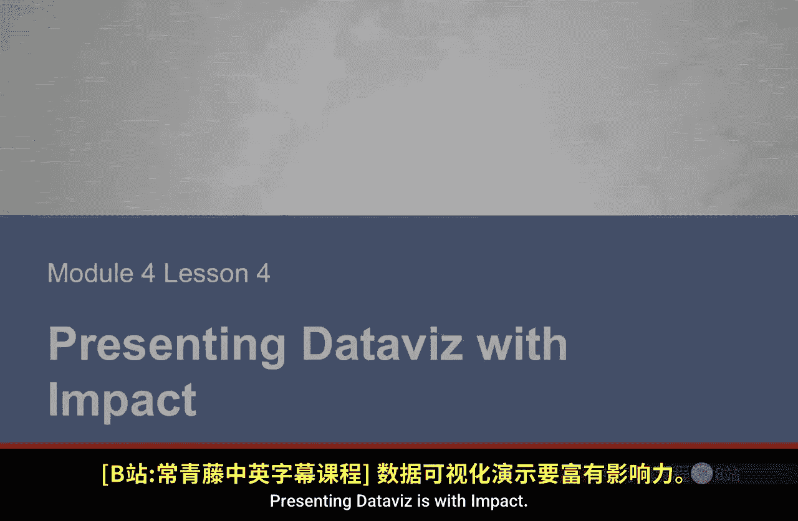
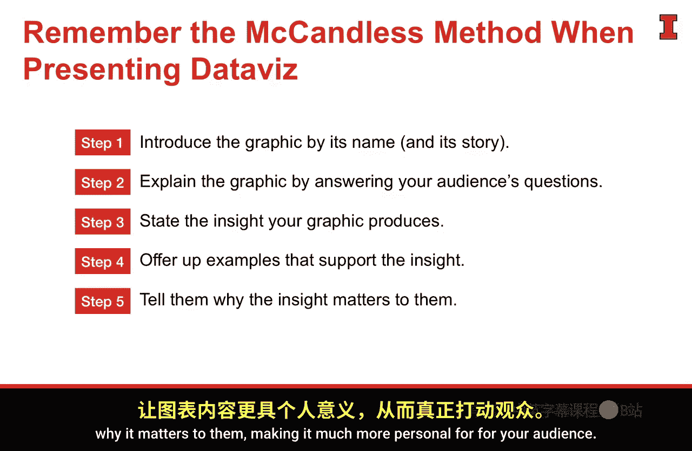
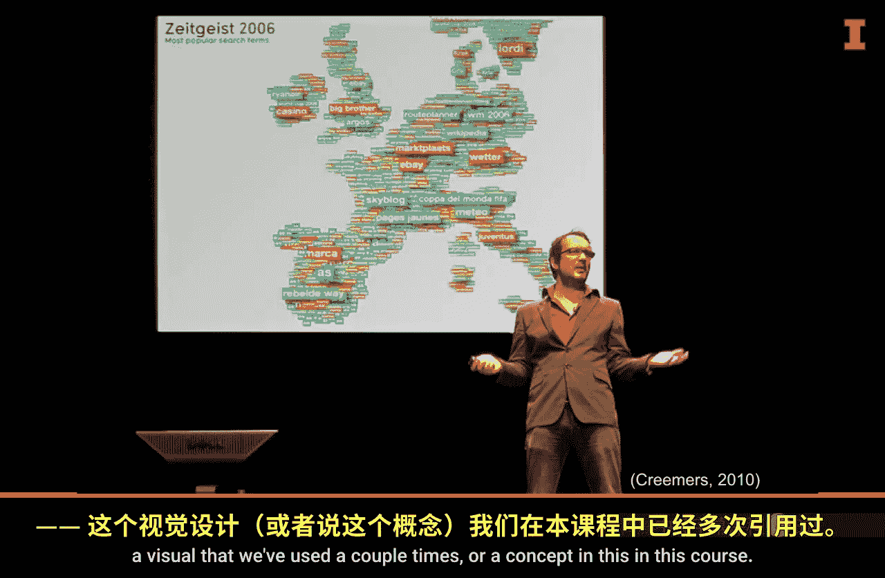
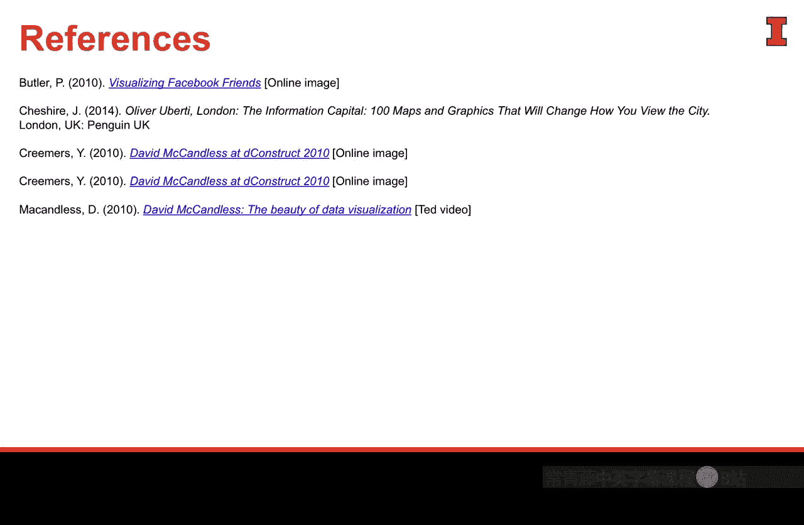

**商业分析：4-4：有影响力的数据可视化展示**

在本节课中，我们将学习如何有效地口头展示和沟通数据可视化。这是整个沟通旅程的最后一步，确保我们精心准备的分析成果能被听众清晰理解并产生影响力。

---

### **概述：沟通旅程的最后一步**

我们已经完成了数据收集、目标确定、故事构建，并通过可视化发现了关键模式。我们还对图表进行了润色，使其达到交付标准。现在，最后一步是站在听众面前，有效地展示这些可视化成果。

为了确保沟通效果，我们可以遵循一个结构化的方法。接下来，我们将介绍一个由David McCandless启发的五步法，它能帮助你清晰、有力地展示任何图表。

---

### **五步展示法：McCandless方法**

以下是展示数据可视化的五个关键步骤。这个方法能引导听众的注意力，并确保你的核心信息被准确接收。

**第一步：介绍图表名称**
首先，为你的图表命名。这能将听众的注意力从你身上转移到图表本身，并让他们对即将看到的内容有一个初步的认知框架。

**第二步：解释图表要素**
主动解答听众在看到图表时可能产生的疑问。例如：
*   数据来源是什么？
*   不同的颜色或形状代表什么含义？
*   坐标轴的单位是什么？

提前回答这些问题，可以防止听众在思考中“掉队”，确保他们能紧跟你的叙述。

**第三步：陈述核心洞察**
在提供详细证据之前，先直接给出图表揭示的核心结论或故事。这相当于提前“剧透”。这样做能让听众进入一个“求证模式”，他们会带着你的结论去审视后续的例证，从而更专注。

**第四步：提供例证支持**
现在，用图表中的具体数据点或趋势来支撑你刚才提出的核心洞察。通过实例来证实你的观点。请注意，**先给洞察，再给证据**的顺序比反过来更有效，能避免听众在冗长的数据叙述中迷失方向。

**第五步：阐明重要性**
最后，告诉听众这个洞察为什么对他们重要。将数据与他们的利益、决策或行动联系起来，使其个人化，从而为整个展示画上圆满的句号。

---

### **方法应用示例**

让我们通过课程中曾出现的两个图表，来具体应用这个五步法。

**示例一：美国麻疹病例数（1928-2002）**
1.  **介绍**：“这是美国从1928年到2002年的麻疹病例数量图。”
2.  **解释**：“图中红色线条代表报告的病例数，灰色阴影区域表示数据缺失的年份。”
3.  **洞察**：“这张图清晰地展示了麻疹疫苗引入后，病例数出现了断崖式下降。”
4.  **例证**：“请看，在1963年疫苗普及后，病例曲线急剧下滑，并在后续几十年维持在极低水平。”
5.  **重要性**：“这有力地证明了疫苗接种在公共卫生中的决定性作用，是支持免疫规划的关键证据。”

**示例二：巴西“流感”相关谷歌搜索量**
1.  **介绍**：“这张图展示了巴西地区‘流感’一词的谷歌搜索量变化。”
2.  **解释**：“蓝色曲线代表实际的搜索量，红色虚线代表季节性基线，灰色区域表示搜索量异常高的时期。”
3.  **洞察**：“图表显示，谷歌搜索量的激增能够比官方报告更早地预测流感爆发。”
4.  **例证**：“例如，在这个灰色峰值出现几周后，卫生部门才确认了流感的社区传播。”
5.  **重要性**：“这意味着，像搜索数据这样的非传统信息源，可以成为预警系统和公共卫生监测的宝贵工具。”

---

### **关键要点与总结**

在本节中，我们一起学习了进行有影响力的数据可视化展示的核心方法。

首先，我们理解了沟通最后阶段的重要性。如果展示失败，之前所有的分析工作都可能付诸东流。听众在看到图表时产生的疑问会分散他们的注意力，因此必须主动解答。

其次，我们掌握了展示的核心顺序：**洞察应先于证据**。不要为了制造戏剧性的“揭秘”效果而让听众猜测，这有很大风险让他们失去兴趣。

最后，我们学习了**五步机械法**（介绍、解释、洞察、例证、重要性）。这是一个可靠的结构，可以应用于任何图表展示。建议你多加练习，甚至用它来分析日常看到的图表，从而内化成习惯。

通过遵循这个方法，你可以确保自己付出的努力，最终能转化为听众清晰的理解和有效的决策依据。