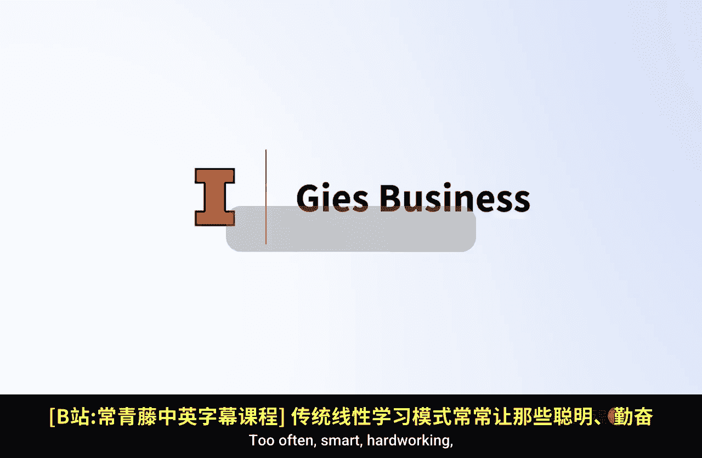
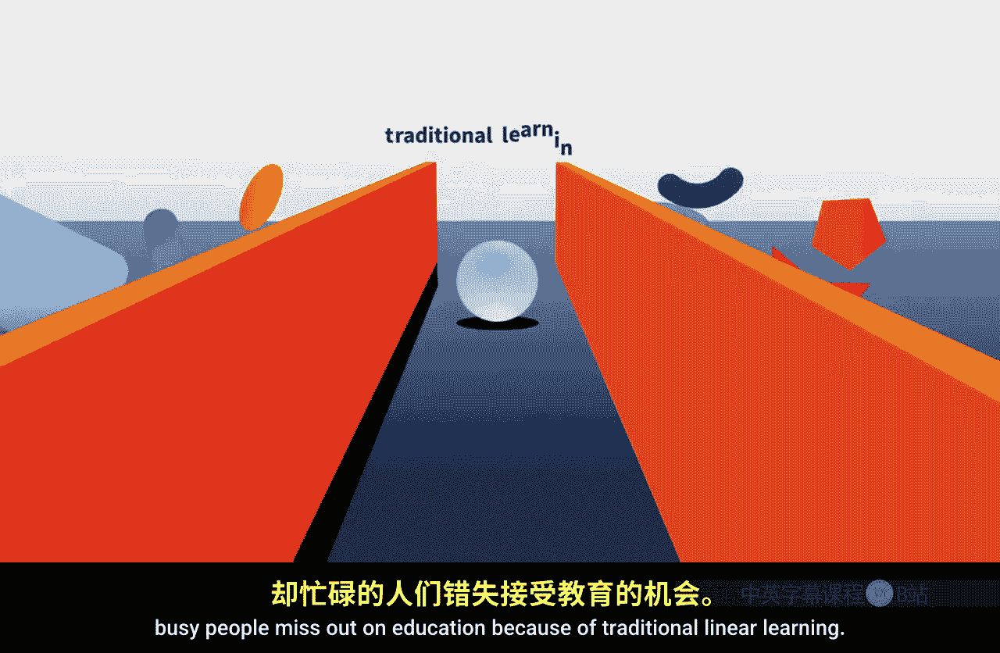
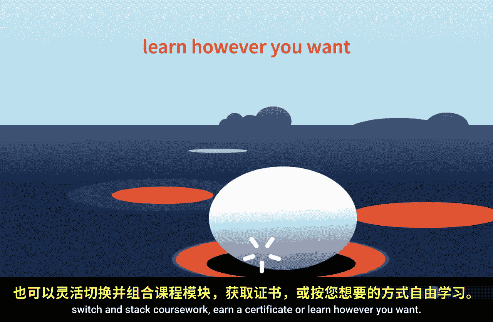
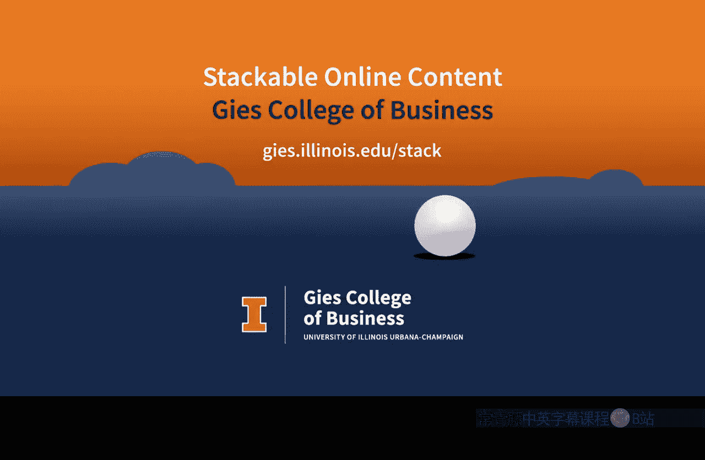

#  082：自主学习课程

在本节课中，我们将了解伊利诺伊大学吉斯商学院提供的灵活在线学习模式。这种模式旨在帮助忙碌的学习者突破传统线性教育的限制，按照自己的节奏和方式获取知识。

## 传统学习的挑战 🎼

传统线性学习方式常常让聪明、勤奋但忙碌的人们错失教育机会。

## 吉斯商学院的解决方案

因此，吉斯商学院提供了可堆叠的在线内容，让学习者能够按照自己的条件进行学习。

以下是该学习模式的核心特点：

*   **自定进度学习**：你可以参加自主节奏的课程。
*   **获取可转录学分**：完成课程可以赚取可被记录的学分。
*   **灵活掌控进度**：你可以随时暂停学习。
*   **获得学位**：通过积累学分，最终可以获得学位。
*   **自由组合课程**：你可以切换和堆叠不同的课程作业。
*   **获取证书**：完成特定课程组合可以赢得证书。
*   **个性化学习路径**：或者以任何你想要的方式进行学习。

无论你处于学习旅程的哪个阶段，你都能以或大或小的增量，获得由专家引领的教育。开始吉斯商学院学习的最佳时机，就是你认为合适的时间。

---

本节课中，我们一起学习了吉斯商学院灵活、自主的在线学习模式。它通过提供可堆叠、自定进度的课程与学分，打破了传统教育的线性限制，让学习者能够根据自己的时间、目标和节奏来规划学习路径，最终实现获取证书、学分乃至学位的目标。