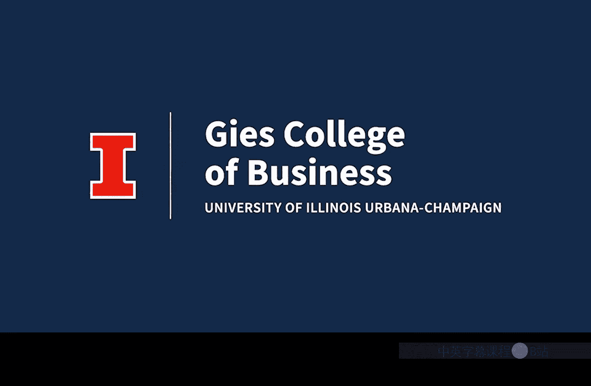

#  083：课程介绍 🚀

在本节课中，我们将学习商业分析专项课程的核心内容与学习路径。课程旨在为你提供利用数据获取可执行商业洞察所需的工具。我们将介绍一个核心决策框架，并概述四个关键模块的学习重点。

欢迎来到课程。本课程的目标是为你提供必要的工具，使你能够利用数据来获取可执行的商业洞察。

如今，从在线购物到使用人工智能，我们几乎所有的活动都渗透并受益于大数据、机器学习和数据分析。要在商业竞争中获胜，甚至只是成为一名成功的参与者，你我都需要学习如何掌握那些能帮助我们将数据转化为可用商业洞察的工具。

本课程将为你配备四种应对数据分析世界所必需的前沿工具。我们首先聚焦于培养你的分析思维，探索如何有效处理信息、批判性地思考数据以及进行数据驱动的问题解决。

基于此基础，接下来的三个模块将深入探讨Python和人工智能的力量。模块二将向你介绍用于探索性数据分析的Python，你将学习如何准备、清理、可视化数据并从中获得初步洞察。

模块三将专注于结构化查询语言，即SQL。这是从大型关系数据库中高效提取特定数据子集的基础工具，这些技能将与你基于Python的分析形成互补。

最后，模块四将探索应用程序编程接口，即API。这将使你能够从各种外部系统中检索数据，并将其整合到你的分析工作流中，从而进一步扩展你的数据来源范围。

在本课程中，我们将引用一个用于基于数据做出商业决策的框架，即FACT框架。

FACT框架是一个首字母缩写词，其中：
*   **F** 代表 **F**rame a question（构建问题）。
*   **A** 代表 **A**ssemble the data（收集数据）。
*   **C** 代表 **C**alculate the results（计算结果）。
*   **T** 代表 **T**ell others（传达结果）。

虽然本课程涵盖的工具与FACT框架的每个部分都相关，但我们将重点强调“构建问题”和“收集数据”这两个部分。其他课程将更侧重于数据的高级计算以及如何向他人传达这些计算的结果。

我们在本课程中的目标是为你提供一个坚实的框架和基础，让你理解并实践商业分析。因此，未来当你遇到未曾接触过的数据分析任务时，你将能够将其纳入该框架，快速理解它，并利用Python和人工智能的力量，更快地吸收你需要学习的新信息。

更重要的是，你将能够运用新知识来获取商业洞察并解决商业问题。

在每个模块中，我们都将使用真实的商业数据来练习使用这些工具。因此，每个模块都将专注于解决商业问题。

我们很高兴你能通过学习更多关于Python和人工智能如何帮助你执行数据清理、加载和探索等任务来扩展你的工具包。这些是所有数据分析的基础。

有效利用数据就像拥有一个可靠的指南针和一张详细的地图，用以导航复杂的商业地形。它帮助你了解自己的位置，识别到达目的地的潜在路径或策略，并帮助你在学习这些模块的过程中避免迷失方向。深入钻研并尝试使用数据。你练习得越多，你的数据工具包和解决商业问题的能力就越强。

商业的未来是数据驱动的，你现在正走在成为关键参与者的道路上。让我们一起解锁Python、人工智能和深度思考的力量。

**总结**

本节课我们一起学习了商业分析专项课程的总体介绍。我们明确了课程目标：掌握将数据转化为商业洞察的工具。课程围绕 **FACT框架**（构建问题、收集数据、计算结果、传达结果）展开，并重点介绍了四个核心学习模块：分析思维、Python数据分析、SQL数据查询以及API数据获取。通过本课程的学习，你将建立起坚实的数据分析基础，为在数据驱动的商业世界中解决问题做好准备。