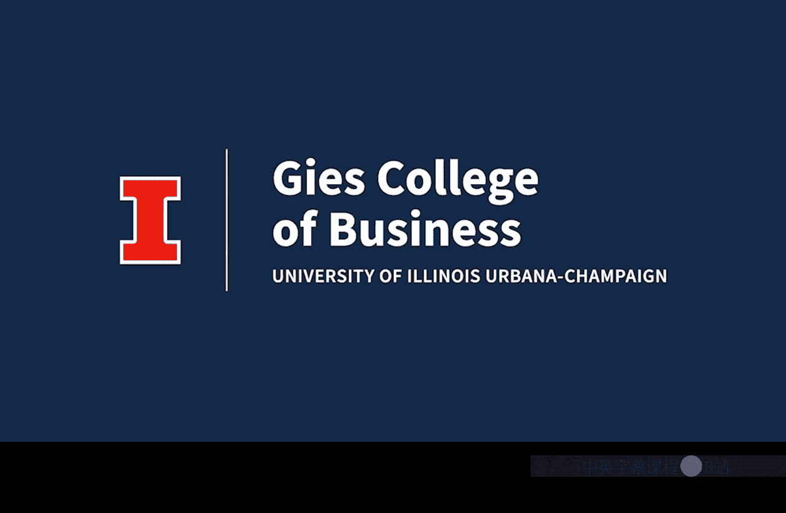

#  084：关于金门多萨教授 👩‍🏫

在本节课中，我们将了解本专项课程的一位核心讲师——金门多萨教授的背景与经历。这有助于我们理解她将如何引导我们学习商业分析。

---

大家好，我是金门多萨。我很高兴与大家分享一些关于我的信息。

在步入教学生涯之前，我曾在普华永道担任审计师，这段经历让我获得了关于会计和金融的宝贵见解。那些年加深了我对会计和金融的理解。

在担任审计师期间，我遇到了许多悬而未决、想要深入探究的问题。因此，我决定前往华盛顿大学攻读博士学位。这段求学之旅塑造了我的教学和研究方法，并帮助我在伊利诺伊大学厄巴纳-香槟分校获得了教职。

我教授过从财务会计到数据分析等多种课程，并在多年间开发了大量数据分析教学内容。我热切期待与我的学生们分享这些内容。

吉斯商学院是数据分析领域的领导者。它是德勤基金会商业分析中心的所在地，该中心是全球各大学获取商业分析教学材料的权威来源。

在课堂之外，我享受演奏音乐。我会弹吉他、钢琴和尤克里里。我也喜欢和我的三个孩子共度时光。我们热爱探索这个校园。在周末，我们经常去大学植物园、联合大楼或钟楼。看着我的孩子们玩耍并发现这所大学的美，是一件非常有趣的事。

我非常高兴你决定将吉斯商学院作为你教育旅程的一部分。我也很荣幸能在你于伊利诺伊大学学习期间担任你的导师。

---

本节课中，我们一起了解了金门多萨教授从审计实践到学术研究的职业路径，以及她在吉斯商学院开发数据分析课程的经历。这为我们跟随她学习商业分析奠定了良好的基础。