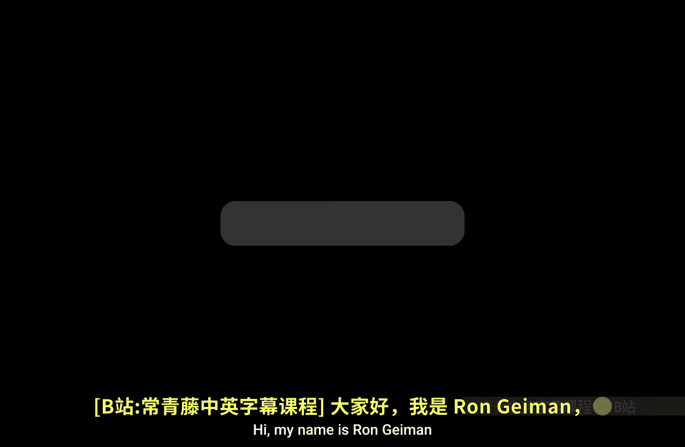
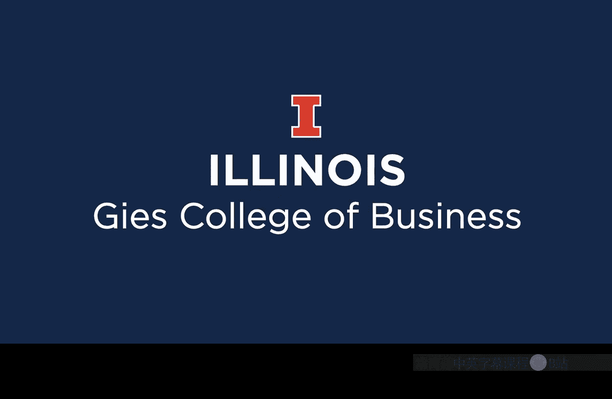

#  085：关于罗纳德·盖蒙教授 👨‍🏫

在本节课中，我们将认识本课程的教授——罗纳德·盖蒙。我们将了解他的专业背景、个人生活以及他对于教学和人生的深刻见解。

---

## 专业背景介绍

大家好，我是罗纳德·盖蒙，目前在吉斯商学院会计学院任教。

我的会计学位分别来自杨百翰大学和爱荷华大学。

我的职业经历融合了学术与实践。在学术方面，我的教学与研究专注于管理会计与数据分析。在实践方面，我曾担任过数据科学家。以上是关于我专业经历的一些介绍。

## 个人生活点滴

现在让我分享一些我的个人生活。好的，这张照片里是我，我正站在哥布林谷的顶部，我非常喜欢这里。这里的徒步旅行非常有趣，景色也十分壮丽，你可以看到全景式的风景。

我热爱能够来到户外。年轻时，我就常来这个地区徒步和露营。在人生的现阶段，我花大量时间从事我热爱的工作，但户外活动的时间变少了。因此，我有时会带我的孩子们来这里，看着他们奔跑和徒步，这让我感到非常快乐。

几年前，我和我的妻子有机会在这里参加了一场跑步比赛。我们跑遍了这里的部分区域。这场比赛我最喜欢的部分，是终点设在被称为“胡斯谷”的地方。最后，我们跑上一些台阶，在能看到所有“哥布林”岩石的地方完成了比赛。这是我参加过的最喜欢的比赛之一。

## 教学理念：成为桥梁建造者

我现在在拱门国家公园，欣赏这些巨大的拱门。在我身后，有几个看起来像桥的拱门。当我想到桥时，我就会想到教师。

为什么想到桥会联想到教师呢？因为我所知道的最伟大的教师之一，托马斯·蒙森，曾经常常谈论为他人建造桥梁的重要性。😊

他曾分享过一首名为《桥梁建造者》的诗。诗中，一位老人正在旅行，他遇到了一个巨大的峡谷，谷底有一条河。这位老人经验丰富，能够设法渡过河流，到达峡谷的另一边。

当他到达对岸后，他停下来建造一座桥。另一位路过的旅人问他：“既然你已经过来了，为什么还要建桥？”老人回答说，他不是为自己建桥，他是为他人建桥，这样当别人需要渡过时，会更容易一些。

我很感激有机会成为一名教师，我渴望成为一名优秀的桥梁建造者。我也希望你们，在完成学业后，能花时间为他人建造桥梁。😊

---

本节课中，我们一起认识了罗纳德·盖蒙教授。我们了解了他横跨学术与数据科学领域的专业背景，他对户外和家庭生活的热爱，以及他将教师比作“桥梁建造者”的深刻教学理念。他希望我们不仅能自己渡过知识的河流，更能为后来者搭建通往成功的桥梁。