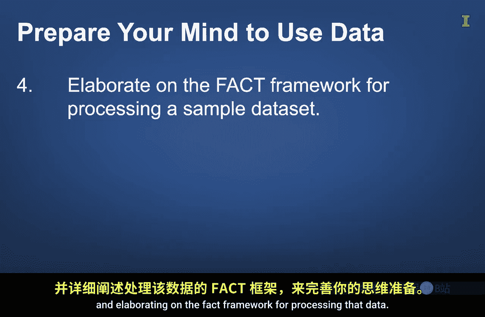

#  088：课程介绍 🎯

在本节课中，我们将学习商业分析的核心基础，理解数据分析如何为商业决策提供支持，并探讨培养正确思维模式的重要性。

欢迎来到位于南加州的美丽校园——西方学院。这里恰好是美国第44任总统巴拉克·奥巴马开始其教育生涯的地方。我坚信终身学习的重要性，尤其是在这个快速变化的世界中，保持与时俱进至关重要。

随着技术进步，掌握新工具变得非常重要。市面上有许多强大的软件工具可用于执行商业分析流程。然而，在这一系列课程中，我们将聚焦于最重要的工具——你的头脑。

有一句令人难忘的九字箴言，强调了头脑的重要性：**“一个拿着工具的傻瓜，依然是个傻瓜。”**

为了进一步阐述这个观点，想象一下：如果一个傻瓜有一堆梯子，却不知道如何用它们翻过一堵墙，会发生什么？无论他有多少梯子都无济于事，他很可能永远无法翻越那堵墙。

另一方面，一个知道如何使用梯子的人，不仅能用它上下攀爬，还可能想出其他创造性的使用方法。当你完成这些课程时，你的头脑将在几个方面做好准备。

以下是本模块将帮助你准备的几个关键方面：

首先，我们将通过分享几个公司使用数据分析来解答问题的简短案例，来武装你的头脑。这些案例将强调一个现实：**数据本身并不创造价值**，它更像一种原材料，只有在经过正确处理后才能体现价值。

其次，我们将通过讨论培养创造性和分析性思维模式的重要性来武装你的头脑。有时我们听到这些思维模式被讨论为右脑和左脑活动，并认为右脑活动更多属于艺术而非科学领域。但现实是，在商业分析工作中，好奇心和创造力与分析性思维、将大问题分解为小部分以及遵循结构化流程的能力同等重要。😊

这一点尤其重要，因为我们有时是在识别出数据中的模式后才去追寻商业洞见，而非从预设好的前提开始。将观察到的模式与业务流程、其他问题及分析流程联系起来的能力，需要一个好奇且富有创造力的头脑。

第三，我们将通过强调“让数据说话”的重要性来武装你的头脑。我们不希望你认为所有决策都必须基于数据做出。专业判断和直觉在商业决策中仍然极其重要。然而，重要的是要持开放态度，接受商业分析结果可能与你原有信念相悖的可能性。也就是说，**让数据说话**至关重要。

第四，我们将通过介绍一个样本数据集并详细阐述处理该数据的FACT框架，来武装你的头脑。

该数据集是真实商业数据的样本，我们希望你能对其以及它能回答的问题有一定程度的熟悉。我们希望你能认识到，这个数据集所展示的商业分析应用，可能也适用于你当前正在处理的数据。

然后，我们将回顾用于分析数据的FACT框架，并详细阐述这些步骤，以充实一个更细致入微的数据建模流程。

最后，我们将通过回顾一些相关的商业分析术语和主题来武装你的头脑。

在本模块结束时，我们希望你能说：一个只懂数据工具的傻瓜，依然是个傻瓜。但送那个傻瓜去上学，他就能变得相当酷。

---

**本节课总结**

在本节课中，我们一起学习了商业分析入门的核心思想。我们认识到，工具（包括数据）本身并非万能，**最关键的“工具”是我们经过训练的头脑**。我们探讨了培养兼具**创造性**与**分析性**思维的重要性，并强调了在决策中既要尊重专业直觉，也要学会**“让数据说话”**。最后，我们预告了后续将深入学习的真实数据集和FACT分析框架。记住，学习的目标是让自己从“拿着工具的傻瓜”转变为能够巧妙运用工具的“酷”专家。