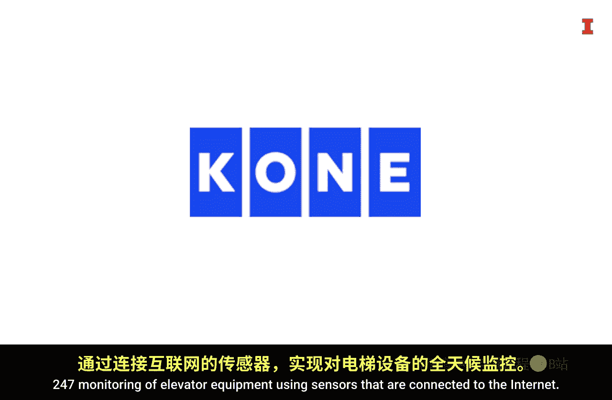
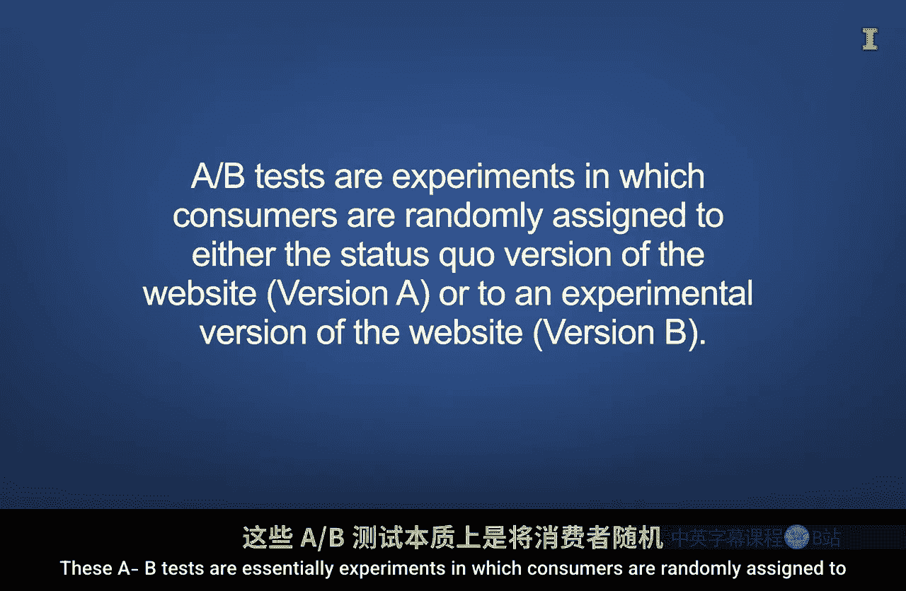
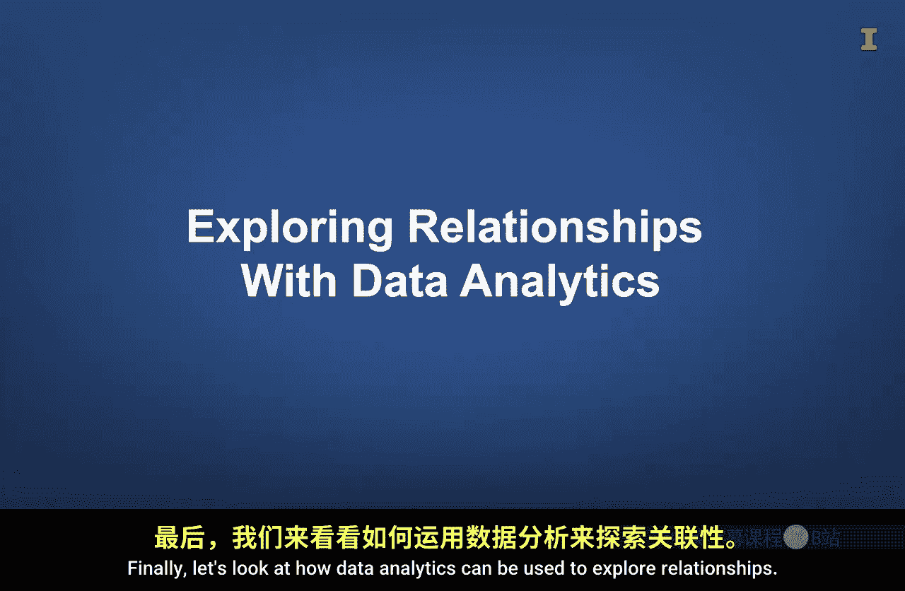
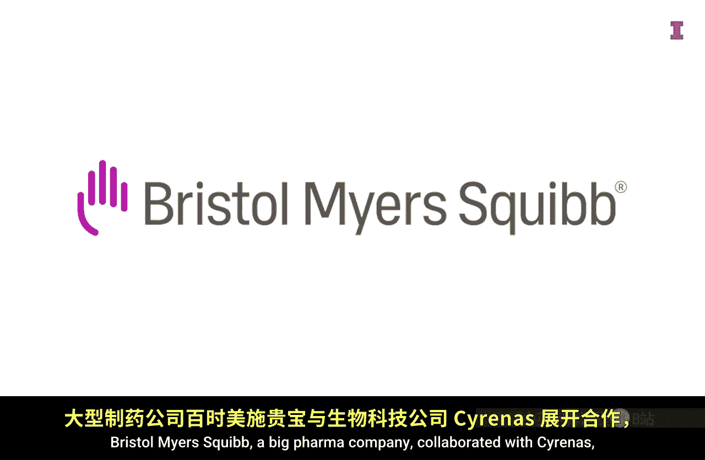
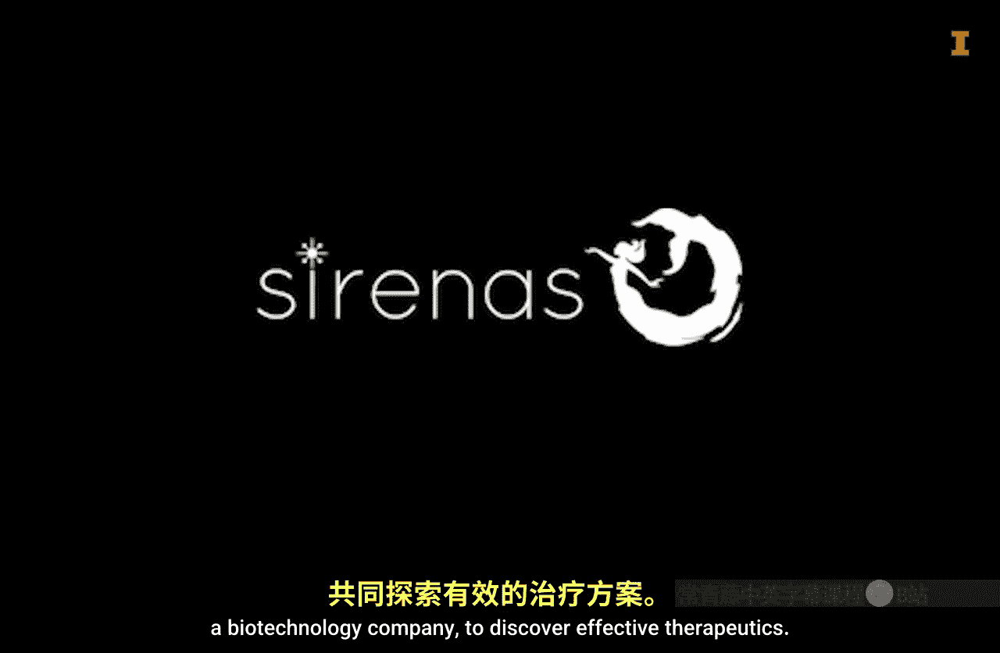
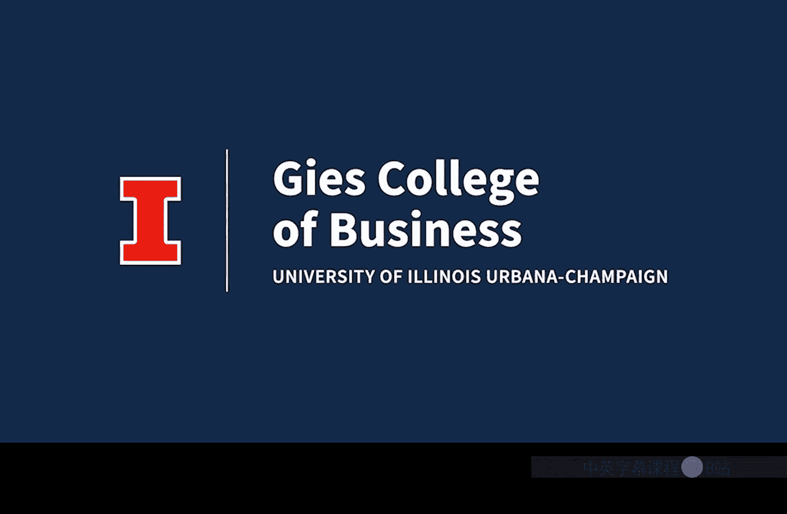

#  089：将业务数据转化为业务洞察 🎯

在本节课中，我们将学习如何将原始的业务数据转化为有价值的商业洞察。我们将通过几个真实案例，了解数据从收集、处理到最终产生决策价值的完整过程。数据本身并非魔法，它更像是原材料，需要经过一系列严谨的加工才能成为可用的“成品”。

---

## 引言：数据不是魔法粉尘 ✨

欢迎来到巴恩斯泰尔艺术公园，这里是各类艺术家的聚集地。公园里有美丽的建筑、艺术画廊、艺术学校和令人惊叹的景观。我们很感激那些与我们分享创造力的人才。

有些人可能不熟悉艺术创作过程，认为艺术家仅凭直觉就能神奇地创作出美丽、有价值的艺术品。虽然可能有些创作者确实能仅凭直觉，但大多数艺术家都花费了大量时间来培养直觉和磨练技巧。

类似地，数据对于做出有洞察力的商业决策非常有用。然而，根据我的经验，有些人认为数据就像魔法粉尘，他们只需将更多数据撒在问题上，就相信它会神奇地转化为清晰的解决方案或有价值的洞察，而无需任何实际工作或理解逻辑过程。他们认为粉尘越多，魔力就越强。

这种想法可能包含一点真理，因为先进的算法处理数据以创建有用模型的方式确实令人惊叹。然而，无论你是基于大量数据创建AI模型，还是基于少量数据构建回归模型，在本课中，我们都想强调：**数据更像是原材料，而不是可以立即消费的成品**。

像任何原材料一样，数据必须通过劳动和机器进行处理，才能转化为可付诸行动的洞察“成品”。我们希望通过分享一些公司将数据转化为洞察的真实故事，来提供关于这一过程的一些高层细节。在分享这些故事时，请特别注意用于收集数据和将其转化为可操作洞察所付出的努力。

---

## 案例一：高尔夫运动中的生物力学分析 ⛳

上一节我们介绍了数据作为原材料的概念，本节中我们来看看数据在高尔夫运动分析中的具体应用。

我与生物力学家泰勒·斯坦福博士进行了交谈，他通过使用数据帮助高尔夫球手提升球技。我们来听听他关于高尔夫公司如何收集数据，然后将这些数据转化为洞察的看法。

> “我叫泰勒·斯坦福，是犹他谷大学的生物力学副教授，也是几家不同高尔夫公司的独立顾问，我与他们合作进行产品教育和数据分析。我们的用户最想要的是，当他们购买一套测力板时，他们想知道应该关注什么，以及职业高尔夫球手的数据集是怎样的。每个人都希望像职业球手那样移动和挥杆，他们希望产生相同的速度和距离。因此，他们真正想了解的是数据的细微差别，这些差别可以帮助他们的球员开始那样移动。所以我做的很多工作就是深入研究这些数据集。我很幸运能够让许多高水平球员站在测力板上，查看数据并开始理解我们希望业余高尔夫球手追求哪些方面，以便他们能变得更好，或者从教育的角度，我们可以使用哪些信息。我们如何反过来告知高尔夫教练为什么这如此重要，以及它可能如何影响球被击中后的飞行轨迹。”

> “就我收集的数据如何帮助这些公司而言，从高尔夫行业的角度看，力数据量很大。我们进行一种波形曲线分析。我实验室的测力板每秒收集约100帧数据。如果一个高尔夫挥杆大约三分之一到三分之二秒，那仍然可能有500到600个数据点。而这只是一个维度。我们从三个不同维度观察：上下、左右、前后，我们还观察旋转。你可以看到这些数据如何迅速变得令人不知所措。因此，公司最不希望做的就是向教练出售一套测力板，然后让教练立刻被数据淹没，不知道如何利用它为面前的球手做出决策。归根结底，球手来了，我能否利用所有这些数据做出更明智的决策，帮助这位球手更快地进步？因为他们与这位球手只有一小时的时间。如果他们不能在这一小时内改善球手的击球方式，他们就不可能让球手再来上多次课程。因此，能够清晰地理解数据的细微差别，然后能够将这些信息传达给教练，让他们能够根据我们提供的信息，根据这位球手的情况，在数据中找到他们需要关注的内容，从而做出有意义的改变，帮助球手比盲目猜测更快地进步。”

> “我认为关于数据如何帮助你做出正确决策，我听过最酷的描述之一是：这适用于高尔夫球手、篮球运动员、排球运动员等任何运动员。他这样描述：如果你去看医生，你说‘嘿，这是我的药瓶，这是我的药桶，我不会给你做任何检查，你只需把手伸进桶里抓一把药，你可能拿到降压药，可能拿到降胆固醇药，可能拿到其他什么药，然后你就希望它有效’。而能够实际收集数据，就像你说的，使我们能够真正深入数据，并开出他们所需的确切、特定的药片，就像医生会尽可能多地进行检查一样。这能让教练更快地为球员做出改变。”

在这个例子中，测力板和动作捕捉技术被用来收集关于球员如何转移重心、挥动球杆等数据。然后可以分析这些数据，以识别高尔夫球手挥杆的弱点，并提供球员可以执行的特定训练建议，帮助他们将球打得更远、更直。

---

## 案例二：制造业的预测性维护 🔧

上一节我们看到了数据在体育训练中的应用，本节中我们来看看工程和制造公司如何使用数据分析来预测机器何时需要维护。

在制造业中，机器被用来执行许多任务，但这些机器的各种部件会磨损，需要维护或更换，否则就会损坏。即使机器有定期维护计划，意外故障也会发生。意外故障会产生高昂的现金成本，尤其是当机器的一个损坏部件导致另一个部件也损坏时。此外，机会成本也很高，因为必须花费时间来识别故障源并修理损坏的部件，而不是用于生产产品。

一种数据驱动的解决方案是使用**预测性维护**。科恩是一家专注于人员运输的工程公司，尤其是使用电梯和自动扶梯。如果你曾在高层建筑工作，并依赖电梯到达你的楼层，那么你可能从个人经验中知道，当电梯停运时，有时会出现长时间的延误。

科恩与IBM合作，使用连接到互联网的传感器对电梯设备进行24/7监控。

现在，他们不再等待客户打电话报告电梯故障，而是使用传感器数据创建模型，预测部件何时会损坏，然后在低使用率时段安排维修。

在这个例子中，努力被投入到使用战略性地放置在电梯设备上的传感器来收集数据，以提供持续监控。然后，传感器数据被用来创建模型以预测未来事件。

---

## 案例三：网站设计的A/B测试 🖥️

上一节我们探讨了数据在预测性维护中的作用，本节中我们来看看数据分析如何用于有效设计网站。

在线旅行社行业的公司倾向于将旅行者与交通、住宿、餐饮和其他活动联系起来。作为消费者，你可能从个人经验中知道，计划一次旅行需要考虑很多因素。因此，该行业的公司必须设计一个网站，既能提供适量的信息，又能营造一种紧迫感，使网站访问者不会转到其他网站进行购买。这是一个相当难以实现的平衡，而且必然会有许多设计意见。

那么，如何决定正确的设计呢？公司可以使用各种网站设计运行A/B测试，然后分析结果。这些A/B测试本质上是实验，消费者被随机分配到网站的现状版本（版本A）或实验版本（版本B）。

然后可以量化和分析客户行为，以确定实验版本是否比现状版本产生更理想的行为。如果是，那么实验版本就成为新的现状。

Booking.com 是一家将这一理念发挥到极致的公司。他们允许组织中的每位员工进行实验。

这种所有员工都可以进行实验的自由，导致每年进行数千次实验。Booking.com 拥有完善的基础设施来跟踪消费者行为如何受到网站每个版本的影响。尽管只有大约10%的测试能带来转化率的提升，但他们学到了很多关于如何微调网站设计和增加利润的知识。

因此，在这个例子中，必须仔细创建、存储和分析数据，以便Booking.com能够快速决定是否应该实施新版本的网站。

---

## 案例四：药物发现中的关系探索 💊

上一节我们了解了A/B测试在优化用户体验中的应用，本节中我们最后来看看数据分析如何用于探索复杂关系。

制药行业的药物发现在很大程度上依赖于探索体内蛋白质和化合物之间的复杂关系。考虑到人体中有数万种蛋白质可能成为治疗疾病的目标，以及理论药物空间中有无数分子，识别一种潜在的抗病药物是一项令人难以置信的任务。

如果我们试图系统地遍历每个分子和蛋白质的组合，那将永远无法完成。然而，如果公司能够对蛋白质及其化合物进行分类，然后计算并探索最有希望的关系子集，那么这个过程就可以快得多。

大型制药公司百时美施贵宝与生物技术公司Cirs合作，以发现有效的治疗方法。

Cirs收集了一系列海洋化合物，然后应用其专有的Atlans数据挖掘技术，快速识别治疗疾病的候选疗法。

在这个例子中，对数据进行处理以快速找到可能导致有效治疗的关系。然后探索数据以发现这些关系。

---

## 总结与核心要点 🎓

在本节课中，我们一起学习了将业务数据转化为商业洞察的完整过程。再次请注意，**领域知识**在所有例子中的重要性。如果没有对底层业务及其行业的了解，企业首先就不会收集正确的数据，更不用说分析数据并以能带来可操作洞察的方式解释结果了。

总而言之，请记住，**数据只是一种原材料**，就像油漆、植物和混凝土是创造这个美丽艺术公园的人们的原材料一样。通常需要付出努力来有效地收集和分析数据。将数据与领域知识和有效的数据处理工具相结合，可以产生能够付诸行动的洞察，从而将企业和组织提升到新的水平。

