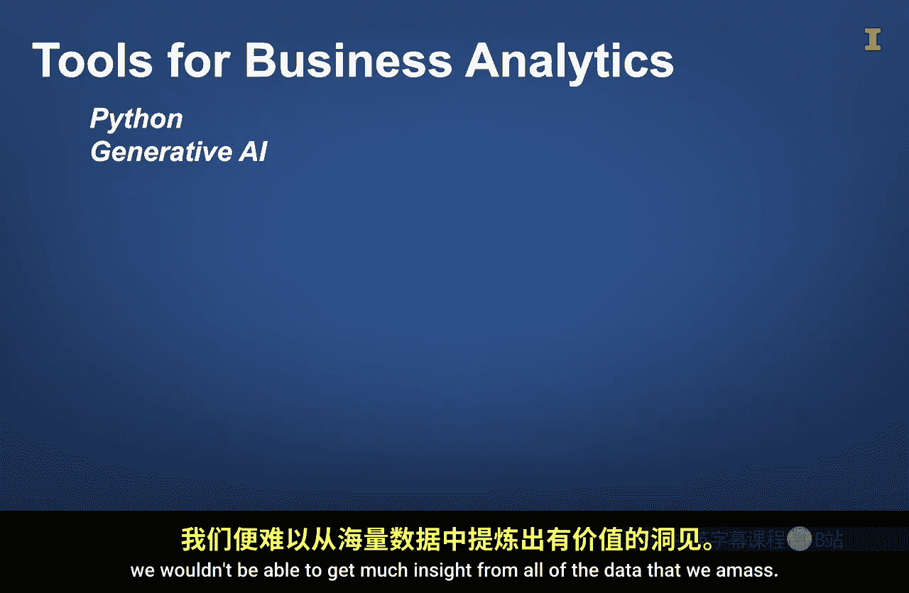

#  090：你的思维是最重要的工具 🧠

在本节课中，我们将要学习商业分析中一个至关重要的核心理念：你的思维是最重要的工具。我们将探讨创造力如何成为商业分析的核心，以及如何培养兼具创造力和分析性的思维模式。

---

虽然Python和生成式AI是用于商业分析的强大工具，但除非你拥有有效运用这些工具解决问题的方法，否则它们不会带来太多益处。因此，在本课中，我们首先要强调，你的思维是最重要的工具。

那么，如何才能释放你思维的潜力呢？我们想从讨论创造力开始。没错，就是创造力。这也正是我们身处南加州巴恩斯德尔画廊剧院前的原因。

对一些人来说，这可能显得不同寻常，因为创造力通常与绘画、摄影或建筑等艺术学科相关联。然而，我们认为创造力是商业分析的核心。

让我们通过首先定义创造力来探究其原因。

《牛津学习者词典》将“创造力”定义为：运用技能和想象力来创造新事物或艺术。这个定义虽然支持创造力源于艺术领域的观点，但它也普遍适用于创造事物。具体而言，这个定义提到了“新”或“原创”的概念，并指出创造力需要技能和想象力。因此，当你结合技能、想象力和努力时，你就踏上了创造之路。

像列奥纳多·达·芬奇和文森特·梵高这样的创意艺术家，他们擅长使用画笔等工具和颜料等原材料。他们也运用自己的想象力，我们推测这深受其领域知识（如人体知识）的影响。最后，他们付出努力，运用技能将想象中的画面转化为画布上的原创绘画。

同样，有创造力的商业分析师擅长使用硬件、软件等工具来收集和分析他们的原材料——数据。他们也运用想象力，这深受其商业经验的影响，并决定如何收集和分析数据。最后，他们付出努力，应用数据分析的结果，并将发现转化为可操作的见解，以便与他人沟通。

因此，我们要强调，商业分析需要大量的创造力。我们希望这对那些认为商业分析仅仅是死记硬背规则和公式、重复应用相同流程的人来说是个好消息。

---

上一节我们探讨了创造力在商业分析中的核心地位。本节中，我们来看看创造性的思维模式与分析性的思维模式并不矛盾。

我们已经确认创造力是商业分析的重要组成部分。我们还想强调，创造性思维与分析性思维并不冲突。分析性思维是指将问题分解成更小的部分，并系统地处理这些部分，使它们组合成一个连贯的整体。

我们推测，像列奥纳多·达·芬奇这样的艺术家，会将脑海中的想法分解成更小的部分，然后以结构化、系统化的方式去实现这些部分。例如，在画人脸时，艺术家可能先勾勒脸部轮廓，然后勾勒眼睛、鼻子、嘴巴和耳朵，之后才上色。上色时，他们可能会先画这些部分，然后再填充脸部的颜色。

类似地，商业分析师需要将一个商业问题分解成更小的部分，然后以结构化、系统化的方式去实现这些部分。例如，在制定客户细分策略时，商业分析师必须决定从何处获取数据、如何清理和汇总数据、哪些指标对细分客户最重要、创建多少个不同的客户细分、使用何种合适的算法来创建客户细分，以及如何以有意义的方式向利益相关者解释和传达结果。

---

在商业分析和艺术领域，培养兼具创造性和分析性的思维模式比工具和原材料更为重要。

创造性思维深受技能、想象力和投入努力的意愿影响。事实上，**创造性的分析思维是你最重要的工具**。这一点很重要，因为在本课程中，我们的重点确实是培养你的思维模式，而工具是次要的。

你可以使用多种工具来分析数据。我们鼓励你熟悉并最终掌握我们将重点关注的工具，即Python和生成式AI，两者都可以在个人电脑上运行。软件和硬件的进步使数据分析成为可能，没有它们，我们将无法从积累的所有数据中获得太多见解。

---

请记住，虽然这些工具非常出色，但它们本身并不会创造价值，就像把画笔放在颜料和画布旁边不会自动产生原创艺术品一样。😊

**画笔、颜料和画布只有在技艺精湛且富有想象力的艺术家付出努力，系统地将颜料涂抹到画布上时，才会产生原创艺术品。**

我们的目标是，在本课程结束时，你将在思维模式和软件工具方面打下基础技能，从而能够为许多商业问题提出创造性的解决方案。就像为巴恩斯德尔艺术公园的艺术画廊、景观和建筑做出贡献的艺术家们一样，他们的作品为许多人带来了享受。

---

**总结**

本节课中，我们一起学习了商业分析中思维模式的核心地位。我们明确了创造力不仅是艺术领域的专属，更是商业分析解决问题的关键驱动力。我们探讨了如何将创造性思维与分析性思维相结合，通过系统性地分解问题并付出努力，将技能和想象力转化为可执行的商业洞察。最后，我们重申了工具（如Python和生成式AI）是强大的辅助，但培养**创造性的分析思维**才是你最根本、最重要的工具。