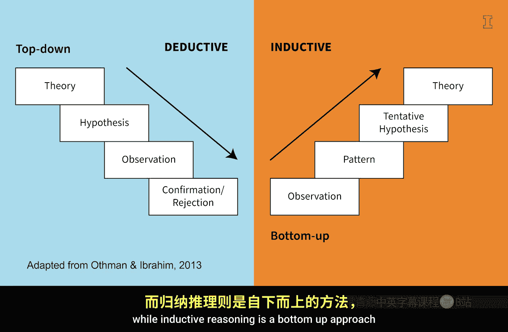
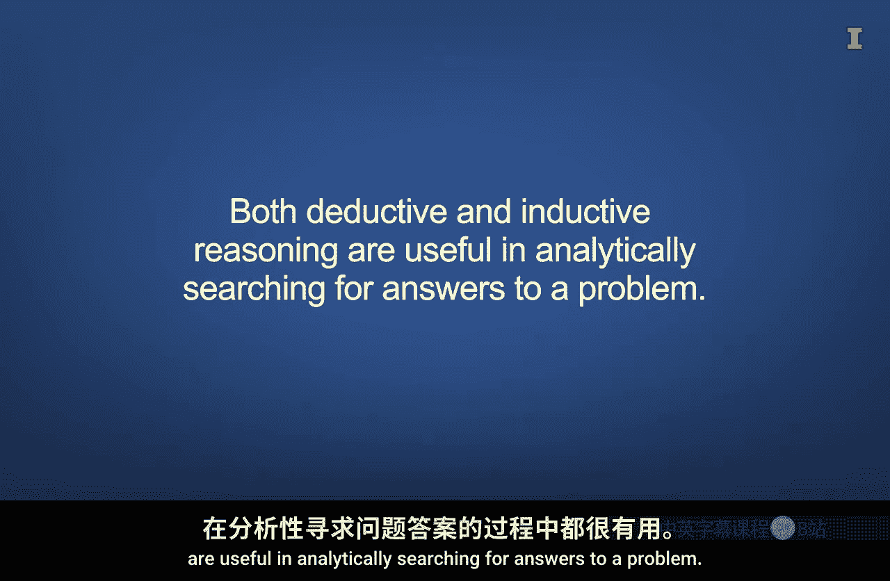

#  092：归纳与演绎推理 🧠

在本节课中，我们将要学习商业分析中的两种核心推理方法：演绎推理与归纳推理。我们将了解它们如何帮助我们从数据中提取洞见，并做出更明智的商业决策。

## 概述

位于南加州的格里菲斯天文台是一个标志性地点，坐落在广阔的洛杉矶大都市之上。类似这样的地点，至少通过两种普遍方式帮助我们增进对宇宙的理解。

首先，天文台中的望远镜帮助我们观测天体现象，并识别恒星、行星及其他天体运动的新模式。其次，天文台记录这些模式和已确立的定律，进而可用于预测未来的天体事件。

简而言之，这个天文台帮助我们运用系统二的思维模式，仔细且系统地思考与天体事件相关的数据。

## 从天文到商业：系统化思维

现在，让我们思考这与商业事件有何关联。一旦你确定某个商业决策值得投入时间，你就应该切换到系统二的思维模式，即仔细且有方法地思考问题。

接下来，让我们看看在处理大数据时，能帮助我们逻辑性地得出答案的一些推理技巧。两种常被比较的推理体系是演绎推理和归纳推理。

## 两种推理方法：演绎与归纳

通常认为，演绎推理是一种自上而下的方法，从一般规则出发，推导出具体的结论。其逻辑形式可表示为：
**如果 P 成立，则 Q 成立；P 成立；因此，Q 成立。**

而归纳推理是一种自下而上的方法，利用观察结果来创建一个更普遍的规则。其过程可概括为：
**观察现象 A、B、C... → 发现模式 → 提出一般性假设或规则。**

## 商业分析中的演绎推理

我们在商业分析中经常使用演绎和归纳推理。当我们基于论证的有效性来确定结论的真实性时，就会用到演绎推理。

例如，从会计角度看，我们知道公司的资产等于负债加上所有者权益。因此，如果我们知道资产和负债的价值，就可以**推导**出所有者权益的价值。

从商业分析的角度看，如果在网站分析数据中观察到来自特定地区的网站流量突然下降，演绎推理可能涉及考虑潜在原因，如该地区的服务器宕机、当地互联网基础设施的变化或针对性审查，然后逐一调查这些可能性。具体来说，如果是服务器宕机，你可能会看到该地区所有用户的网络流量突然全部停止。另一方面，如果是针对性审查，你可能会看到该地区部分用户的网络流量停止。

所以，演绎推理从一个前提开始，然后评估数据以查看其是否支持该前提。

## 商业分析中的归纳推理

与演绎推理相反，在使用归纳推理评估推论时，前提并不旨在被证明为绝对有效。你可能观察到一个模式，然后从该模式中**推断**出一个一般规则。

我正站在这片贫瘠、干燥、类似沙漠的气候中，旁边是这些像地精形状的岩石构造。地质学家认为，现在这片沙漠曾经是海滨地带。地质学家得出这个结论的方式，可能是归纳推理如何运作的一个好例子。

他们可能看到了这块岩石上的纹路，并提出了一个观点：造成这些纹路的原因是水在该区域涨落流动的结果。这一条证据不足以提供确凿的支持来证明这里曾是海滨地带，但当他们看到这种模式在这里一遍又一遍地重复出现数十次时，它就支持了那个假设。直到他们看到证据表明这里不是海滨地带，或者直到出现一个更好的假设来解释岩石上的这种模式之前，科学家们将继续相信这里曾是海滨地带，而这种信念最终会成为一个被普遍接受的前提，在此基础上可以建立额外的假设。

商业中归纳推理的一个例子是坏账费用的计算。由于坏账费用是对某一期间产生的、将永远无法收回的应收账款金额的估计，它通常是通过观察历史收款模式推断出来的。

具体来说，如果我们从历史数据中观察到，在过去五年中，每个月平均有 **3%** 的应收账款从未收回，那么我们可能会建立一个一般规则：每个月，坏账费用将占月度赊销额的 **3%**。

现在，商业分析使我们能够完善坏账费用的估计。例如，如果我们观察到在每月的某个特定时间进行的购买，其坏账费用更高，那么我们或许能提出一个假设，然后通过额外的分析来证实它。

## 推理方法的结合使用

演绎推理和归纳推理在分析性地寻找问题答案时都很有用。

你可能从一个你认为正确的前提开始，然后收集数据来支持它是正确的。当你收集数据来验证那个前提时，你可能会发现一些证据表明它并不总是正确的。在这种情况下，你可以从该模式中进行推断，以生成一个修改过的或补充性的前提。

以下是一个例子：假设你知道销售收入比预期要好。根据这个观察结果，你使用归纳推理假设这是由于支付了社交媒体影响者的广告费用所致。

当你收集社交媒体数据时，你发现社交媒体平台上的点赞和评论确实增加了。然而，你还发现你的市场经理一直在付费给社交媒体渠道来推广帖子。

因为已经充分证实，额外付费在社交媒体上推广帖子确实会导致销售额增加，所以你使用演绎推理推断，销售额的增加可能同时由微影响者和社交媒体帖子推广所导致。

因此，你现在必须尝试弄清楚这两种行为各自的影响。解析每种行为的独特效果，是一类可以通过数据分析技术解决的问题，这将在另一节关于回归的课程中讨论。

## 总结

本节课中，我们一起学习了商业分析中的演绎推理与归纳推理。

关键要点是，演绎推理和归纳推理都能在商业环境中带来更有效的数据分析。演绎推理可以引导你收集相关数据，并在分析中包含正确的变量。归纳推理帮助你识别数据中意想不到的模式，这些模式可用于创建一个更普遍的规则，然后应用于其他情境。

请记住，无论你是从一个坚实的理论出发，还是在数据中发现有趣的模式，这些逻辑工具都是你做出更明智的数据驱动决策的秘密武器。这些逻辑工具将在任何商业领域，甚至在天体领域帮助你。现在，自信地去分析吧。