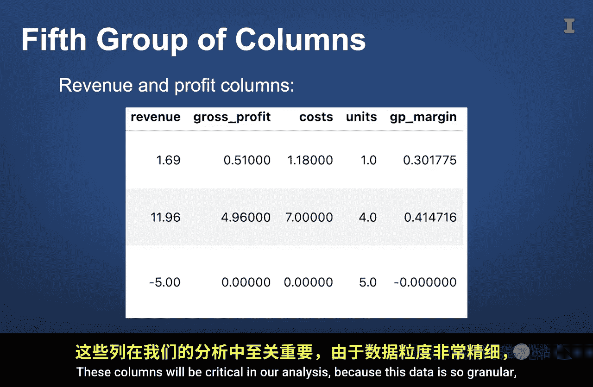

#  094：课程数据集简介 📊

在本节课中，我们将学习本课程将要使用的核心数据集——TechCA数据集。我们将了解其来源、结构、包含的字段组别以及如何为后续的分析任务做好准备。

---

当我们观察这个精心规划的社区时，它很好地提醒我们，组织和细节是理解复杂系统的关键。这正是我们将在本视频中要做的。具体来说，在本视频中，我们将练习在一些非常酷的销售点数据上应用数据分析工具。

在本课中，我们将详细浏览该数据集，以便你在思想上为如何处理它做好准备。

我们将使用的数据集称为 **TechCA 数据**。它来自一家名为 TechCA 的虚构公司，该公司在美国各地拥有超过 150 家便利店和加油站。这些商店销售典型的便利店商品，如汽油、糖果、苏打水、薯片、彩票等。

虽然这个 TechCA 数据集相当大（尤其是按 Excel 的标准），但它实际上只是所生成数据的一小部分。我们已将其缩小为 2023 年至 2025 年的数据样本。如果使用所有数据，它将包含数亿行，个人计算机将难以处理。

---

上一节我们介绍了数据集的背景，本节中我们来看看数据是如何聚合的。

该数据集的每一行代表**单次交易中的一个独特产品**。如果客户在一次交易中购买了两个不同的产品，那么该客户的交易将对应两行不同的数据。重要的是，如果客户购买了两个相同的产品，那么该交易将只有一行数据。还需要注意的是，客户在一次访问中可能进行多次交易。例如，如果客户购买了一个早餐卷饼，然后在离开前几分钟决定返回为朋友或家人再买一个早餐卷饼，那么每次交易都会有一行独立的记录。

---

了解了行的含义后，接下来我们看看数据列。数据集中有数十列，可以分为五组。

以下是数据列的分组说明：

*   **第一组：交易信息组**
    *   这些列包括每行的唯一标识符、交易编号和交易日期。

*   **第二组：客户信息组**
    *   这实际上只有一列：**客户ID**。此唯一标识符仅对忠诚度奖励计划的会员已知，否则为空。

*   **第三组：产品与类别组**
    *   这组列包含产品名称及其在产品层次结构中的位置信息。具体来说，所有产品都属于一个类别，所有类别都属于一个父类别。因此，**父类别**列的不同值数量最少，**类别**列的不同值数量多于父类别，而**产品**列的不同值数量最多。

*   **第四组：门店信息组**
    *   此组中的列包含商店位置信息，如城市、州、邮政编码和经纬度坐标。为了保护实际的便利店，坐标已更改为附近邮局的坐标。此外还有一个**门店ID**列。

*   **第五组：收入与利润组**
    *   这些列表示与每行数据相关的收入和利润金额。这些列在我们的分析中将至关重要。

---

由于这些数据非常细粒度，因此可以在许多不同层级上进行聚合，例如按小时、日、月、年、客户、产品、类别、父类别、盈利能力以及这些特征的组合进行聚合。换句话说，从这些数据中可以获得许多潜在的商业洞察。

虽然数据已经过相当程度的清理，但我们保留了一些数据准备任务供你完成。

---

本节课中我们一起学习了 TechCA 数据集的基本情况。正如这个社区精心规划的基础设施可以实现顺畅的导航和可预测的结果一样，理解这个数据集的结构将使你能够驾驭其复杂性并发现宝贵的见解。这只是对数据的介绍，在后续课程中，当你进行一些数据准备和探索任务时，你会对它更加熟悉。

准备好深入探索吧。