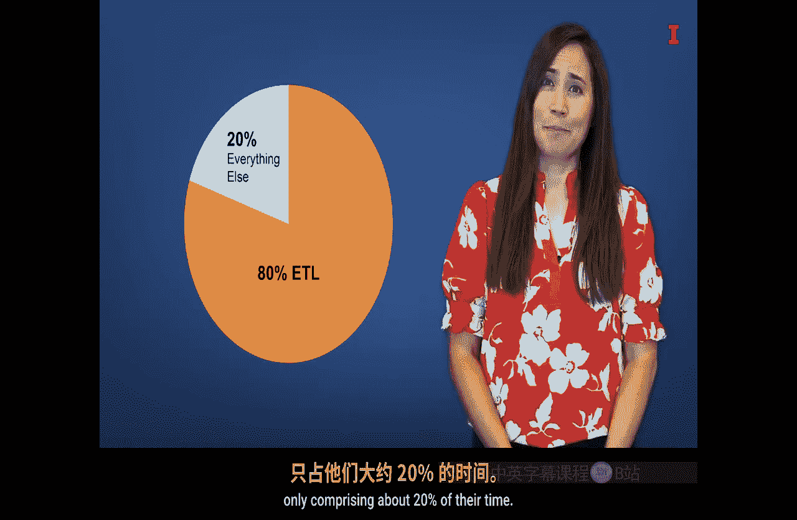
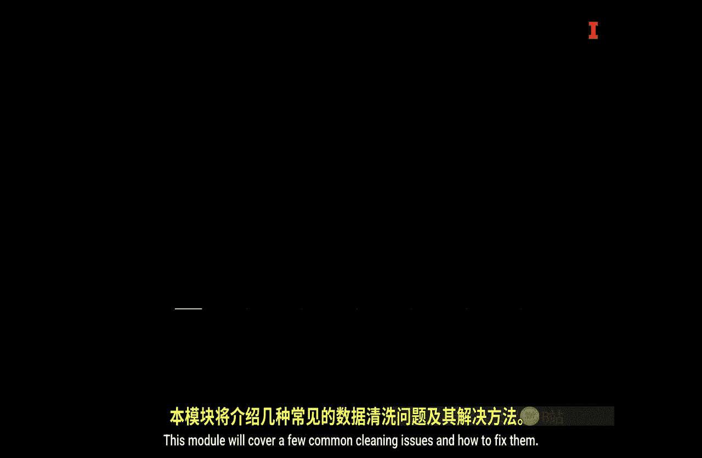
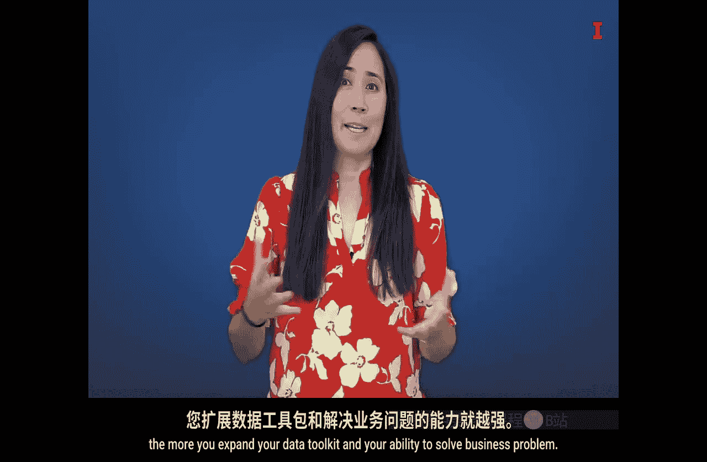

#  097：Python数据分析与可视化入门 🐍

在本模块中，我们将探索一个用于数据分析和可视化的流行工具——Python。我们将学习如何安装Python，如何使用Python进行数据的提取、转换和加载，以及如何对数据进行探索性分析。掌握这些基础技能是进行任何深入数据分析的前提。

## Python简介 🚀

我们将要使用的工具是Python。Python是一种通用编程语言，也是数据科学领域最流行的编程语言之一。对于一些人来说，学习编程语言的想法可能令人望而生畏，但只要付出一些努力和时间，并遵循指导，你很快就能进行富有洞察力的数据分析。

市面上有很多编程语言，学习任何一门语言都需要时间和精力。但Python尤其以其易于学习的语法而自豪，它强调代码的可读性，这使得初学者相对容易上手。此外，它是开源的，可以免费使用。

因为Python是一种通用编码语言，它可以用于各种数据分析任务，从收集数据到使用高级机器学习技术，再到可视化和沟通发现与解决方案。它是一个真正强大的工具。

## 开发环境：Jupyter Notebook 💻

我们将在Jupyter Notebook中编写Python程序。Jupyter Notebook是一个基于Web的应用程序，允许你运行Python代码并查看结果。它是运行Python代码的众多选择之一。然而，它的优势在于允许你将代码与文本、可视化图表以及代码的其他输出结果交织在一起。

## 本模块核心任务 🎯

在本模块中，我们将教你完成三项主要任务。

以下是本模块将要涵盖的核心内容：

1.  **下载和安装Python**：我们将指导你如何获取并设置Python环境。
2.  **使用Python进行ETL**：ETL代表**提取（Extract）、转换（Transform）、加载（Load）**。我们将学习如何用Python处理数据，使其变得可用。
3.  **进行探索性数据分析**：EDA代表**探索性数据分析（Exploratory Data Analysis）**。我们将学习如何探索、描述和分析数据。

在此过程中，我们将讨论一个用于许多动手示例和演示的酷数据集。当然，关于ETL和EDA可以开设完整的课程，因此我们必然只能在一个较高的层次上进行介绍。然而，本模块的视频将为你提供足够的信息来开始使用这个工具。虽然我们不假设你有任何Python经验，但我们鼓励你探索可用的在线资源，以加深对Python的理解。

因为Python是一个开源工具，所以有非常多免费的学习资源可以帮助你掌握它。

## 在FRACT框架中的位置 🗺️

那么，这个模块在FRACT框架中处于什么位置呢？你可能已经猜到了，ETL和EDA属于 **“计算结果（Calculate Results）”** 阶段。我们已经有了问题，也知道要使用什么数据，现在我们要进行一些分析，特别是探索性分析。要做到这一点，你需要将数据导入你的工具（在我们的案例中是Jupyter Notebook），然后需要清理数据，使其可查看并尽可能减少错误。

接着，你要探索数据能告诉你什么故事，以及它如何帮助你解决业务问题或创造商业机会。一图胜千言，因此探索数据的一部分工作必然是创建一些可视化图表，以帮助你和他人与数据互动并理解数据。

## 数据处理的挑战与价值 ⚙️

当然，事情从来不像听起来那么容易。原始数据似乎总是存在问题、错误和混乱。事实上，你可能听过一个常见的经验法则：**商业分析师80%的工作是清理数据**，而像分析、呈现结果等其他所有事情只占他们大约20%的时间。

本模块将涵盖几个常见的数据清理问题及其解决方法。

我们还将教你几种常见的数据可视化方法。

## 本模块的应用场景 💡

这个模块能帮助你解决什么样的问题呢？我们在本模块讨论的技术适用于任何你用数据来检验的业务问题。每当你拥有数据时，你都需要查看它、清理它，并在你开始尝试解决业务问题之前理解它。如果你不了解数据中包含什么信息，或者你的数据不干净，那么用这些数据解决业务问题几乎是不可能的。

我们使用的数据来自便利店，这是一个非常丰富的数据集，因此我们可以尝试用这些数据回答很多问题。但我们在本模块的重点是准备和探索数据。我们也会提及一些可以用这些数据解决的潜在业务问题。

## 总结与鼓励 🌟

我们很高兴你能通过学习更多关于Python的知识来扩展你的工具包。数据清理、加载和探索是所有数据分析的基础。打开一个新的数据集并理解它，就像打开一个宝箱并解开一个谜题，也像剥洋葱一样，需要一层一层地学习。

当你学习这个模块时，请深入钻研，把玩数据。你练习得越多，你扩展数据工具包和解决业务问题的能力就越强。

---

**本节课中，我们一起学习了：**
*   Python作为数据分析工具的优势和特点。
*   如何使用Jupyter Notebook作为开发环境。
*   本模块的三个核心学习目标：安装Python、进行ETL操作以及执行EDA。
*   数据处理在商业分析中的核心地位和常见挑战。
*   数据可视化在探索和理解数据中的重要性。
*   通过实践来巩固和提升技能的必要性。