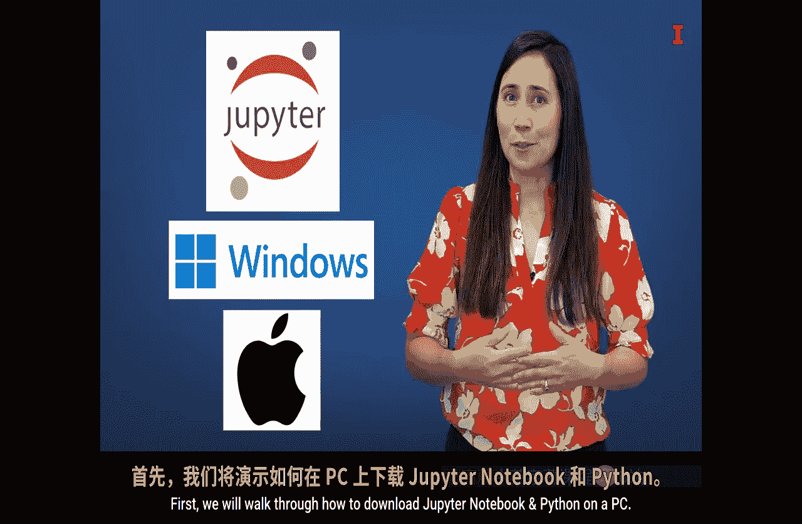
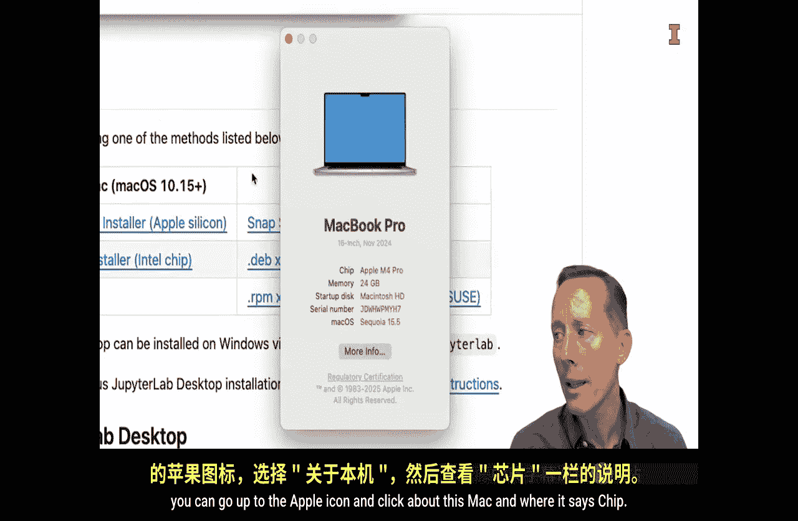
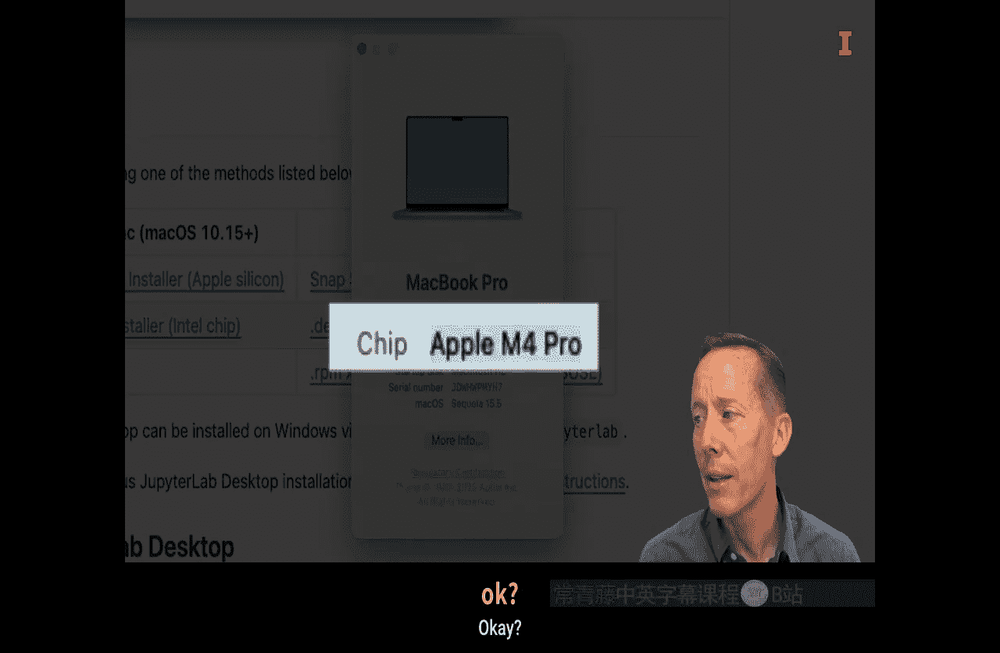
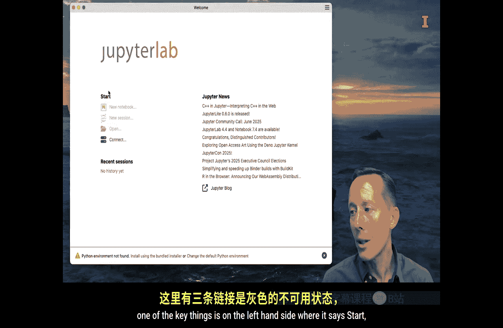
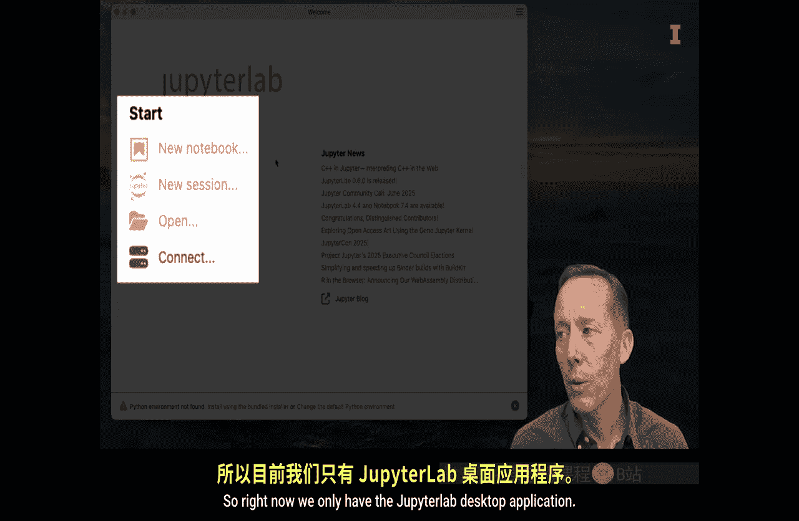
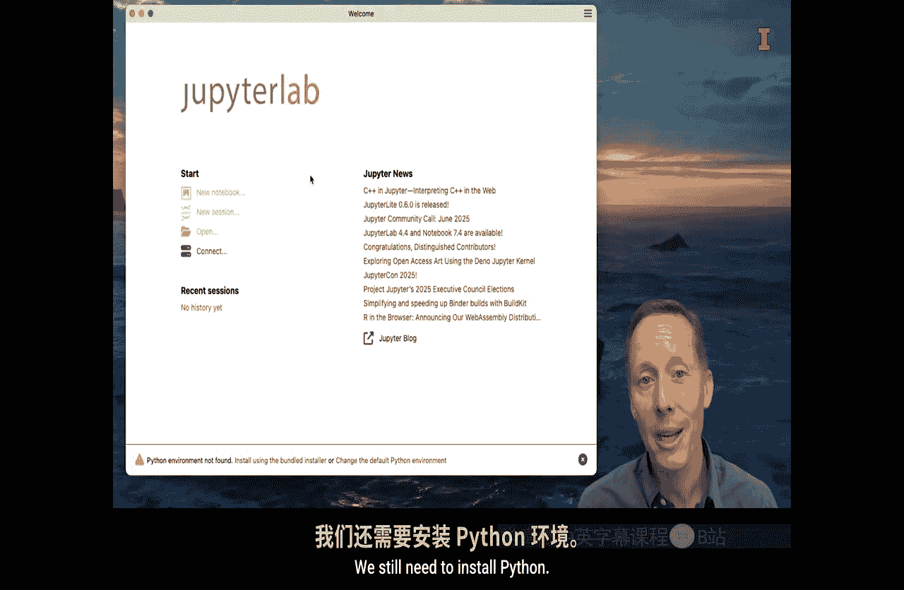
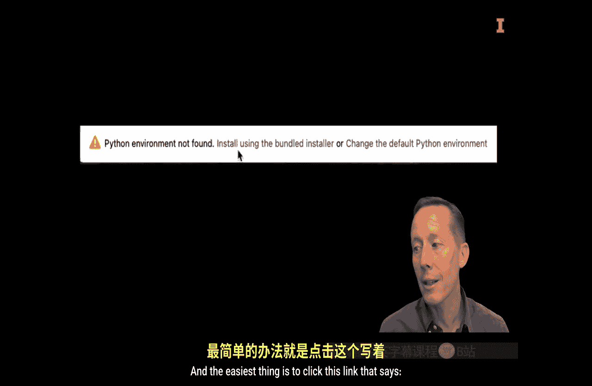

#  100：Jupyter Notebook与Python安装教程 🚀

在本节课中，我们将学习如何在Windows PC和Mac电脑上下载并安装Jupyter Notebook和Python。我们将使用JupyterLab桌面应用程序，这是一个非常便捷的工具，它允许你像使用Microsoft Word或Excel一样，通过双击文件来打开笔记本。

## 概述

我们将分步完成以下操作：
1.  在Windows PC上下载并安装JupyterLab桌面应用。
2.  为JupyterLab安装Python环境。
3.  在Mac电脑上完成相同的安装步骤。

---

## 在Windows PC上安装

上一节我们介绍了本教程的目标，本节中我们来看看如何在Windows PC上完成安装。

首先，我们需要在PC上同时安装Jupyter Notebook和Python。我们将下载JupyterLab桌面应用程序。这是一个非常棒的桌面应用，你可以通过双击笔记本文件来打开它，就像使用Microsoft Word或Excel一样。我们将先下载JupyterLab桌面应用，然后安装Python环境。如果你的电脑上已经安装了Python，可能不需要执行第二步。

以下是具体步骤：

1.  访问GitHub页面：`https://github.com/jupyterlab/jupyterlab-desktop`。
2.  向下滚动到“Installation”部分。由于我们正在使用Windows电脑，请点击“Windows installer”链接进行下载。
3.  下载完成后，双击下载的文件以执行安装程序。
4.  当系统询问是否允许此应用对你的设备进行更改时，选择“是”并同意许可协议。
5.  安装过程很快。安装结束时，确保“Run JupyterLab”选项被勾选，然后点击“完成”。这将打开JupyterLab桌面应用程序。

安装完成后，你可能会注意到桌面应用中的许多选项是灰色的。这是因为我们只安装了JupyterLab应用程序，还没有安装Python环境。

为了解决这个问题，我们将使用捆绑安装程序来安装Python。在JupyterLab应用窗口底部，你会看到提示“Python environment not found”，点击“install using the bundled installer”链接。

安装过程可能需要几分钟。完成后，底部的警告信息会消失，之前灰色的选项（如创建新笔记本、打开文件）将变为可用。

现在，你可以点击“Create a new notebook”来创建一个新笔记本，选择“Python 3”作为内核，然后就可以开始编辑和使用这个笔记本了。这就是我们后续课程中将使用的Jupyter Notebook环境。

---

## 在Mac上安装

上一节我们完成了Windows PC的安装，本节中我们来看看在Mac操作系统上的安装步骤。这种方法的一个巨大优点是，无论你使用Windows还是Mac，步骤几乎完全相同。

首先，打开网页浏览器。你可以搜索“Jupyter Lab desktop”，请注意拼写是“JupyterLab”一个词，并且“Jupyter”的拼写是 **`J-U-P-Y-T-E-R`**。这个名字是为了致敬Jupyter项目支持多种数据分析语言，包括Julia、Python和R。

在搜索结果中，你应该会看到一个指向GitHub仓库的链接，标题通常是“JupyterLab desktop application based on Electron”。点击这个链接，它会带你到GitHub页面。GitHub是开发者分享开源代码的网站，JupyterLab桌面版就是一个免费的开源应用。

进入GitHub页面后，向下滚动到“Installation”部分。这里有一个表格，列出了三个主要操作系统对应的安装文件。

以下是针对Mac用户的选择：

*   如果你使用的是较新的、搭载 **Apple Silicon芯片**（如M1, M2, M3等）的Mac，请点击“Apple Silicon”对应的链接。
*   如果你使用的是较旧的、搭载 **Intel芯片**的Mac，请点击“Intel”对应的链接。

如果不确定自己的Mac型号，可以点击屏幕左上角的苹果图标，选择“关于本机”。在“芯片”信息栏中，如果显示“Apple M…”字样，那么你使用的是Apple Silicon版本。

点击正确的链接后，会开始下载安装程序（约300MB）。下载完成后，双击`.dmg`文件。对于Mac用户，标准的安装方式是将`JupyterLab`图标拖拽到“应用程序”文件夹中。

安装完成后，你可以在“应用程序”文件夹中找到`JupyterLab`并双击打开。首次打开时，Mac系统可能会提示你确认是否要打开此应用，点击“打开”即可。

应用启动后，你会看到欢迎页面。左侧“Start”区域有三个灰色的链接和一个可用的“Connect”链接。为了让灰色链接可用，我们需要安装Python环境。

在窗口底部，你会看到警告“Python environment not found”，并提供了几个链接。最简单的方法是点击“install using the bundled installer”。

点击后，安装程序将开始安装Python以及一些常用的数据分析Python模块。这个过程不会太久。

安装成功后，底部的警告会消失，之前灰色的链接会变为可点击状态。你可以直接点击“Create a new notebook”创建笔记本，但这通常会在你的根目录创建。更常见的做法是点击“New Session”，这会打开完整的JupyterLab环境。

打开后，你可以根据喜好调整界面。建议进入“View” -> “Appearance”菜单，取消勾选“Simple Interface”和“Presentation Mode”。你也可以直接点击“Reset Default Layout”来恢复默认布局。

现在，环境已经准备就绪。你可以通过左侧文件浏览器导航到电脑上的不同文件夹，进入目标文件夹后，点击顶部的“+”按钮即可创建新的笔记本文件。

---

## 总结

本节课中我们一起学习了在Windows和Mac操作系统上安装Jupyter Notebook和Python的完整流程。我们通过下载 **JupyterLab桌面应用程序** 并利用其内置的捆绑安装程序来设置Python环境，这种方法简单统一，非常适合初学者。Jupyter Notebook是一个免费、开源、广泛使用的交互式开发环境，拥有丰富的在线资源可供查阅。安装完成后，我们就可以开始使用Python进行数据分析之旅了。