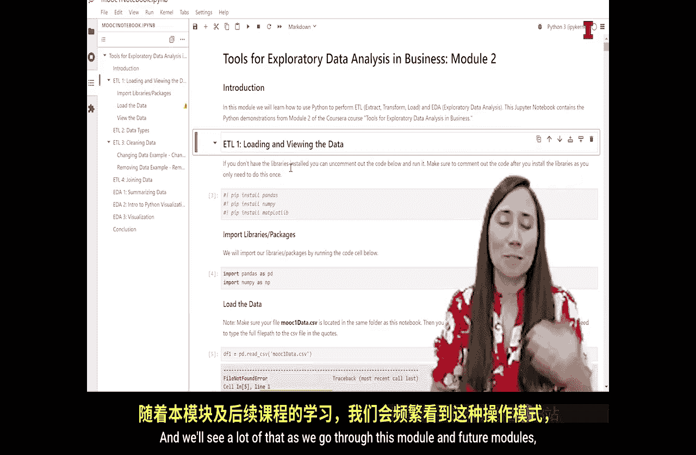
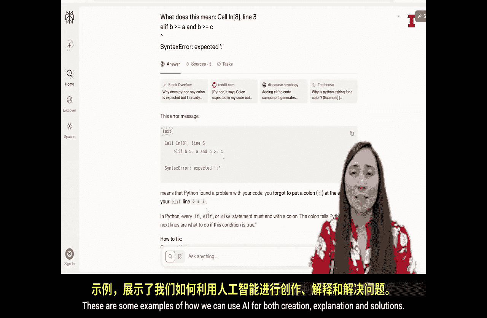

#  101：Jupyter Lab入门与AI辅助编程 🚀


在本节课中，我们将学习Jupyter Lab的基本操作，并了解如何利用AI工具辅助Python编程和数据分析。我们将从打开和运行笔记本开始，逐步探索代码与文本的编辑，最后介绍AI在代码创建、解释和调试中的强大应用。

---

## 打开与界面设置 🖥️

上一节我们下载了Jupyter Lab，本节中我们来看看这个工具如何工作。

我展示了我的桌面，上面有Jupyter Lab桌面应用程序，以及一个放在桌面上的Python笔记本文件（`MOO_one.ipynb`）。要打开它，可以直接双击笔记本文件，也可以在Jupyter Lab中导航到该文件位置。我选择双击打开。

打开后，可以看到笔记本内容。它包含Markdown文本（看起来像普通文档）和代码单元格（由灰色框和旁边的括号标识）。括号内有时有数字，有时没有。

初始视图可能不显示左侧工具栏。为了更方便地查看文件位置和目录，可以进行设置。

以下是调整视图的步骤：
*   进入 **View（视图）** 菜单。
*   选择 **Show Left Activity Bar（显示左侧活动栏）**。

启用后，左侧会显示文件树和目录，方便我们跳转到笔记本的不同部分。

---

## 运行代码与单元格 ▶️

现在，我们位于笔记本的开头。首先介绍Jupyter笔记本的文件格式和基本使用方法。

第一件事是学习如何运行代码。Jupyter笔记本的优势在于，你可以拥有不会被计算机执行的文本（Markdown单元格），而只运行被指定为代码的单元格。

灰色框是代码单元格，而其他部分是Markdown单元格。我们可以随时更改单元格类型。

运行单元格有几种方法：
*   选中想要运行的单元格，然后点击工具栏的 **播放按钮**。
*   或者，按下 **`Shift + Enter`** 组合键。

运行Markdown单元格时，不会有输出，但会渲染其格式。运行代码单元格时，左侧括号内会先显示一个星号 `[*]`，表示代码正在运行。运行完成后，星号会变成一个数字序号。如果代码有输出，结果会直接显示在单元格下方；如果没有，则不会显示任何内容。

---

## 运行整个笔记本与重启内核 🔄

接下来，讨论如何运行整个笔记本。

点击顶部菜单栏的 **Run（运行）** 下拉菜单，可以看到多个选项：
*   **Run Selected Cells（运行选中单元格）**：运行当前选中的单元格。
*   **Run All Cells（运行所有单元格）**：按顺序运行笔记本中的所有单元格。
*   **Restart Kernel and Run All Cells（重启内核并运行所有单元格）**：如果笔记本运行异常或卡住，这个功能非常有用。它会重启内核（类似于重启笔记本），然后重新运行所有代码。你可能需要重新选择Python作为内核。
*   **Run All Above Selected Cell（运行选中单元格以上的所有单元格）**：这是我们经常使用的功能。它只运行当前选中单元格之前的所有单元格。例如，选中某个单元格后执行此操作，可以确保其依赖的代码都已执行。

如果代码出错，你会看到一个错误信息，通常显示为一个较长的粉色或红色框。

---

## 编辑与格式化Markdown单元格 📝

最后，我们来了解Markdown单元格。

你会注意到这些文本框就是Markdown单元格。它们的优点是：双击即可编辑，并且支持丰富的文本格式化，让笔记看起来更美观。

例如，这段文本之所以显示为大标题，是因为使用了 `#` 符号。`#` 的数量决定了标题的级别，从而在左侧自动生成目录结构。

以下是Markdown的使用要点：
*   使用 `#`、`##`、`###` 等来创建不同级别的标题。
*   这些标题符号会自动在左侧生成目录。
*   双击单元格进入编辑模式，输入内容。
*   编辑完成后，运行该单元格（`Shift + Enter`）以渲染格式化的效果。



Jupyter笔记本的真正优势在于，它允许我们在同一个文件中混合编写描述性文本和可执行代码。我们可以轻松地阅读和理解分析过程，添加对输出的解释，并清晰地展示代码。

随着课程的深入，我们会在笔记本中看到越来越多的代码输出，因为本课程将大量使用Python进行数据分析。


---

## AI在数据分析中的应用 🤖

了解了Jupyter笔记本的基本操作后，现在花点时间谈谈AI。目前有许多AI工具对于使用Python进行数据分析极具价值。几乎所有这些工具都经过多种编程语言的训练，Python也不例外。

AI可以帮助**创建**程序、**解释**程序以及在遇到问题时**调试**程序。

以下是AI的三个主要应用场景：
1.  **创建**：你可以要求AI编写一个执行特定任务的程序，它会提供相应的代码。
2.  **解释**：你可以将已有的代码或代码运行后的输出交给AI，让它向你解释其含义。
3.  **调试/解决**：如果你的程序出现错误或运行不正确，可以请AI帮助解决这个问题。

可以想象，这些AI工具非常强大且实用。然而，理解并批判性地评估你决定使用的AI输出同样重要。AI并非总是完美的，因此务必对AI的输出进行批判性评估甚至测试。


让我们通过打开一个新的Jupyter笔记本和你喜欢的AI工具（我将使用Perplexity进行演示），来具体看看这三种使用AI辅助数据分析的方法。

---

### 1. 使用AI创建代码 🛠️

让我们从创建程序开始。假设我有三个变量 `A`、`B` 和 `C`，我想创建一个程序来确定这三个变量中哪个数值最大。

我可以这样询问Perplexity：“What is the Python code for determining which of three variables is the highest value?（用于确定三个变量中哪个值最大的Python代码是什么？）”

AI会给出一种实现方法。我可以复制这段代码到Jupyter笔记本中并运行它。例如：
```python
A = 13
B = 11
C = 32
largest = max(A, B, C)
print(f"The largest value is {largest}")
```
运行后，它会输出最大的值。如果我修改变量的值，重新运行，结果也会相应改变。

我还可以进一步要求AI修改代码，例如让它输出最大值的变量名而不是具体的数值。AI可能会提供使用字典或简单逻辑判断的不同解决方案。这就是使用AI进行**创建**的例子。

---

### 2. 使用AI解释代码 📖

接下来，谈谈使用AI进行**解释**。任何时候，当你遇到借用的、自己写的或网上看到的代码时，都可以将AI当作一个导师。你可以复制代码并请AI解释它。

例如，我找到一段不太理解的代码，可以将其粘贴到AI工具中并提问：“Please explain this code.（请解释这段代码。）”

AI会逐行解释代码的逻辑。例如，对于一段比较三个数字大小的代码，它可能会解释：“第一行检查A是否同时大于等于B和C，如果是，则A最大并打印A；否则检查下一个条件……”

你甚至可以要求AI用更简单的方式解释，比如“像我从没编过程序一样解释给我听”。AI会尝试用更基础的比喻（比如三个装有数字的盒子）来分解概念。你还可以针对特定代码行要求更详细的解释。这就是使用AI进行**解释**的方法。

---

### 3. 使用AI调试与解决问题 🐛

最后，讨论使用AI工具寻求**解决方案**。如果你在编码中遇到障碍或错误，可以利用AI。

例如，运行代码时出现了一个语法错误：“SyntaxError: invalid syntax”。我可以将这个错误信息复制给AI并提问：“What does this error mean?（这个错误是什么意思？）”

AI会解释错误原因，例如：“Python发现你的代码有问题，在 `if` 语句末尾忘记加冒号了。” 它甚至会指出需要添加冒号的位置。

对于更复杂的错误，你可能不需要粘贴整个错误堆栈，只需提供Python解释器给出的最终错误描述，AI就能帮助你调试代码。这就是使用AI进行**调试和解决问题**的例子。

---

## 总结 🎯



本节课中，我们一起学习了Jupyter Lab的核心操作和AI辅助编程的三种方式。

我们首先学习了如何打开Jupyter笔记本、设置界面以及区分代码单元格与Markdown单元格。接着，掌握了运行单个单元格、运行整个笔记本以及重启内核的方法。然后，探索了如何编辑和利用Markdown语法来格式化文本并生成目录。

在第二部分，我们深入探讨了AI在数据分析中的强大辅助作用：通过示例了解了如何使用AI**创建**代码、**解释**复杂的代码逻辑，以及在遇到错误时利用AI**调试**和解决问题。

借助Jupyter这类编程环境和丰富的AI工具，我们能够高效、有效地创建程序并进行数据分析。然而，尽管这些工具功能强大，仍然需要“人在循环中”。作为数据分析师，我们必须决定要检查什么、如何清理和准备数据、应该进行哪些分析以及这些分析结果意味着什么。同时，我们也必须判断AI的输出是否正确实现了我们的目标。


因此，即使我们在过程中使用了许多现成的工具，掌握如何创建Python程序、如何执行和解释数据分析的这些基础构建模块仍然至关重要。