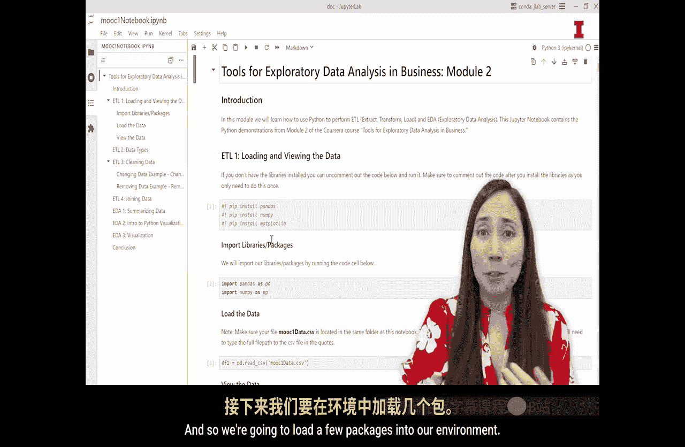
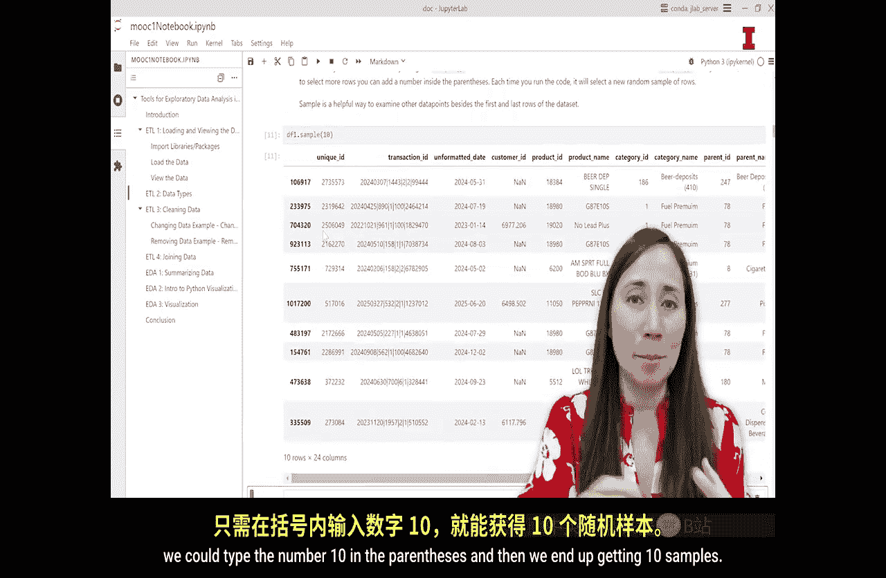

#  102：加载和查看数据 📊

在本节课中，我们将学习数据准备与分析的核心环节——ETL（提取、转换、加载）。我们将通过实际操作，使用Python的Pandas库来加载一个数据集，并学习多种查看和检查数据的方法。掌握这些技能是进行有效商业分析的基础。

许多商业数据分析师声称，他们80%的工作是从原始环境中提取数据，将其加载到数据分析工具中，并进行转换或准备以便分析。这些过程通常被称为ETL（提取、转换、加载）、数据整理或数据清洗。无论80%这个数字是否准确，毫无疑问，准备数据进行分析需要大量的时间、资源和专业知识。本视频将为您提供一些ETL的实践练习。让我们使用我们的`techca`数据集。如果您能跟随Jupyter笔记本进行操作，我们鼓励您这样做，因为“边做边学”比“只看不练”能帮助您更快地熟悉Python。

我们为您提供了两个文件。第一个是名为`OC1data.csv`的数据文件。第二个是名为`MOone_notebook.ipynb`的Jupyter笔记本文件。

## 打开Jupyter笔记本

现在，我们想打开Jupyter笔记本。如何操作呢？您需要导航到保存Jupyter笔记本文件和数据的位置。在您的文件夹系统中，无论您将它们保存在哪里，都可以导航到该位置。如果您已经下载了Jupyter Lab桌面应用程序，那么打开这些文件就非常容易。您可以双击笔记本文件，它们就会打开，就像打开Word文档或Excel文件一样。所以，我将双击它。我想提到的另一点是，您需要确保数据文件也保存在与笔记本文件相同的文件夹中。这将使打开数据或将其加载到我们的环境中变得更加容易。如果它们没有保存在同一位置，您的笔记本中可能会出现错误。好的，我将双击它，这将打开Jupyter Lab。

我喜欢使用这个目录选项卡，它看起来像三个带线条的项目符号。如果我点击它，它会打开目录。这样做的目的是允许我通过点击来浏览我的笔记本。因此，我不需要向下滚动并试图找到我的位置，只需点击标题即可跳转到该位置。这对我们来说非常有用，因为这是我们整个模块的Jupyter笔记本。这意味着当我们进行到几个视频之后，我们将需要使用笔记本底部的代码。因此，我们不需要滚动，可以说“好的，让我们跳转到‘用于连接数据的ETL’部分”。然后，您在这里的左侧查看并点击“joining data”，它就会直接跳转到那个位置。

好的，让我们跳回到开头。打开笔记本后，我们要做的第一件事是加载我们的库和包，以便我们可以在Jupyter环境中拥有需要使用的函数。因此，我们将加载几个包到我们的环境中。

## 理解函数与库

有些人可能想知道什么是函数。函数是由其他人编写的代码块，我们可以调用它们来满足我们自己的目的。因此，我们不必自己从头开始编写一大堆复杂的代码，只需使用别人的函数，例如“制作直方图”或“过滤此数据表”。函数使我们的生活变得更加轻松。然而，要使用函数，我们必须告诉计算机我们想要使用哪些Python库。每次我们打开一个新的笔记本或环境时，都必须这样做。

这是有原因的。有成千上万的Python库和包。因此，如果我们每次打开笔记本时，计算机都必须将每个Python库加载到环境中，我们的程序会变得非常非常慢。为了提高效率，我们只告诉计算机我们计划使用哪些特定的Python库，而不是所有可用的库。这样，我们的计算机只需要将必要的库引入我们的环境。

好的，让我们先导入我们的库。

## 导入必要的库

我们将导入的第一个库是`pandas`库。然后我们还要导入`numpy`库。`pandas`库是数据分析中经常使用的库，它是处理数据表的一个非常流行的库。为此，我们将转到笔记本的“导入库和包”部分。我将在这里讨论这段代码。它被注释掉了，这意味着它不会运行。我把它放在这里，以防您遇到错误，但我会讨论它。

要导入一个库，我们需要写`import`这个词，然后是我们想要导入的库。如果您愿意，还可以包含一个`as`和一个别名。别名是一个缩短的名称或昵称。别名非常好，因为有时库的名称很长。因此，我们可以给它一个昵称，每次我们想使用该库中的函数时，都可以引用这个昵称。

`pandas`已经相当短了，但我们将使用别名`pd`。`numpy`也很短，所以我们将使用别名`np`，这样只是稍微缩短了一点。我这样做是因为这是在线上的标准做法。当您在线查看别人的代码并试图解决自己的代码问题时，如果人们使用`pandas`，他们通常使用别名`pd`。这样，您就熟悉了别名的概念，并且知道要查找什么或您在看什么。

好的，所以`import pandas as pd`，`import numpy as np`。当我运行这个时，这将把这些包加载到我们的环境中，这样我们就可以使用`pandas`库和`numpy`库中的所有函数。运行这个有几种方法。我可以按这个播放符号，但必须确保单元格被选中。我可以按播放符号，或者按`Shift + Enter`，这将运行单元格并将选择移动到下一个单元格。所以我按`Shift + Enter`。

好的，我们的库已经加载到环境中了。这意味着我们可以告诉计算机，如果我们想使用`pandas`或`Numpy`中的任何函数。

## 加载数据

接下来我们想加载数据。要加载数据，我们将使用一个名为`read_csv`的`pandas`函数。您会注意到这里有`pd`，那是`pandas`库的别名。我要再次重申这一点，您需要确保`O1data.csv`文件与您打开的笔记本在同一个文件夹中。

要加载我们拥有的CSV文件数据，我们将创建一个名为`df1`的变量。这个变量将包含我们的数据。然后我们将该变量设置为这个`pandas`函数`read_csv`。要调用该函数，我们说从`pandas`库`pd.read_csv`，这是我们正在使用的函数，然后我们说我们想要读取的文件是什么。在本例中，我们的数据文件名为`MOO1data.csv`。

当我们运行这个时，我们应该在这里看到一个小星号，表示代码正在运行，然后数字2会出现，或者您运行的其他代码序列。如果您在此之前运行了其他单元格，您会看到不同的数字。好的，这可能是一个稍大的文件，它不算巨大，但它有一百多万行。所以我们会看到一个小星号出现，根据您计算机的速度，这可能需要一点时间，但请耐心等待。好的，我要运行这个。我们看到星号在那里。这意味着代码正在运行，并且正在加载数据。一旦我看到这里出现一个数字，我现在就有了一个名为`df1`的变量。`df1`是一个数据框，即一个数据表。这是`pandas`的一种数据类型，一个数据表，它就是我们的`MOOC1`数据表。

## 查看数据维度

我们可能想知道的关于数据的第一件事是它有多大。我们的数据有多少行或多少列？一种方法是使用`shape`属性。如果我们转到下一个代码单元格，我们可以使用所谓的`shape`属性或单词`shape`。

这样做会给我们一个输出，其中行数和列数仅作为两个数字列出。有很多方法可以做到这一点，但我喜欢`shape`属性，因为它小巧简洁。因此，如果您真正寻找的只是行数和列数，它不会使您的笔记本变得杂乱。

要使用`shape`属性，我们说`df1.shape`。如果我运行这个，我会看到两个数字显示出来。第一个数字是150000。第二个数字是24。这两个数字分别代表我们的行数和列数。这意味着我们的数据集有150000行和24列或变量。

## 查看数据信息

我们可能想知道的关于数据集的下一件事是，我们拥有的这24个变量是什么。一种方法是使用`info`方法。我们拥有的下一个代码使用了这个`info`方法。`info`方法将列出我们数据框中的所有变量，并为我们提供关于这些不同变量的一些信息。

好的，让我们运行它，以便我们可以讨论我们所看到的内容。要运行`info`方法，我们首先必须说明我们想要获取哪个数据框的信息，因为有时我们处理许多不同的数据框。我们可能有`df1`、`df4`、`df20`。所以我们要说我们正在查看哪个数据框。在本例中，我们只有`df1`。所以`df1.info`。这表示我们想要这个数据框的信息。

我必须选中这个单元格，然后我可以按这里的播放键或按`Shift + Enter`。我们可以在代码单元格正下方看到这个的输出。好的，我们可以看到我们有24列。Python在计数时从0开始。所以我们有0到23。这是列数，也就是我们的24列。我们有列的名称。这是来自我们CSV文件的标题。所以我们有`unique_id`、`transaction_id`、`unformatted_date`、`customer_id`，一直到`units`和`gross_profit_margin`。这就是列名。

然后我们有另一列叫做`non-null count`。这告诉我们，对于我们的每一列或每个变量，该列中有多少项是非空的，即不是缺失值。对于我们的大多数变量，我们可以看到它们有正确的数量，或者没有缺失值，因为我们看到数据框的行数是150000。我们看到许多变量有150000个非空值。这意味着没有缺失值。但实际上我们看到，对于我们的一些列，确实有缺失值。以这里的`customer_id`为例。`customer_id`有267000个非空值。这意味着其余的行是缺失值或空值。这并不奇怪。

实际上，因为`customer_id`只有在客户是忠诚客户时才存在，所以并非每个人、每笔交易或购买的物品都将是忠诚客户。事实上，许多交易都不是忠诚客户，我们可以在这里看到这一点。

这里的最后一列是数据类型列。

## 查看描述性统计

另一种检查数据的方法是查看数据的一些描述性统计。有一个名为`describe`的方法，它将查看所有列，并尝试提供关于这些列的一些描述性统计信息。要调用此方法，我们需要说明我们正在查看哪个数据框。在本例中是`df1`，然后`.describe()`，我们这里有括号。当我们运行这个时，我们可以看到它试图获取我们数据框中所有变量的描述性统计信息，但它实际上只能计算我们数值变量的这些描述性统计信息。

所以我们有`unique_id`、`customer_id`等所有数值变量，它计算了一些描述性统计信息。具体来说，它计算了8个统计量：计数、平均值、标准差、最低值（最小值）、最高值（最大值），以及第25、50和75百分位数。它为您提供了一些关于数据分布的信息。

我们可以看到，对于我们的一些数字或变量，这可能是非常有用的信息，比如`revenue`，平均收入是多少，最大或最小收入是多少，`gross_profit_margin`也是如此。但对于其他变量，可能没有那么有用。比如说`unique_id`。那只是分配给给定行的ID。所以它实际上没有数值意义。因此，计算平均值、最小值、标准差并不是那么有用或有益。但是，如果您有一个数值变量，其数值很重要，那么`describe`方法可能非常有帮助。

## 查看数据框头部

我们可以检查数据的第四种方法是实际查看数据框本身。有几种方法可以做到这一点，但我们将使用所谓的`head`方法。`head`方法允许我们查看数据框的最顶部，默认显示前五行。要调用`head`方法，我们说我们想要查看哪个数据框，然后写`.head()`，括号闭合。当我们运行这个时，我们将在Jupyter笔记本中看到输出，即数据框的前五行。

我们运行了它，按`Shift + Enter`，我们看到了前五行，即第0、1、2、3、4行，以及列。我经常使用这个方法，因为它允许我快速查看我的数据发生了什么变化。例如，当我清理数据或更改数据时，比如删除一列或进行计算，我可以快速看到该列是否已添加到我的数据框中，计算是否正确执行。因此，当您处理数据时，这是一个非常有用的方法。

默认情况下，它显示前五行，但如果您想显示不同的行数，比如只想要三行，您可以在括号内添加一个3，然后它会显示三行。

## 查看数据样本

我们可能想要查看数据的最后一种方法是查看样本。这与`head`方法非常相似，因为它允许您实际查看数据框本身，但不同之处在于，`sample`从您的数据框中随机抽取一行。它的调用方式类似。所以我们说`df1.sample()`，如果我们括号里没有数字，那么它只给出一个样本，从数据框中抽取一行。但如果我们想说抽取10行的样本，我们可以在括号内键入数字10，然后我们最终会得到10个样本。

## 总结

这些只是使用Python和Jupyter Notebook查看数据的几种常见方法。我们将在数据分析的ETL阶段大量使用这些函数，因为我们在清理、准备和操作数据时，经常需要查看数据以确保我们的代码正常工作。熟悉这些概念将有助于您在进行数据分析时，尤其是在需要频繁查看数据的ETL阶段。

在本节课中，我们一起学习了如何打开Jupyter笔记本、导入必要的库（如`pandas`和`numpy`）、加载CSV数据文件，以及使用`shape`、`info`、`describe`、`head`和`sample`等多种方法来查看和检查数据的基本信息。这些是数据准备和分析的基石，熟练掌握它们将为后续更复杂的数据操作和分析打下坚实的基础。