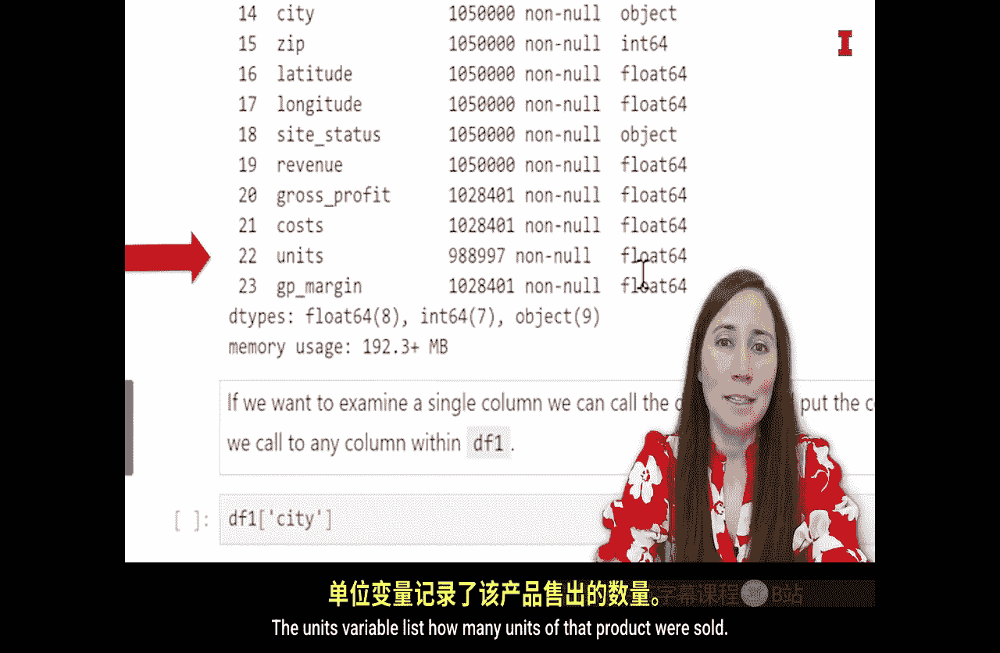

#  103：数据类型详解 📊

在本节课中，我们将学习Python中常见的数据类型。理解数据类型是数据处理和分析的基础，它决定了Python如何解释和操作数据。我们将逐一介绍整数、浮点数、字符串、日期时间和布尔值这几种核心类型，并了解它们在真实数据集中的具体表现。

## 数据类型简介

当数据存储在Python环境中时，其值会与数据类型一同存储。数据类型告诉Python在程序中使用这些数据时应如何处理。数据类型种类繁多，有针对单个值的类型（如数字与文本），也有针对数据集合的类型（如数据表或列表）。

本节我们将重点介绍单个数据值的常见数据类型。以下是本视频将涵盖的常见数据类型：整数、浮点数、字符串、日期时间和布尔值。

## 常见数据类型详解

### 整数

首先是整数。整数是一种数值数据类型，但它不能是任意数字，必须是**没有小数部分的整数**。整数可以是负数、正数，甚至是零。

*   **公式/代码示例**：`42`, `-7`, `0`

上面这些数字是整数，而下面带小数点的数字则不是整数。

### 浮点数

另一种数值数据类型是浮点数。Float是“浮点小数”的缩写。这种数据类型可以表示从负无穷大到正无穷大的任何数字，并且顾名思义，它**允许有小数位**。

*   **公式/代码示例**：`3.14159`, `-2.5`, `0.0`, `42.0`

您会注意到最后两个数字`0.0`和`42.0`的小数位是0。整数可以存储为整数或浮点数。当它们存储为浮点数时，您会在整数后面看到`.0`。

### 字符串

我们将讨论的第三种数据类型是字符串。字符串是文本数据。文本数据包括字母、数字、标点符号、空格、字符——基本上，您能在键盘上键入的任何内容都可以是字符串。

*   **代码示例**：`"Hello, World!"`, `"Product ID: 12345"`, `"2023-10-27"`

左侧的所有这些文本都可以是字符串数据类型。通常，当我们想到文本数据时，会想到单词，但数字和日期也可以存储为字符串。有时这可能是个问题，我们需要将数据转换为正确的数据类型，但有时将数字存储为字符串实际上可能很有帮助。

### 日期时间

我们将使用的另一种常见数据类型是日期时间数据类型。顾名思义，日期时间数据类型包含日期和时间，**代表精确到微秒的特定时刻**。

虽然您可以将日期存储为字符串，但将其存储为日期时间可以让Python按时间顺序对数据进行排序。使用日期时间数据类型，Python还可以计算两个日期时间之间过去了多少时间。这在日期时间存储为字符串时很难做到。

它也是一种极其有用的数据类型，因为它存储了大量关于日期的信息。

*   **代码示例**（在pandas中）：`pd.Timestamp('2023-10-27 14:30:00')`

虽然这看起来可能没什么特别，但借助日期时间对象，我们可以使用特殊函数来提取重要的信息，如月份、日期、年份、小时，甚至是星期几。这使我们能够进行一些非常有趣的分析。

### 布尔值

在查看真实世界数据之前，我们将介绍的最后一个数据类型是布尔值。布尔值是一种**只能取两个值的数据类型：真（True）和假（False）**。

*   **代码示例**：`True`, `False`

这种数据类型用于我们程序中的逻辑，例如当我们使用“如果-那么”逻辑时。

## 在数据集中查看数据类型

既然我们已经讨论了常见的数据类型，现在让我们来看看这些数据类型以及它们在本模块的TechA数据中是如何表示的。

您需要打开您的Jupyter笔记本，然后我们希望运行“ETL2”部分之前的所有单元格。我们可以通过侧边栏的目录来导航。如果您没有看到侧边栏，可以转到“视图”->“外观”并勾选“显示左侧活动栏”。

点击目录后，它会显示我笔记本中所有不同的标题。我们将定位到“ETL2 数据类型”，然后点击它。接下来，我需要运行这个标题之前的所有单元格，也就是上一个视频中我们加载和查看数据所做的所有事情。

我们必须这样做的原因是，任何时候我们关闭Jupyter或电脑，实际上都会丢失我们的环境。环境保存了我们为此笔记本将要使用的所有库、已导入的任何数据以及已创建的任何变量。所有这些信息都会消失，并且只在我们运行和打开该环境时临时存在。如果我们关闭电脑或关闭Jupyter，那么该环境就不再存在，因此我们必须将所有库重新加载到环境中，并重新加载数据，以便我们可以再次开始处理它。

为此，我们希望运行“ETL2 数据类型”之前的所有单元格。我喜欢这样做：选中“ETL2 数据类型”单元格，然后选择“运行”->“运行选中单元格以上的所有单元格”。运行后，我们将看到它正在执行这些单元格。

现在，我们已经运行了之前的所有单元格，加载了库和数据。接下来，我们将查看数据框中所有不同的变量。如果您还记得上一个视频，我们实际上查看了多种查看数据的方法，我们可以查看整个数据框，也可以查看数据框的各个方面。现在我们将使用其中一种方法：`info`方法。`info`方法会列出数据框中所有不同的变量，并告诉您一些关于它们的信息，例如每个变量有多少非空行以及其数据类型。

我们将逐步讲解，并使用这个`info`代码来讨论数据框中的所有不同变量。我将选中这个单元格并运行它。然后，我直接在笔记本中得到了输出结果：我的数据框中所有列的列表。

总共有24列，从第0列“unique_id”一直到第23列“gross_profit_margin”。我对这些变量有了一些了解，让我们逐一讨论每个变量是什么。

以下是数据集中各变量的详细说明：

*   **unique_id**：数据框中的第一列，是整数数据类型。它是数据集中每一行的唯一标识符，没有重复项。每一行都有自己的unique_id，这是我们识别数据集中给定行或观察值的方式。
*   **transaction_id**：数据框中的第二列，没有缺失值，共有150,000个非空项（即数据框的行数）。它是对象数据类型，这意味着在我们的环境中它被保存为字符串数据类型。transaction_id是标识该商品属于哪笔交易的ID。此列中存在重复项，因为有时一笔交易包含多个商品。例如，购买三件商品的交易，这三件商品的transaction_id是相同的，以表示它们属于同一笔交易。这与unique_id不同，那三件商品会有各自的unique_id，但它们的transaction_id相同。
*   **unformatted_date**：同样没有缺失值，目前是对象（即字符串）。unformatted_date是该商品被购买的日期，即交易发生的日期。它目前没有格式化为日期数据类型，我们最终需要更改它，但现在我们只需知道这是购买发生的日期。
*   **customer_id**：第四列。实际上，customer_id存在一些缺失值，我们只有267,104个个体或交易有数字记录。它被保存为浮点数据类型，因此数据具有小数或分数部分。customer_id在某些情况下缺失，因为该customer_id仅对忠诚客户已知。如果在该交易中，客户使用了他们的忠诚卡或输入了忠诚号码，那么该customer_id号码将与那笔交易及其购买的所有商品关联。然而，有很多人进入这些便利店和加油站，他们没有忠诚卡或忠诚号码，因此他们的购买记录没有关联的customer_id。或者，忠诚客户可能没有输入他们的号码或使用忠诚卡，那么我们也不会为该交易或商品附加客户号码。
*   **product_id**：没有缺失值，因此数据框中的每一行都有一个product_id号码，并且它是整数。product_id是客户购买的实际产品的ID号码。每一行都是一笔交易中购买的单件商品，因此该商品有一个产品ID。还有一个product_name，即该商品的实际名称。ID是一个数字，而product_name是它的叫法。例如，我购买果冻豆，那将是产品名称，但会有一个product_id或数字与果冻豆产品类型或单个产品相关联。
*   **category_id 和 category_name**：对于TechA销售的每一种产品，它们都被分组到类别中。这些类别是相似类型的产品。以我的果冻豆例子为例，果冻豆是实际产品、单个产品，而类别可能是“水果糖”。我们为该水果糖类别有一个ID号码，然后我们也有该类别的名称。
*   **parent_id 和 parent_name**：这是我们单个产品更广泛的类别分组。我说过我有果冻豆，它们可能属于“水果糖”，而果冻豆的更广泛类别可能是“所有糖果”，这将包括巧克力、焦糖、其他可能不在更具体类别中的糖果。我们称之为父类别，因此我们看到parent_id和parent_name。每个父类别也有一个与之关联的ID号码以及一个名称（显示为对象数据类型，即字符串）。
*   **product_count**：表示每个父类别中不同类别或商品的数量。
*   **site_id**：代表购买该商品的便利店的特定ID号码。这也是数值数据类型。
*   **site_name**：是该位置的名称，通常根据便利店或加油站的位置命名。
*   **address, city, zip_code**：这些是位置变量。address和city都是字符串数据类型（此处显示为对象）。zip是整数，是一个数字，因此最终保存为整数数据类型。重要的是，这些不是我们便利店的真实地址，因为我们希望掩盖数据以保护这家公司的身份。
*   **latitude 和 longitude**：这些是浮点数据类型，是可以具有小数或分数部分的数值数据类型。纬度和经度也是用于确定商店位置的位置变量。
*   **site_status**：第19个变量，表示商店是活跃还是关闭的状态。
*   **revenue**：一个非常有用的数字，显示每个产品赚取了多少收入。这里没有缺失值。它是浮点数据类型，因此具有小数部分，可以赚取美元和美分，所以我们看到这种小数或浮点数据类型。
*   **gross_profit**：对我们来说也是一个非常有用的数字。总利润是扣除直接成本后公司剩余的利润的财务概念。总利润本质上是收入减去销售该产品的成本。我会跳到gross_profit_margin，因为它与总利润相关，那是我们的最后一个变量。
*   **gross_profit_margin**：是百分比，是一个财务概念。它的计算方式是（收入 - 成本）/ 收入，也就是我们的总利润除以收入。因此，毛利率代表了每美元收入中的利润百分比。这是衡量企业以及单个产品类别利润的一个非常重要的指标。我们将在课程中大量使用这些指标。
*   **cost**：所售产品的成本，即公司的成本。我们可以看到这里有一些缺失值，可能只是我们缺少某些成本信息。我们看到这也影响了总利润和毛利率，因为我们需要成本来进行这些计算。
*   **units**：我们将讨论的最后一个变量是units变量。units变量列出了售出的该产品的单位数量。

## 总结与下一步

本节课中，我们一起学习了Python中的核心数据类型：整数、浮点数、字符串、日期时间和布尔值，并详细查看了它们在示例数据集TechA中的具体应用和表现。理解每个变量的含义和其数据类型是进行有效数据分析的第一步。

既然我们已经讨论了不同的数据类型和数据集中的变量，在下一个视频中，我们就可以继续进行数据清洗了。