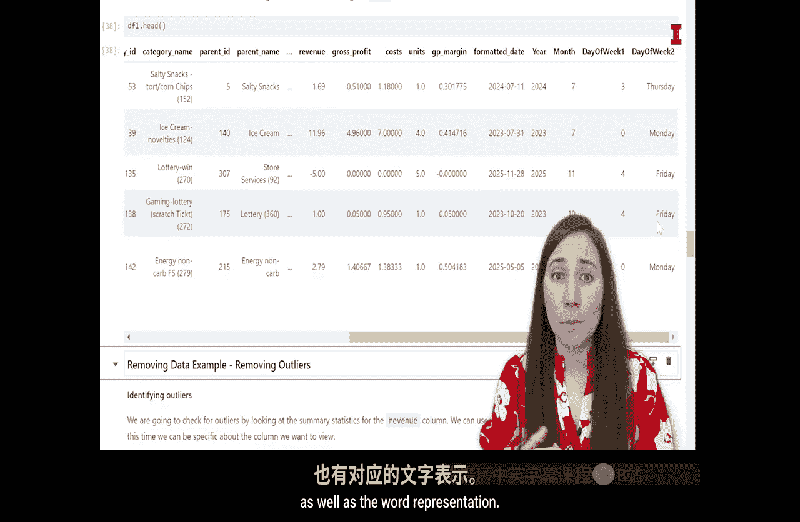
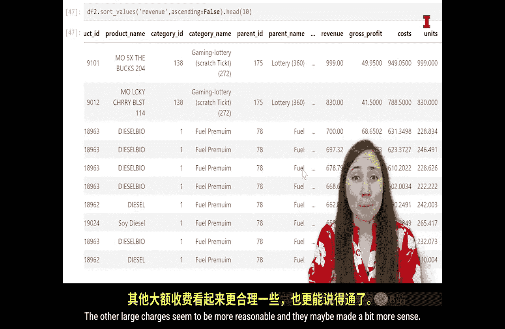

#  104：数据清洗

在本节课中，我们将学习数据清洗的核心概念与操作。数据清洗是数据分析中至关重要的一步，它确保我们使用的数据是准确、一致和可用的。我们将通过一个具体的便利店销售数据集（TechA数据）的实例，学习如何修复、删除和添加数据。

## 概述：数据清洗的类比与核心概念

上一节我们检查了数据集的每一列。本节中，我们将清理或整理这个数据集。

数据清洗的过程可以类比为打理花园。要打造一个美丽的花园，需要大量的准备工作。我们必须浇水、施肥、修剪，当然，还要除草。在这些步骤之前，我们需要高质量的输入，比如良好的土壤、优质的种子或合适的种植地点。高质量的输入和辛勤的照料，最终会产出美丽的花园。

这种准备工作类似于数据清洗。土壤、种子、肥料等输入是我们的原始数据，而除草或清理杂物的工作则类似于数据清洗。

数据集可能存在多种混乱的情况，包括但不限于以下几种：
*   列标题没有名称。
*   单个列中存储了多个变量。
*   存在非常大或非常小的异常值或极端值。
*   存在拼写错误。
*   列的数据格式或数据类型错误。
*   存在缺失值或缺失列。
*   需要将其他来源的数据合并到当前数据集中。

我们稍后会回到这个花园的比喻，但现在，让我们回到工作室开始清洗数据。

当数据不干净时，我们通常可以采取以下三种途径之一进行清洗：
1.  **修复或更改数据**：例如，纠正错误、更改数据类型或统一数据格式。
2.  **删除数据**：如果某些观测行（数据行）没有意义或大部分数据缺失，我们通常会删除这些行；或者，如果某列不需要，我们可以从数据中删除该列。
3.  **添加数据**：例如，我们可以基于现有列创建一个分析所需的新列，或者合并来自另一个数据集的数据，以便将所有需要的数据集中在一个地方。

相对而言，我们的TechA数据已经相当整洁。例如，每一行已经是一个观测值，每一列已经是一个变量。然而，仍有一些地方可以整理。在本视频中，我们将涵盖上述每种清洗途径的一个例子。

## 修复数据：更改日期列的数据类型

我们将从第一种清洗途径开始，即修复一个列。我们要修复日期列。

正如我们在上一个视频中看到的，日期列是字符串数据类型。我们也可以通过返回数据框中某个特定单元格的值来查看这一点。我们想查看未格式化日期列中的一个单元格。使用`.at`方法，我们可以引用要返回的列。

以下代码表示，我们想查看数据框`df1`。当我们使用`.at`时，表示返回数据框中的一个特定数据点。我们使用坐标来定位，即第3行，以及列“unformatted_date”。运行此代码，它将提取该列第3行的确切单元格。

我们可以看到它是“2023-10-20”。我们可以判断这是一个字符串，因为它被引号包围。当你提取或返回一个字符串值时，通常会看到两边的引号。

我们希望将其更改为datetime对象，而不是字符串。在Python中，有多种方法可以完成相同的任务，将日期转换为datetime对象也是如此。我们将使用pandas的`to_datetime`函数，它将字符串日期转换为datetime对象。

接下来的代码将把我们的“unformatted_date”列转换为格式化日期。我们将创建一个名为“formatted_date”的新列。在`df1`（我们保存数据的数据框）中，我们将创建一个名为“formatted_date”的新列。

为此，我们使用方括号指定新列名，并将其设置为以下内容：这实际上是获取我们未格式化的日期列，然后将这些字符串日期转换为datetime对象。我们使用pandas（别名为`pd`）的`to_datetime`函数。我们指定要转换的是`df1`中的“unformatted_date”列。

这段代码的作用是：获取保存为字符串数据类型的未格式化日期，将它们转换为datetime对象，并将这些datetime对象保存在“formatted_date”列中。

运行此代码后，笔记本中没有输出，因为它只是在环境中进行更改，只是向`df1`数据框添加了一列，我没有要求计算机显示它。

但如果我们想并排查看这两列，我们可以从数据框中提取这些列并并排显示。接下来我们就这么做：从`df1`中，我们选取这两列的列表，并在笔记本中显示它们。

运行后，我得到了并排显示的未格式化日期和格式化日期。如果你看它们，可能会觉得它们看起来没什么不同，确实如此，它们都是日期的表示形式。但在未格式化日期的表示中，它被保存为字符串数据类型，而在格式化日期的表示中，它被保存为datetime对象。

如果我们想查看“formatted_date”列中某个格式化日期的具体值，就像我们查看“unformatted_date”列中某个未格式化日期的具体值一样，我们可以再次使用`.at`方法。我们引用要查看的数据框`df1`，然后使用`.at`，再指定数据框内的坐标：第3行，“formatted_date”列。

回想一下，我们的未格式化日期在引号中，因为它是字符串。但我们的格式化日期应该不再是字符串了。当我们运行此代码时，这些值被保存为datetime对象，所以看起来会有点不同。它被保存为时间戳“2023-10-20”，没有列出具体的交易时间，只有日期。

这样看起来有点不同。与字符串日期相比，datetime对象可以给我们提供更多信息，或者我们可以更容易地从中提取信息。

我们还可以通过再次查看`info`方法来确认这是两种不同的数据类型。`info`方法提供了数据框中所有变量及其数据类型的列表。我们应该看到，对于未格式化日期，其数据类型是对象（即字符串），而对于格式化日期，其数据类型应该是datetime。

我们看到这里的未格式化日期是对象类型（字符串），而我们添加的最新列“formatted_date”的数据类型是datetime。因此，我们知道已将该日期转换为datetime对象，并将其保存为新列。

datetime对象的一个优点是，我们可以从中提取大量信息，如果日期保存为字符串，做这些操作会更具挑战性。例如，有许多日期方法可以应用于datetime对象来获取信息：我们可以提取年份、月份、星期几（周一、周二等）、分钟、毫秒。所有这些信息都可以非常容易地从datetime对象中提取。虽然用字符串日期也可以做到，但比直接说“从这个数据点给我获取星期几或月份”要麻烦一些。

接下来，我们将再创建三个列：年份列、月份列和星期几列。为此，我们将使用一些datetime对象的方法。使用`.dt`可以从中提取信息。

对于星期几，有几种方法：可以获取星期几的实际名称（周一、周二等），也可以获取与之关联的数字（0-6）。我们将提取两者，虽然其中一个会更常用，但我想展示两者都可以提取。

要创建新列，我们指定要添加到哪个数据框。在所有情况下，我们都是添加到`df1`，这是我们正在处理的唯一数据框。然后，使用方括号和新列名来创建新列。

第一行代码表示：在`df1`中，创建一个名为“year”的新列。
第二行代码表示：在`df1`中，创建一个名为“month”的新列。
第三和第四行代码表示：在`df1`中，创建名为“day_of_week_1”和“day_of_week_2”的新列。

运行此代码后，我们应该有四个新列：年份、月份，以及两种表示星期几的列。

对于每一行，我们将其设置为等于“formatted_date”（因为那是datetime对象），然后从中提取一些信息。

第一行：转到`df1[‘formatted_date’]`，使用`.dt.year`从datetime对象中提取年份，并将年份保存到“year”列。
第二行：使用`.dt.month`提取月份。
第三行：使用`.dt.dayofweek`提取星期几的数字表示（0代表周一，6代表周日）。
第四行：使用`.dt.day_name()`提取星期几的名称表示（Monday， Tuesday等）。

运行此代码。

我们可以使用`head`方法来查看数据框，很多人经常使用这个方法，因为你只想查看数据框的一小部分来检查清洗过程。`head`方法允许你查看数据框的前五行（默认）。我们将从`df1`中查看数据框的头部。

运行后，我得到了数据框的前五行。如果我滚动到最右边，应该能看到我创建的列：那些新列。第一行的年份是2024，第二行是2023，我们可以看到这实际上是从“formatted_date”列中提取的。年份函数从格式化日期列中提取了年份，并将其保存为独立的“year”列。

然后是月份，可以看到它正确地从第一行提取了月份7（七月），从第三行提取了月份11（十一月）等等。这样可以检查代码是否正确运行。

接着是我们的两个星期几列。在Python中，一周的第一天是周一，所以数字0对应周一，6对应周日。我们可以看到，星期几的数字3是周四，0是周一，4是周五。我们既有星期几的数字表示，也有文字表示。

## 删除数据：识别并处理异常值

我们已经介绍了第一种清洗数据的方法，即更改数据。在TechA数据的例子中，我们更改了数据类型，并通过创建新的年份、月份和星期几列来添加数据。

第二种清洗数据的方法是删除数据。我们经常需要删除的一种数据是异常值。异常值是极端的数据点，通常不能准确代表数据。它们可能比其余数据极高或极低。

让我们转到Jupyter笔记本来查看TechA收入数据的异常值。

首先，确保收入列没有缺失值。实际上，当我们之前运行`info`方法时，可以看到数据框有150,000行，收入列有150,000个非空值。所以没有缺失值。

现在，检查异常值。我们可以查看是否有非常高或非常低的值。为此，我们首先查看一些汇总统计信息。回想一下之前的视频，我们学过一个名为`describe`的方法。

`describe`方法为数据框中的数值列提供汇总统计信息。我们也可以通过引用单个列来提供该列的汇总统计信息，这正是我们在这段代码中所做的。

查看汇总统计信息，我们可以看到可能存在一些异常值。最小值是负数（-1680），最大值是一个非常大的数字（4,500,000）。平均值和中位数有些不同，这告诉我们数据可能存在一些偏斜。450万是一个非常大的数字。

我们将查看那些高收入观测值，看看发生了什么。我们将使用`sort_values`方法对原始数据框进行排序。需要注意的是，`sort_values`会显示排序后的值，但不会实际更改原始数据框。除非我将看到的新排序值赋给一个新变量或该数据框，否则它不会将原始数据框更改为新的排序值。

我将在这里对值进行排序。使用`df1.sort_values`，并指定要按哪一列排序。它将查看该列，并按升序（从小到大）或降序（从大到小）排列这些值。`sort_values`的默认值是升序（从小到大）。但我们想看那些大数字，所以我会设置`ascending=False`，这意味着按降序排序。

这将显示按收入列排序后的数据框。当我们排序时，不仅仅是排序该列，而是每一行都会按照排序顺序移动。

运行此代码后，它显示了我的数据框。如果我看收入列，可以看到那个非常大的收入：450万、300万、200万、200万、200万。这些是非常大的值。但当我查看它们是什么时，发现它们都与“Okay Lucky Red Gaming Lottery Scratcher”有关。这看起来可能是一种错误。我们还可以看到，数据框末尾的负值是彩票奖金，便利店为赢得刮刮乐或彩票的人支付奖金，或者是一些预付卡。

在笔记本中显示数据框只允许我看到前五行和最后五行。但如果我想看更多行，可以通过编写相同的代码并加上`.head()`来实现。例如，我想看前25行。我可以再次按收入降序排序，并显示前25行。

然后我可以看到。前五行与“Okay Lucky Red”有关，但现在我发现这是一个大问题：这25个最大的收入观测值都归因于这个“Okay Lucky Red”刮刮乐。看起来系统中记录的方式可能有问题。一个人购买450万美元的刮刮乐，以及另一笔300万美元的交易和一堆200万和100万美元的交易来购买这种刮刮乐，这不太可能。

因此，我们或许可以安全地说这些是异常值，它们实际上并不代表购买那种“Okay Lucky Red”刮刮乐的真实情况。我们可能想要删除这些异常值，因为当我们开始查看诸如商店表现或收入时，它们会使数据产生偏差。

接下来，我们将查看所有这些“Okay Lucky Red”刮刮乐。我们将找到这个特定产品的产品ID，即17628。然后过滤我们的数据框，创建一个名为`outliers`的新数据框，只保留产品ID为此值的所有行，以便更仔细地查看所有这些“Okay Lucky Red”购买记录。

要过滤数据框，你需要确定要基于什么特征或条件进行过滤。我将创建一个名为`outliers`的新变量，将其设置为等于`df1`，但经过过滤。我的过滤条件放在这些方括号内。我指定要在`df1`中查看什么，对于过滤，我说查看“product_id”列，即`df1[‘product_id’]`，并且只选择当它等于（双等号表示等于）数字17628时。

计算机将遍历所有行，只保留“product_id”等于17628的行，并将它们全部保存在我刚创建的`outliers`变量中。运行后，我现在在环境中有了这个`outliers`变量。如果我想看它，可以调用那个`outliers`数据框。

它显示给我看。我说，显示`outliers`数据框。我可以看到，这是我数据框中所有“Okay Lucky Red”的行。如果我查看它们并查看收入，可以看到对于所有行，收入都非常高。所以这似乎是我们“Lucky Red”产品的一个普遍问题。

那么，我可以做的是，将“Lucky Red”产品从我的数据框中移除。为此，我基本上可以进行过滤，但我说的是保留所有不是我的“Lucky Red”产品的行。

我将创建一个名为`df2`的新变量，这将是我的新的、更干净的、经过过滤的数据框。我将其设置为等于`df1`，但经过过滤。在这种情况下，我过滤的条件是什么？我想保留所有不是产品ID 17628的行。为此，我可以说，查看`df1[‘product_id’]`，但任何不等于（用感叹号和等号表示不等于）产品ID 17628的行。这样将保留每一个不是这些异常行的行。

运行后，它保存了那个新变量`df2`，这是我的更干净的数据框，没有那些异常的刮刮乐彩票行。这应该删除了39行。如果我们想确认`df2`已删除这些行，可以检查数据框的形状。它应该是150,000减去39行。运行后，我得到149,961行，完美。

现在，我们将检查新数据框`df2`，看看移除那些非常大的收入项目（450万、300万、200万）后，我们的统计信息是什么样子。

现在，我们再次查看最小值和最大值。我们没有消除负值，这些负值看起来是彩票奖金，这是合理的，不是错误，也不是问题，公司支付彩票奖金是其业务的一部分。对于最大值，以前是450万美元，但现在只有990美元，这比数百万合理得多。现在只是几百美元，对于便利店来说仍然很大，但我们可以看看那是什么。

为此，我们将查看`df2.sort_values`，再次按收入查看，按降序排列，先看最大的项目，查看前10个，看看它们是否合理，是否是异常值，或者可能只是大额购买。

第一个，我们看到收入990美元、830美元，这些又是彩票购买。这可能是合理的，可能有人购买了近1000美元的彩票。如果我们查看单位，他们购买了999张这种彩票。这是1美元的彩票，单位与收入大致匹配，所以这可能说得通。830美元的情况类似。

接下来的最大项是燃料，柴油、大豆柴油。如果给一辆大型半挂车加油，或者有一个巨大的油箱或额外油箱，那将花费很多钱，所以几百美元的收入也可能是合理的金额。

我们查看了数据框中的这些异常值，删除了异常值。当我们再次查看那些非常大的数字时，发现我们可能已经去除了那些大的异常值，其他大额费用似乎更合理，也更有意义。

## 总结

在本视频中，我们学习了执行数据清洗的方法，并通过TechA数据的例子，逐一实践了这些清洗方式。

我们更改了以字符串数据类型导入的日期，使其成为datetime数据类型。然后，从datetime对象中，我们通过创建年份、月份和星期几列来添加数据。我们还通过搜索并删除异常的收入数据来删除数据。