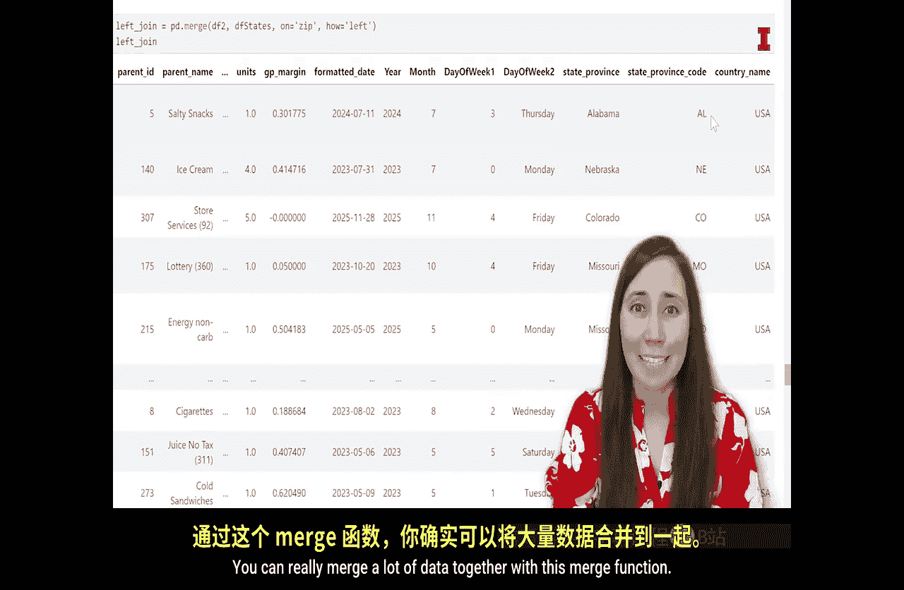

#  105：合并数据


在本节课中，我们将学习如何将两个数据集合并在一起。当我们在一个数据集中找不到所需的所有信息时，可以从第二个数据集中获取这些数据，并通过合并或连接操作将它们整合起来。这是我们在深入分析之前，准备或清洗数据的另一种重要方法。

在开始合并我们正在使用的 `techa` 数据之前，让我们先来了解一下数据合并的基本概念。

## 合并的概念

上一节我们介绍了数据合并的必要性，本节中我们来看看四种常见的合并类型。

以下是四种主要的合并类型：

*   **内连接**：只保留两个数据集中都存在的行。
*   **左连接**：保留左侧数据集的所有行，并从右侧数据集中匹配对应的行。
*   **右连接**：保留右侧数据集的所有行，并从左侧数据集中匹配对应的行。
*   **外连接**：保留两个数据集中的所有行。

## 合并类型示例

为了更清楚地理解这些概念，让我们看一个具体的例子。

假设我们有两个数据集：
*   **数据集A** 包含教授及其喜欢的糖果：`Ron`（糖果A），`Park`（糖果B），`Kim`（糖果C）。
*   **数据集B** 包含教授及其喜欢的颜色：`Unnati`（颜色X），`Park`（颜色Y），`Aishish`（颜色Z），`Ron`（颜色W）。

如果我们想根据“教授”这一列来合并这两个数据集，不同的合并方式会产生不同的结果。

以下是不同合并类型的结果：

*   **左连接**（以A为左数据集）：最终数据集包含 `Ron`、`Park`、`Kim`。`Unnati` 和 `Aishish` 不在最终数据集中，因为他们不在左侧数据集A中。`Kim` 对应的“喜欢的颜色”为缺失值。
*   **右连接**（以B为右数据集）：最终数据集包含 `Unnati`、`Park`、`Aishish`、`Ron`。`Kim` 不在最终数据集中，因为她不在右侧数据集B中。`Unnati` 和 `Aishish` 对应的“喜欢的糖果”为缺失值。
*   **内连接**：最终数据集只包含同时出现在两个数据集中的教授：`Ron` 和 `Park`。没有缺失值。
*   **外连接**：最终数据集包含所有五位教授：`Ron`、`Park`、`Kim`、`Unnati`、`Aishish`。任何缺失的“喜欢的糖果”或“喜欢的颜色”都会显示为缺失值。

## 应用于实际数据


现在，让我们将这些合并概念应用到我们的 `techa` 数据集中。

在我们的 `techa` 数据中，每一行都有邮政编码和城市信息，但没有“州”这一列。如果我们想添加州的信息，就需要从其他地方获取，因为它不在原始数据中。

我们有一个名为 `MOC1_state.csv` 的第二个文件，它为每个邮政编码提供了对应的州和国家信息（本例中所有行都是美国）。

我们可以将 `techa` 数据与这个邮政编码-州数据集进行合并。

如果我们的左侧数据集是 `techa` 数据，右侧数据集是州数据，我们应该选择哪种合并类型？

我们需要思考要保留哪些行。如果我们希望保留所有 `techa` 数据行，并添加对应的州信息，那么**左连接**将是合适的选择，因为它会为 `techa` 数据添加州信息。

## 在 Jupyter Notebook 中操作

让我们进入 Jupyter Notebook 查看实现此操作的代码。

首先，导航到“ETL4 joining data”部分。如果你关闭过 Jupyter Notebook，需要先运行此单元格上方的所有代码，以确保数据已正确加载和环境已设置。你可以通过点击“Run”下拉菜单并选择“Run All Above Selected Cells”来完成。

第一个代码单元格将把我们的州数据集加载到环境中。

```python
df_states = pd.read_csv(‘MOC1_state.csv’)
```

这段代码使用 pandas 的 `read_csv` 函数读取 `MOC1_state.csv` 文件，并将其作为一个 DataFrame 存储在变量 `df_states` 中。**请确保该文件与你的 Notebook 文件保存在同一文件夹中**，否则你需要提供完整的文件路径。

接下来，我们将执行左连接操作。我们使用 pandas 的 `merge` 函数。

```python
left_joined = pd.merge(df2, df_states, on=‘zip’, how=‘left’)
left_joined
```

这段代码的含义是：
*   `df2`：我们的左侧 DataFrame（即 `techa` 数据）。
*   `df_states`：我们的右侧 DataFrame（即州数据）。
*   `on=‘zip’`：指定根据两个 DataFrame 中都存在的名为 `zip` 的列进行合并。
*   `how=‘left’`：指定合并类型为左连接，这意味着保留 `df2` 的所有行，并从 `df_states` 中匹配并添加数据。

运行这段代码后，我们将得到一个新的 DataFrame `left_joined`。它包含了原始 `techa` 数据的所有行，并且在最右侧新增了来自 `df_states` 的列（例如 `state` 和 `country`）。



## 总结


本节课中我们一起学习了数据合并。我们首先介绍了四种常见的合并类型：内连接、左连接、右连接和外连接，并通过示例理解了它们的区别。然后，我们将这些概念应用于实际场景，使用 pandas 的 `merge` 函数，通过左连接为我们的 `techa` 数据集成功添加了州信息。这完成了我们当前阶段的数据提取、转换和加载过程，为后续分析准备好了数据。