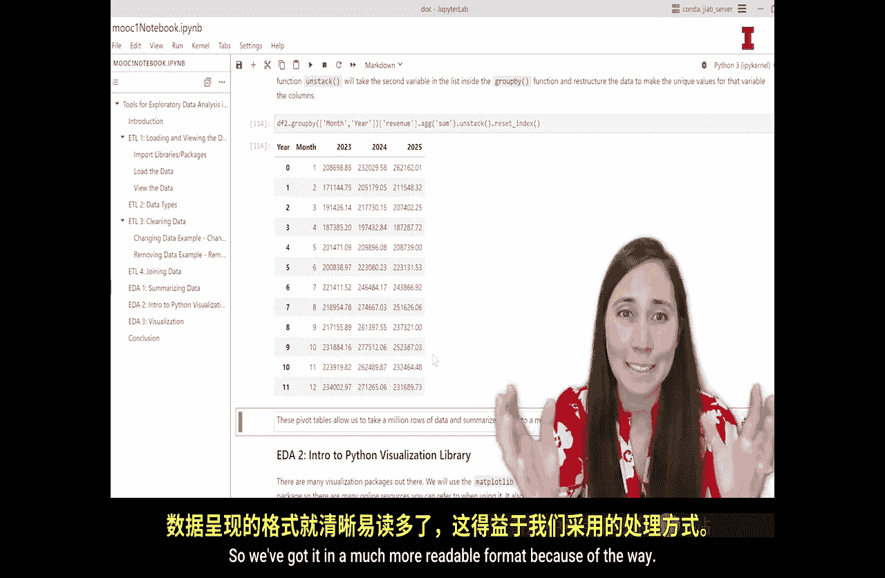

#  106：数据汇总 📊


在本节课中，我们将学习如何使用Python的`pandas`库对数据进行分组和汇总。我们将通过创建数据透视表来探索数据，从而获得有价值的商业洞察。

在之前的视频中，我们重点介绍了ETL，即数据的提取、转换和加载过程。现在，我们将转向数据的查看、理解和探索阶段。这个阶段有时被称为探索性数据分析。

## 探索性数据分析简介

想象一下，你精心打理了一个花园。在收获之前，你需要先观察花园的状况，比如植物的高度、颜色、种类，以及果实的数量。同样，在Python中，我们使用函数来了解数据的“产量”和“多样性”，也就是数据的规模和形态。

一个园丁可能会统计盛开的花朵数量，或者将水果蔬菜按类别分组并估算重量。在Python中，我们将使用`pandas`库中的`groupby`和聚合函数来按类别汇总数据。例如，我们可能希望计算每个地区的总销售额。

## 数据探索的目标与过程

我们分析数据的根本目的是从中获得商业洞察。因此，在提取和清理数据之后，就该开始探索了。但需要注意的是，数据清理和探索的过程并非线性的，而是一个迭代循环。我们清理数据后开始探索，可能会发现需要进一步清理，然后返回去处理，如此反复。

当我们查看数据时，心中需要有一个目标。我们探索数据通常出于两个广泛的原因：
1.  我们有一些具体的问题需要向数据提问。
2.  我们面对一个新的数据集，还不确定能从数据中了解到什么。

本节课我们将聚焦于第二个原因，即更好地理解数据及其所传达的信息。


## 开始汇总数据

我们将继续使用之前视频中的Jupyter Notebook，处理名为`techA`的数据集。这是一个美国连锁便利店2023年至2025年的销售数据。

首先，我们将学习如何汇总数据，然后学习如何使用Python可视化库创建图表。本视频中学习的EDA技术是一种将数据分组并汇总的方法。例如，我们可能想知道这家连锁店在哪几个月收入最高。

面对百万行数据，手动计算每月收入非常困难。幸运的是，有函数可以为我们完成这一切，并返回一个包含所有聚合数据的整洁数据框。

在Python中，完成任何任务都有多种方法，转换和汇总数据也不例外。我们将选择一种分组和汇总数据的方法：`groupby`方法。

## 创建月度收入汇总表

让我们回到Jupyter Notebook，查看`techA`的月度总收入。这将告诉我们一年中哪些月份对商店最有利，并帮助我们更好地了解整个行业。

以下是创建汇总表的步骤：

1.  **指定数据框**：我们使用`df2`数据框，并调用`.groupby()`方法。
2.  **指定分组列**：我们希望按`month`列进行分组。`groupby`会找到`month`列中的所有唯一值，每个唯一值将成为汇总表中的一行。
3.  **指定计算列**：我们希望对`revenue`列进行计算。
4.  **指定聚合函数**：我们使用`.sum()`函数来计算总和。

具体代码如下：
```python
df2.groupby('month', as_index=False)['revenue'].sum()
```
运行这段代码后，我们会得到一个包含两列（`month`和`revenue`）和12行（一月到十二月）的数据透视表。观察数字，我们可以看到下半年收入似乎略高于上半年。这种数据汇总让我们对收入情况有了清晰的洞察，而这在查看百万行原始数据时是难以做到的。

## 保存汇总结果

我们刚刚运行的代码返回了一个数据透视表，但它并没有被保存下来以供后续使用。为了保存它，我们需要将其赋值给一个变量。

以下是保存汇总结果的代码：
```python
df_rev_by_month = df2.groupby('month', as_index=False)['revenue'].sum()
```
运行此代码后，数据透视表就被保存在变量`df_rev_by_month`中了。

## 使用多种聚合函数

除了求和，我们还可以使用其他聚合函数，例如计算每月平均收入的`.mean()`函数，或统计每月交易次数的`.count()`函数。

我们甚至可以将所有这些聚合结果合并到一个数据透视表中。以下是同时计算总收入、平均收入和交易次数的代码：
```python
df2.groupby('month', as_index=False)['revenue'].agg(['sum', 'mean', 'count']).reset_index()
```
运行此代码，我们将得到一个包含`month`、`sum`、`mean`和`count`列的汇总表，可以从中观察到更多模式。

## 按年份和月份进行分组

如果我们不想将三年的所有相同月份数据合并在一起，而是希望分别查看每一年每个月的收入，该怎么办呢？

我们可以修改`groupby`函数，传入一个列名列表，同时按`year`和`month`进行分组。以下是相应的代码：
```python
df2.groupby(['year', 'month'], as_index=False)['revenue'].sum()
```
这将生成一个包含36行的长表格（3年 x 12个月）。

## 重塑数据透视表

36行的表格可能有些冗长。我们可以使用`.unstack()`函数来重塑表格，让月份作为行，而每一年作为单独的列，这样更易于阅读。

以下是重塑表格的代码：
```python
df2.groupby(['month', 'year'])['revenue'].sum().unstack()
```
运行后，我们将得到一个以月份为索引，以2023、2024、2025各年为列的表格，格式更加清晰易读。

## 总结



本节课中，我们一起学习了如何使用`pandas`的`groupby`方法创建数据透视表来汇总数据。我们掌握了如何按单列或多列分组，如何使用求和、平均值、计数等多种聚合函数，以及如何通过`.unstack()`重塑表格以获得更好的可读性。


数据透视表是一个极其强大的工具，特别是在探索数据时。它能快速汇总数据并执行计算，将数据转化为更易于理解的格式，帮助我们洞察数据背后的规律。这种层面的理解，在查看未经筛选和聚合的原始数据集时是极具挑战性的。