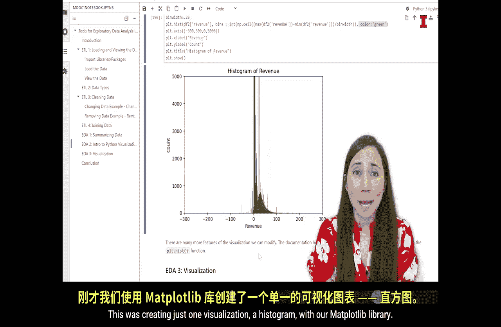

#  107：可视化入门 - Python库 📊


在本节课中，我们将学习如何使用Python进行数据可视化。上一节我们介绍了如何通过汇总统计来理解数据，但“一图胜千言”。本节中，我们将探索一个强大的Python库——Matplotlib，它能快速、轻松地将数据转化为直观的图表，帮助我们进行探索性数据分析。

## 可视化的重要性

正如园丁精心打理花园，通过修剪、移植和布置植物来创造赏心悦目的景观，数据分析师也需要通过可视化来“打理”数据。可视化让我们能够直观地理解数据的模式、分布和关系，从而更好地展示分析的成果。

## 为什么选择Matplotlib？

以下是选择Matplotlib作为入门可视化工具的几个主要原因：

1.  **成熟且广泛使用**：Matplotlib是一个拥有超过二十年历史的库，拥有丰富的在线文档和社区支持，便于解决问题。
2.  **简单直接**：它提供了预置的函数来创建各种图表。例如，要创建直方图，只需调用 `hist()` 函数，而无需手动计算和绘制每个条形。
3.  **直观的图层概念**：构建图表就像在画布上添加图层一样直观，可以逐步添加坐标轴标签、标题等元素。


## 开始使用Matplotlib

首先，我们需要在Jupyter Notebook中导入Matplotlib库。我们通常使用 `plt` 作为其别名，以简化后续代码。

```python
import matplotlib.pyplot as plt
```

## 创建第一个可视化：直方图

直方图用于展示单个变量的分布情况。每个条形代表一个数值范围，条形的高度代表落入该范围的数据点数量。

我们将针对数据集中的“营收”列创建直方图。

```python
# 基础直方图
plt.hist(df2['revenue'])
plt.show()
```

运行上述代码会生成一个直方图，但初始结果可能因为数据分布过于集中而显得不够清晰。

## 调整与优化可视化

为了使图表更具信息量，我们可以利用Matplotlib的功能进行调整。

**1. 调整条形数量**
通过设置 `bins` 参数，可以控制直方图的条形数量，从而改变数据的粒度。

```python
plt.hist(df2['revenue'], bins=100)
plt.show()
```

**2. 调整视图范围**
使用 `plt.axis()` 函数可以缩放图表的显示范围，聚焦于数据的特定区域。

```python
plt.hist(df2['revenue'], bins=100)
plt.axis([-300, 300, 0, 5000]) # 设置x轴和y轴的显示范围
plt.show()
```

**3. 指定条形宽度**
除了设置条形数量，还可以通过计算来指定每个条形的宽度。

```python
bin_width = 0.25
num_bins = int((df2['revenue'].max() - df2['revenue'].min()) / bin_width)
plt.hist(df2['revenue'], bins=num_bins)
plt.show()
```

**4. 添加图表元素**
最后，我们可以为图表添加标题和坐标轴标签，使其更加完整和易懂。

```python
plt.hist(df2['revenue'], bins=num_bins, color='green')
plt.xlabel('Revenue') # x轴标签
plt.ylabel('Count')   # y轴标签
plt.title('Histogram of Revenue') # 图表标题
plt.show()
```

## Matplotlib的总结与展望

本节课中，我们一起学习了如何使用Matplotlib库创建和定制直方图。Matplotlib是一个易于上手的可视化工具，非常适合初学者。它的主要优点是简单直接，但生成的图表风格相对基础。



数据可视化领域还有许多其他功能更丰富、图表更美观的Python库（如Seaborn, Plotly等）。当你掌握了Matplotlib的基础后，可以进一步探索这些库来创建更具吸引力的交互式可视化图表。


通过本节的学习，你已经掌握了将数据转化为直观视图的第一步。在接下来的课程中，我们将运用这个库创建更多类型的图表，深入进行探索性数据分析。