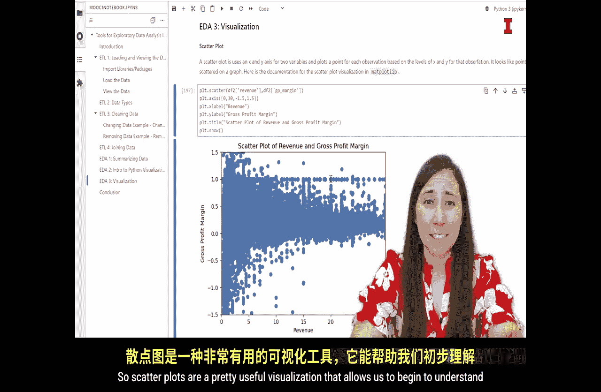
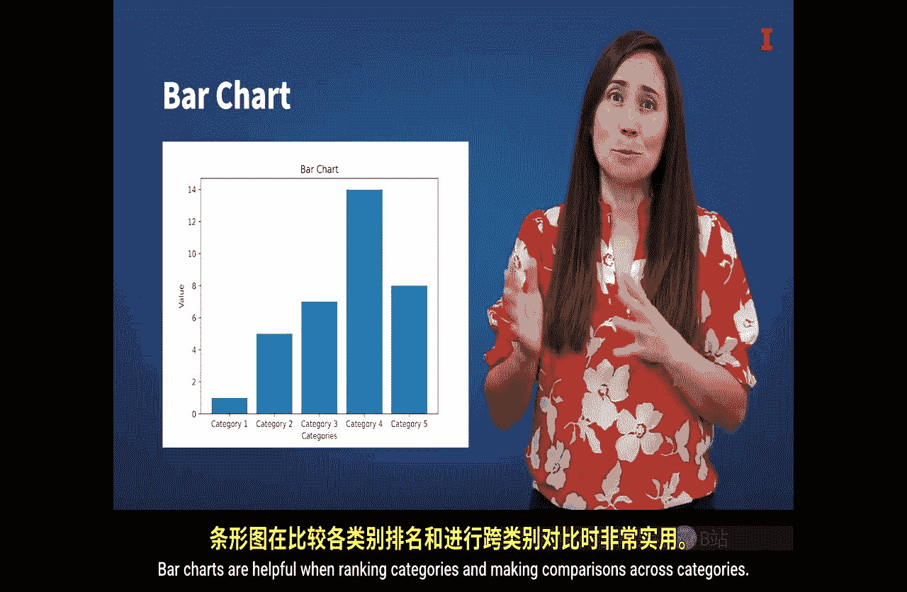
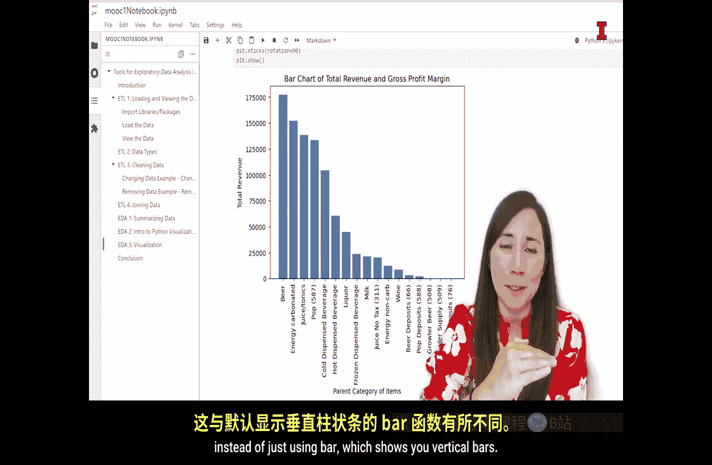
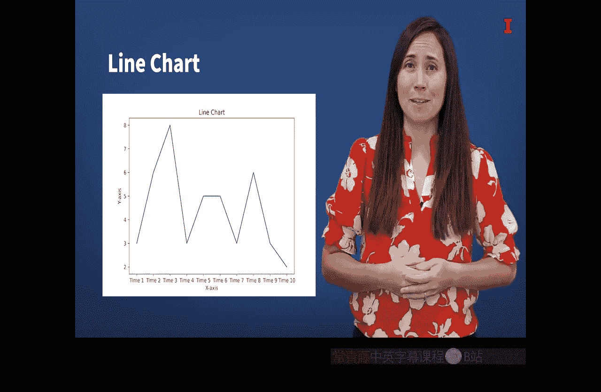
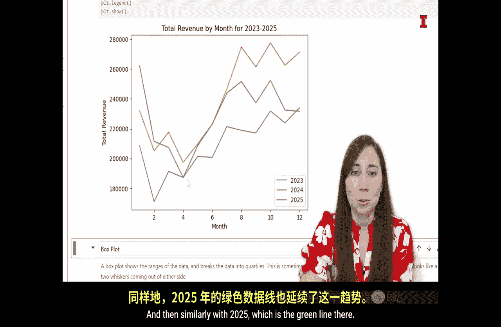
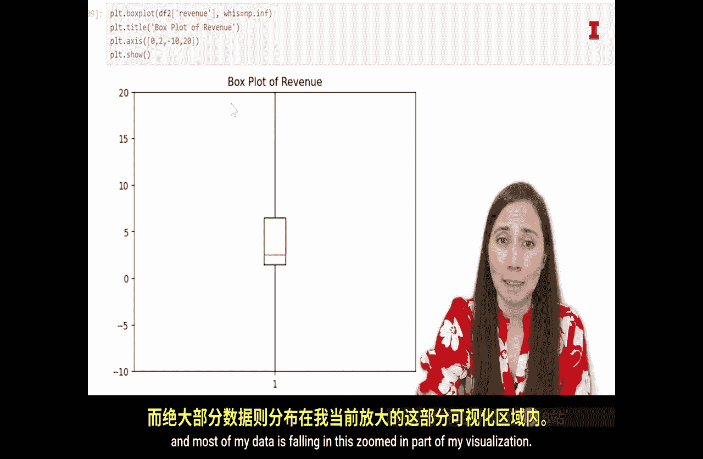

#  108：在Python中创建可视化 📊


在本节课中，我们将使用上一节介绍的 `matplotlib` 库，基于我们的 `techca` 数据创建一系列可视化图表。我们将学习四种核心图表：散点图、条形图、折线图和箱线图，并了解它们如何帮助我们探索和理解数据。

## 散点图：探索变量间关系 📈

上一节我们介绍了 `matplotlib` 库，本节中我们来看看如何用它创建散点图。散点图是一组绘制在水平轴（X轴）和垂直轴（Y轴）上的点。它使用两个连续或离散变量，分别代表X变量和Y变量。散点图可以展示两个变量之间的关系。

两个变量之间的关系主要有三种：正相关、负相关和无相关。通过观察散点图中点的分布模式，我们可以初步判断变量间的关系类型。


*   **正相关**：点呈现**向上**的趋势。这意味着随着X轴变量的增加，Y轴变量也增加。
*   **负相关**：点呈现**向下**的趋势。这意味着随着X轴变量的增加，Y轴变量减少。
*   **无相关**：点没有明显的趋势，表明X和Y之间可能没有明确的关系。

现在，让我们用Python和`matplotlib`创建一个散点图。首先，请打开你的Jupyter Notebook，并导航到可视化部分。

以下是创建散点图的步骤：

1.  我们想探究**收入**和**毛利率**之间的关系：收入更高的商品，其毛利率是更高还是更低？
2.  使用 `plt.scatter()` 函数，并指定X轴和Y轴的数据。
3.  添加坐标轴标签等图层，使图表更清晰。

```python
import matplotlib.pyplot as plt

# 创建散点图：X轴为收入，Y轴为毛利率
plt.scatter(df2['revenue'], df2['gross_profit_margin'])
plt.xlabel('Revenue') # X轴标签
plt.ylabel('Gross Profit Margin') # Y轴标签
plt.title('Revenue vs. Gross Profit Margin') # 图表标题
plt.show() # 显示图表
```



运行代码后，我们得到了散点图。从图中可以看出一些有趣的现象：收入和毛利率之间可能存在微弱的正相关关系，但很难确定。同时，不同收入水平下的毛利率差异很大。对于高收入商品（可能主要是燃油），其毛利率普遍较低。散点图是一个非常有用的工具，能帮助我们初步理解数据中真正发生了什么。

## 条形图：比较类别间的数值 📊



接下来，我们将创建条形图（或称柱状图）。在条形图中，每个条形通常代表一个不同的类别，而条形的高度（或长度）则代表该类别的数值大小。条形图有助于对类别进行排名和跨类别比较。

创建条形图时，我们通常需要重构数据，使每个类别成为一行，并有一个数值代表该类别条形的高度。

假设我们想创建一个条形图，展示**每个饮料类别的总收入**。

以下是创建条形图的步骤：

1.  首先，我们需要使用 `groupby` 和聚合函数（如 `sum`）创建一个数据透视表，汇总每个父类别（`parent_name`）的总收入。
2.  然后，过滤出我们感兴趣的饮料类别。
3.  使用 `plt.bar()` 函数创建条形图，将类别名称作为X轴，总收入作为条形高度。
4.  为了使图表更美观，可以旋转X轴标签，避免重叠。

```python
# 1. 创建数据透视表，汇总每个父类别的总收入
df_parent = df2.groupby('parent_name', as_index=False)['revenue'].sum()

# 2. 过滤出饮料类别
beverage_categories = ['Hot Dispensed Beverage', 'Juice', 'Liquor', 'Milk', 'Pop', ...] # 你的类别列表
df_beverages = df_parent[df_parent['parent_name'].isin(beverage_categories)]

# 3. 创建条形图
plt.bar(df_beverages['parent_name'], df_beverages['revenue'])
plt.xlabel('Beverage Category')
plt.ylabel('Total Revenue')
plt.title('Total Revenue by Beverage Category')
plt.xticks(rotation=90) # 旋转X轴标签90度
plt.show()
```

运行代码后，我们得到了按字母顺序排列的条形图。为了更直观地比较大小，我们可以在绘图前对数据进行排序。

```python
# 在绘图前，按收入降序排列数据
df_beverages = df_beverages.sort_values('revenue', ascending=False)

# 然后使用排序后的数据创建条形图
plt.bar(df_beverages['parent_name'], df_beverages['revenue'])
# ... (其余代码不变)
```

现在，条形图将按收入从高到低排列，更容易进行比较。此外，除了垂直条形图，我们还可以使用 `plt.barh()` 函数创建水平条形图。

## 折线图：观察数据随时间的变化趋势 📉

我们的第三个可视化是折线图。折线图展示信息在连续区间（通常是时间）上的变化情况。在折线图中，数据点被绘制在图表上，并以点对点的方式用线连接起来。线条的上升或下降，直观地描绘了变量随时间增加或减少的趋势。

对于这个折线图，我们想知道**收入是否具有季节性**。因此，我们将检查收入如何随月份变化。

以下是创建折线图的步骤：



1.  使用 `groupby` 按“年月”对数据进行分组，并计算每月的总收入。
2.  使用 `unstack` 方法重塑数据，以便将不同年份的数据作为不同的列。
3.  使用 `plt.plot()` 函数分别绘制每一年的折线。
4.  添加图例以区分不同年份的线条。



```python
# 1. 按年月分组并计算总收入，然后重塑数据
df_line = df2.groupby(['month', 'year'])['revenue'].sum().unstack()

# 2. 创建折线图
plt.plot(df_line.index, df_line[2023], label='2023') # 绘制2023年线
plt.plot(df_line.index, df_line[2024], label='2024') # 绘制2024年线
plt.plot(df_line.index, df_line[2025], label='2025') # 绘制2025年线

plt.xlabel('Month')
plt.ylabel('Total Revenue')
plt.title('Monthly Revenue Trend (2023-2025)')
plt.legend() # 添加图例
plt.show()
```

运行代码后，我们得到了一个清晰的折线图。从图中可以看到一个模式：在冬末春初，总收入较低，然后随着年份的推移而增加。2023年（蓝线）、2024年（橙线）和2025年（绿线）都显示出相似的模式。

## 箱线图：理解数据的分布情况 📦

最后一个可视化是箱线图。箱线图通过显示几个重要的统计量（最小值、最大值、中位数、第25百分位数和第75百分位数）来展示一个或多个变量的分布情况。它有时被称为盒须图，因为其可视化效果像一个带有两条“须”的盒子。



图的每个部分代表数据的四分之一（一个四分位数）。从上须顶端到箱体顶部是最大的25%数据，箱体顶部到箱体中间的线是次高的25%，箱体中间到箱体底部是第三高的25%，箱体底部到下须底端是最小的25%数据。与直方图类似，箱线图能告诉你很多关于变量分布的信息。

要创建箱线图，我们调用 `plt.boxplot()` 函数。

以下是创建箱线图的步骤：


1.  在括号中放入我们想要为其创建箱线图的变量，这里是我们数据框 `df2` 中的 `revenue` 列。
2.  使用 `whiskers` 参数将须线延伸到数据的最小值和最大值。
3.  添加标题并显示箱线图。

```python
# 创建收入数据的箱线图
plt.boxplot(df2['revenue'], whis=float('inf')) # whis=float('inf') 将须线延伸到最小和最大值
plt.title('Box Plot of Revenue')
plt.show()
```

初次运行箱线图时，你可能会发现图表看起来很奇怪，箱体被压缩成一条线。这是因为数据中存在一些极值，导致箱体本身在图表中显得非常小。为了更清楚地观察主要数据的分布，我们可以使用 `plt.axis()` 函数来放大图表的特定区域。

```python
# 先创建箱线图
plt.boxplot(df2['revenue'], whis=float('inf'))
plt.title('Box Plot of Revenue (Zoomed In)')

# 然后放大到我们感兴趣的区域（例如，聚焦于大部分数据所在的区域）
plt.axis([0, 2, -10, 20]) # 设置X轴和Y轴的显示范围
plt.show()
```

通过放大，我们可以清楚地看到箱体，它包含了50%的数据。这让我们了解到，大部分数据都集中在这个缩放的区域内。



## 总结 🎯


本节课中，我们一起学习了如何使用Python的 `matplotlib` 库创建四种核心的可视化图表：散点图、条形图、折线图和箱线图。我们探索了数据，并特别对收入变量有了一些新的认识。虽然还有很多其他变量可以探索，也有很多其他类型的可视化可以学习，但掌握了这些图表和 `matplotlib` 包，你已经为对自己的数据进行探索性数据分析打下了良好的基础。