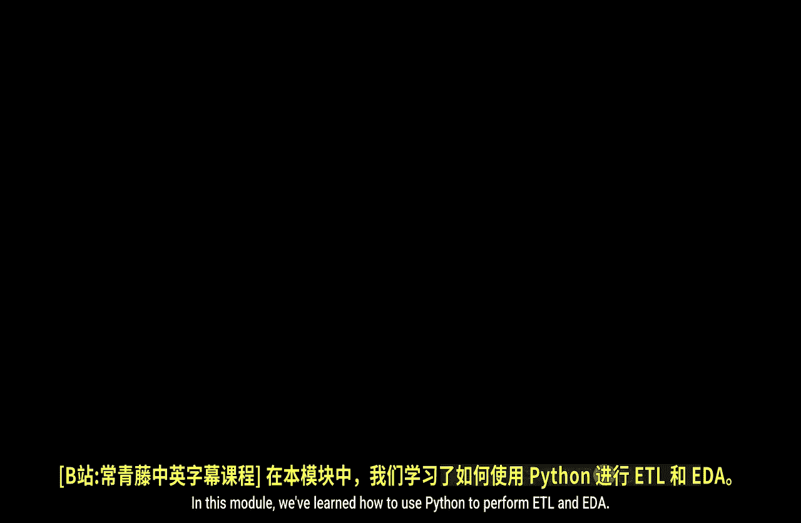
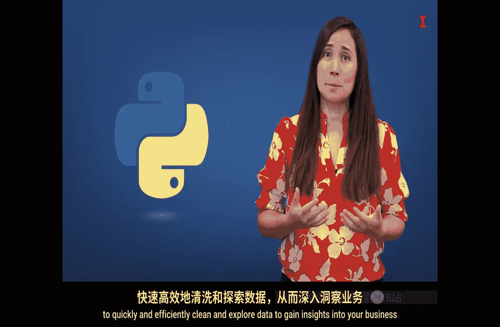

#  109：第二模块总结 🎯



在本模块中，我们学习了如何使用Python进行ETL（提取、转换、加载）和EDA（探索性数据分析）。我们将回顾视频中的核心内容，并总结Python在数据分析中的优势。

---

## Python：数据科学的通用语言 💻

Python是一种通用编程语言，也是数据科学领域最流行的语言之一。我们目前所学的只是Python强大功能的冰山一角。

Python是开源的，这意味着它可以免费使用。网络上有大量关于我们正在使用甚至尚未探索的软件包的问答资源。因此，当遇到障碍时，通常可以在网上找到解决方案，或者利用许多可用的AI工具来帮助生成代码、通过调试找到解决方案并解释代码。

与“点击即用”或“拖放”式软件不同，作为一种编程语言，Python非常灵活，可以广泛应用于各种数据分析任务。

---

## 数据清洗：分析的基石 🧹

在本模块中，我们使用Python开始探索和理解TechA公司的数据。然而，在开始探索之前，我们需要清理数据，即修复或移除错误和异常值，并补充数据。

我们发现Python是清洗和整理数据的非常有用的工具。

### 数据概览与检查

首先，我们找到了一些有用的函数来汇总和查看我们的大型数据集。Python使我们能够轻松地检查数据。例如，我们无法在Excel中查看这个CSV文件，因为Excel只允许大约一百万行，而我们的数据集行数更多。

### 数据类型与清洗路径

接下来，我们学习了pandas库中的不同数据类型，这引导我们采用了不同的数据清洗路径。

以下是三种主要的数据清洗方法：

1.  **修复或更改数据**：我们使用的例子是清理日期列并更改其数据类型。
2.  **移除数据**：我们使用的例子是从数据中移除异常值。
3.  **补充数据**：我们通过添加新信息来丰富数据集。

我们的数据起初相对干净，但通常数据分析师会花费大量时间来清洗和准备数据以供分析。

---

## 探索性数据分析：挖掘商业洞察 🔍

一旦数据相对干净，我们就能够通过EDA开始从数据中提取商业洞察。

### 数据汇总与聚合

我们使用了`Groupby`方法来汇总大数据，并学习了如何以不同方式重构和聚合数据。

**示例代码：**
```python
# 使用Groupby按产品汇总收入
revenue_by_product = df.groupby('product')['revenue'].sum()
```

### 数据可视化

在学会了如何汇总和聚合数据后，我们转向了数据可视化。

我们学习了`Matplotlib`包，并创建了许多可视化图表，这些图表帮助我们开始获得关于TechA公司收入的商业洞察。我们了解了其收入的季节性，以及哪些产品可能产生更多或更少的收入。

**示例公式/概念：**
可视化帮助我们发现模式，例如：**收入峰值出现在第四季度**。

---

## 总结：从园丁到数据分析师 🌱

我们曾用园丁来比喻数据清洗和可视化。就像园丁一样，我们通过探索这个真实的TechA数据集，亲手处理了现实世界的数据。

现在，你已经能够使用一个顶级的统计工具——Python，来快速高效地清洗和探索数据，从而深入了解你的业务及其面临的挑战与机遇。

本节课中，我们一起学习了Python在数据清洗和探索性数据分析中的核心应用，掌握了从数据准备到获取初步商业洞察的完整流程。

---




