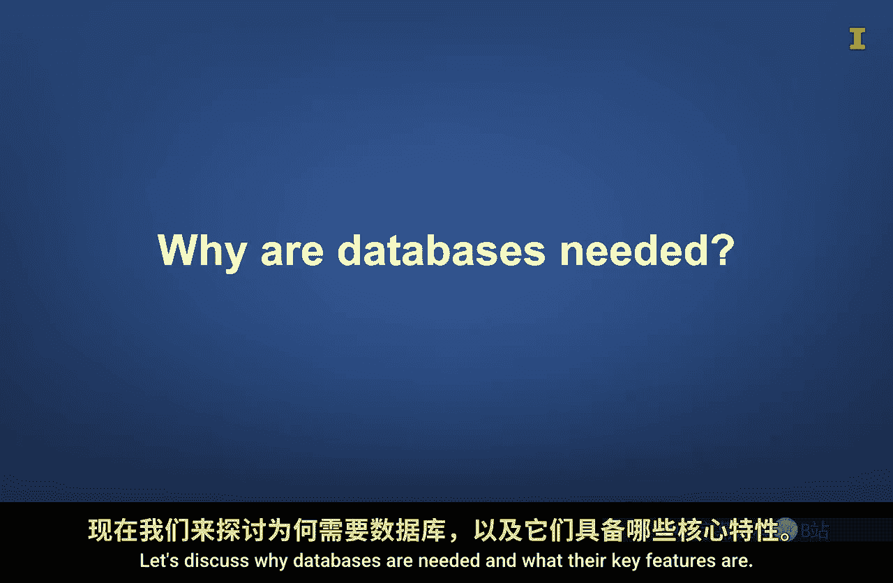
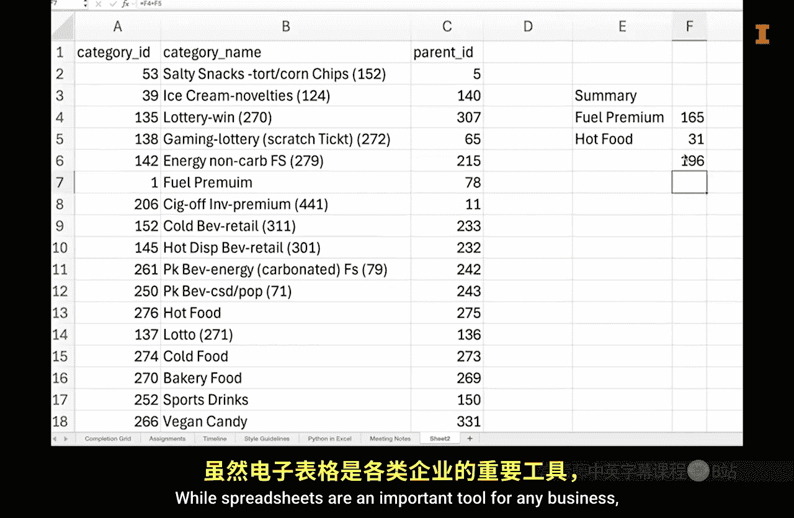
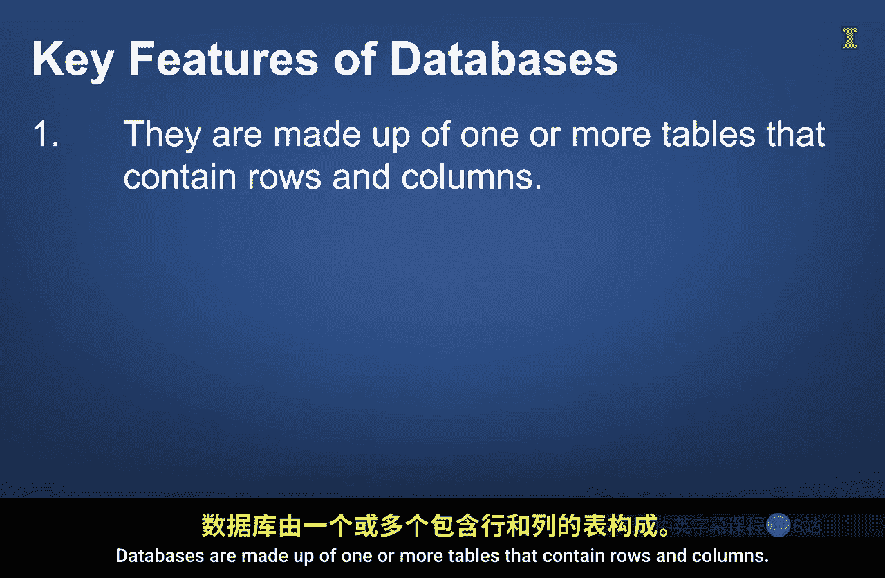
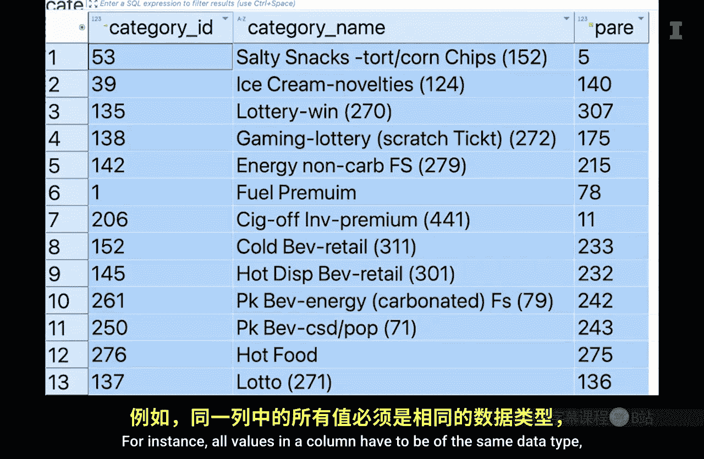
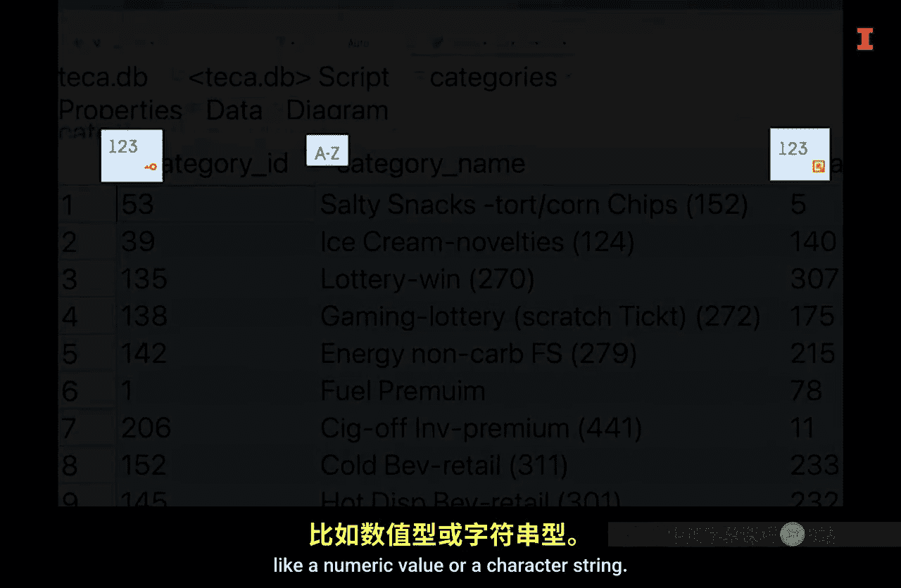
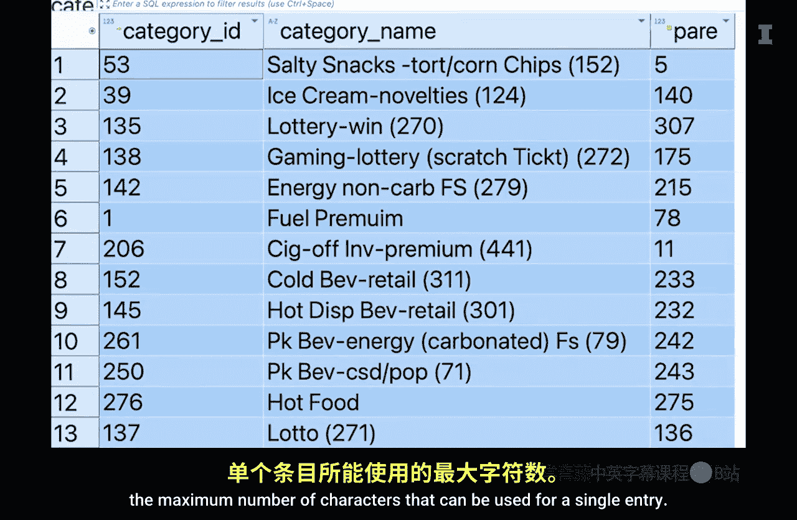
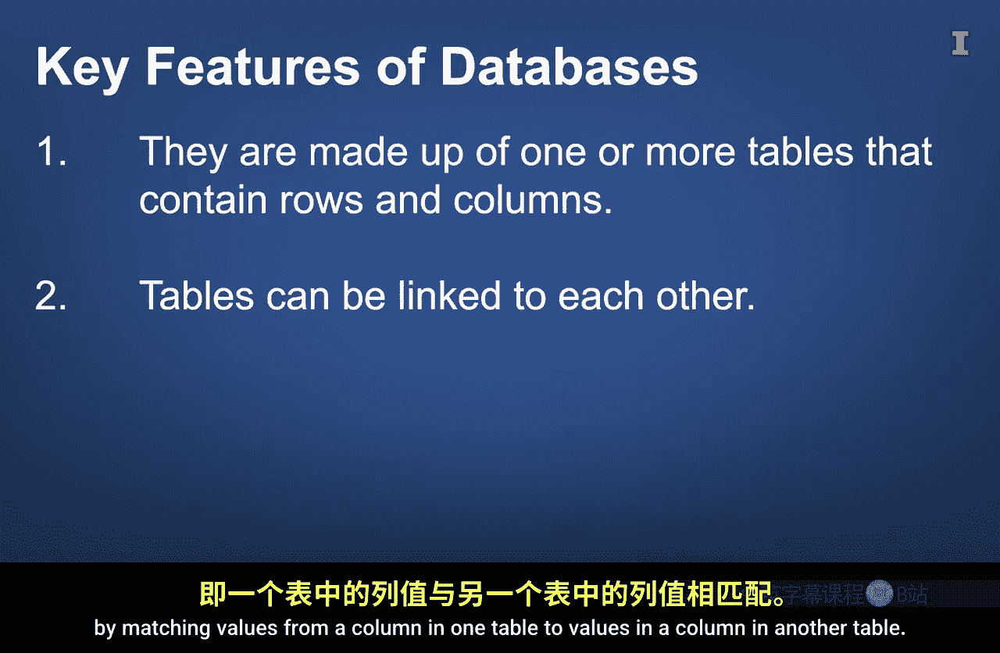
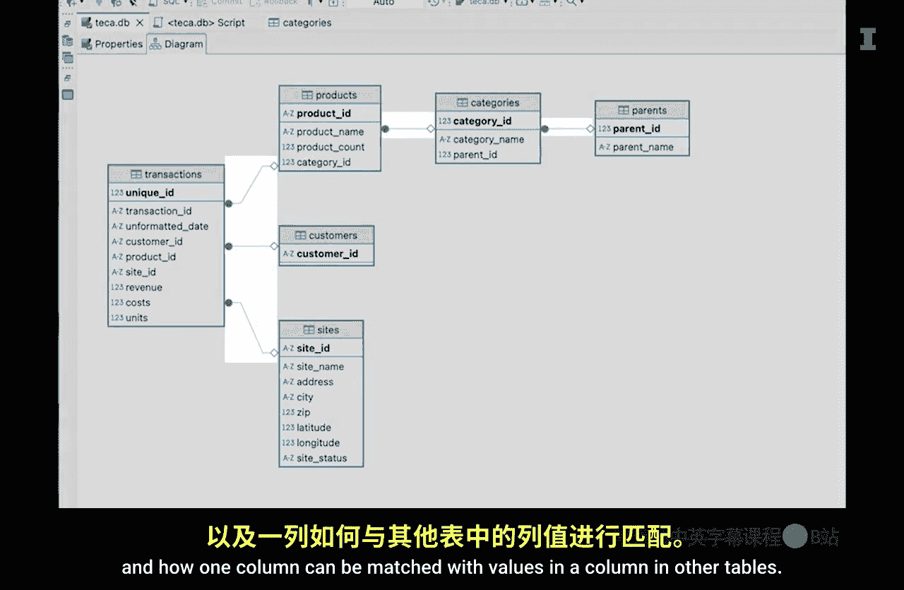

#  111：数据库导论 🗄️

在本节课中，我们将要学习关系型数据库管理系统的基础知识。我们将探讨为什么需要数据库，以及它们相较于电子表格的关键优势与核心特性。

## 为什么需要数据库？

上一节我们介绍了课程主题，本节中我们来看看为什么数据库在现代数据管理中不可或缺。要理解这一点，可以先思考使用电子表格（如Excel）存储和共享数据时可能遇到的问题。

虽然电子表格是商业专业人士的重要工具，但在存储大量数据并供多人访问时，它们存在一些弱点。

以下是电子表格的三个主要弱点：

1.  **存储容量有限**：例如，Excel工作表最多只能容纳约100万行数据。对于大多数电子表格用例来说，这已经足够。然而，与中型和大型组织存储的数据量相比，100万行数据只是沧海一粟。
2.  **可能存在数据版本冲突**：如果你曾与团队合作项目，并且多人希望同时修改同一个电子表格文件，你就能体会到这一点。管理电子表格文件内容时，可能会发现存在多个文件版本，每个版本都包含其他版本没有的信息，这会造成困扰。
3.  **数据结构化程度低**：对许多人来说，这可以是一个优点，因为你可以创建自定义样式的表格、隐藏工作表或在同一工作表中包含多个表格。然而，当你处理需要不断更新且供多人使用的数据时，缺乏结构会令人沮丧。

数据库可以解决所有这三个问题。

## 数据库的关键特性

既然我们了解了电子表格的局限性，接下来让我们探讨数据库的核心特性。数据库由一个或多个包含行和列的表格组成。

你可以将数据库中的表想象成电子表格工具中的单个工作表。然而，与电子表格不同，数据库对每个单元格可以存储的数据类型有严格的要求。

以下是数据库表格的一些关键特性：

*   **列数据类型一致**：一列中的所有值必须是相同的数据类型，例如数值或字符串。
    *   **代码示例**：在SQL中定义表时，会指定列的数据类型，如 `VARCHAR(50)` 表示最大50个字符的字符串，`INT` 表示整数。
*   **字符串长度限制**：如果是字符串，通常需要指定单个条目可使用的最大字符数。
*   **海量数据存储**：数据库表可以包含数百万乃至数十亿行数据。其限制更多取决于数据库所在服务器的存储容量，而非软件本身。
*   **表间关联**：数据库的一个重要特性是，表之间可以通过匹配一个表中的列值与另一个表中的列值相互关联。
    *   **公式/概念**：这种关联通常通过**主键**和**外键**来实现。主键是表中唯一标识每一行的列，外键是另一个表中指向主键的列。

这些关系通常在创建数据库时定义，并汇总在数据库模式中。这些模式通常通过实体关系图进行可视化展示。

ERD列出了表名、包含的列，以及一列如何与其他表中的列值匹配。

数据库中各表之间的关系非常重要，因为它允许你根据需要，创建组合了来自多个表的列的新数据集。这通常通过使用查询来完成，我们将在其他课程中详细讨论。

数据库结构的一个理想特性是数据不应重复。例如，客户的地址不应存储在多个表中，而应只存储在一个表中。这使得更新数据库更容易，同时也减少了存储需求。

## 确保数据一致性：ACID属性

数据库的另一个重要特性是，尽管存在许多交互和错误，它们仍能保持数据的一致性。这是通过整合所谓的ACID属性来实现的。ACID是一个缩写词。

以下是ACID属性的具体含义：

*   **A - 原子性**：这意味着与数据库的每次交互都被视为一个单一单元。换句话说，整个交互要么成功，要么失败。不存在部分完成的情况。
*   **C - 一致性**：一个重要的含义是，当向数据库表中添加新行时，必须确保数据类型与每列要求的数据类型一致。
*   **I - 隔离性**：这意味着当对数据库的更改同时发生时，其结果与它们顺序发生的结果相同。例如，考虑一个在线交易，我与另一位客户Rick同时完成了购买自行车的交易。如果不存在隔离性，库存水平将错误地减少一个单位而不是两个。隔离性的存在确保了此类事件不会发生。
*   **D - 持久性**：这意味着对数据库的更改以某种方式存储，如果在事务开始后发生断电，一旦恢复供电，事务将完成。

## 总结

本节课中我们一起学习了关系型数据库管理系统的基础知识。我们了解到，数据库因其可靠性、安全性和可扩展性，自20世纪70年代出现以来，一直是存储数据的重要方式。我们比较了数据库与电子表格，指出了电子表格在存储容量、版本控制和数据结构化方面的局限性。接着，我们深入探讨了数据库的关键特性，包括严格的数据类型定义、海量存储能力、表间关联关系以及避免数据冗余的设计原则。最后，我们介绍了确保数据可靠性的ACID属性。正如我们可以对太平洋和美丽的后湾说更多一样，关于数据库还有很多可以探讨的内容，例如如何连接数据库以及如何与它们交互。我们将在后续课程中讨论这些内容。