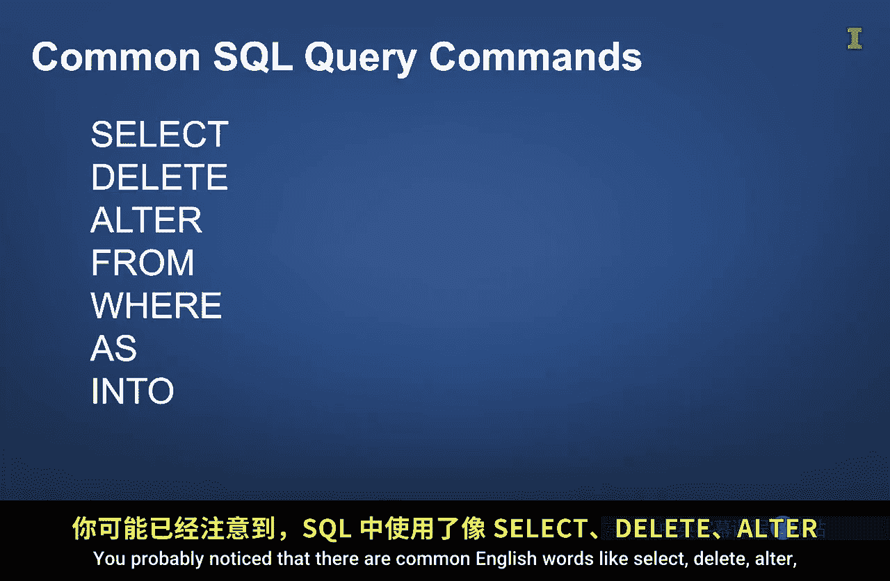
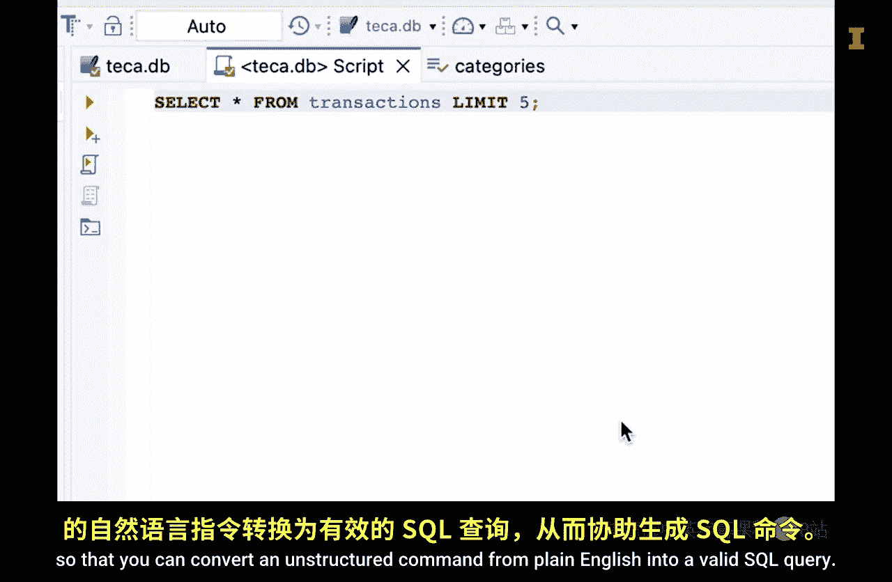

#  112：结构化查询语言（SQL）概述 🚤

在本节课中，我们将要学习结构化查询语言（SQL）的基本概念。SQL是与关系型数据库进行交互的核心工具，它允许我们查询、操作和管理数据。我们将了解SQL的用途、基本命令以及它在实际工作中的应用场景。

---

我正身处巴布亚岛紧邻太平洋的一个码头。太平洋蕴藏着巨大的生产力和无与伦比的美丽。这片水域被用于多种用途，例如捕鱼、划船和运输。但要充分利用海洋的优势，你必须拥有某种方式来航行于水域之上，比如皮划艇、帆船、游艇或桨板。

类似地，关系型数据库内部也蕴藏着巨大的潜力，但你必须能够以某种方式在其中“航行”。在之前的课程中，我们讨论了关系型数据库。既然你已经对关系型数据库有了初步了解，本节课我们将重点学习如何使用一种易于理解的语言与关系型数据库进行交互，这种语言被称为**结构化查询语言**，通常缩写为 **SQL**。

“结构化”和“语言”这两个词的含义应该相当直接。你可能想知道为什么“查询”这个词是SQL名称的一部分。一般来说，**查询就是一个问题**。因此，在关系型数据库的上下文中，你可以将查询视为向数据库提出的一个问题。作为回应，数据库将返回一部分数据作为答案。

你还可以创建不仅仅返回部分数据的查询。例如，你可以创建利用表之间关系的查询，以返回一个组合了多个表数据的数据集。你也可以创建返回数据相关计算的查询，例如平均值和中位数。

让我们听听Qualtrics的数据分析师Tucker Campamp讨论他如何使用SQL。

> 我的名字是Tucker K。我在Qualtrics担任数据分析师。我在服务运营团队工作。我们为客户运营团队提供洞察分析和分析支持，并为他们创建仪表板。这大致是我的工作内容。
>
> 是的，我作为数据分析师使用的主要工具是SQL。它是一个帮助提取、检索数据、操作数据并以有效和有用的方式呈现数据的工具。这是我使用的主要工具。另一个工具是Python，用于进行更深入的统计分析和可视化。所以这可能是我使用的主要两个工具。然后就是大量的电子表格和Google Docs。
>
> 就我使用的技术工具而言。是的，我使用的主要SQL命令显然是`SELECT`语句。这只是检索我需要的数据。`DELETE`、`ALTER`，比如SQL中的`ALTER`语句，例如，如果我需要向表中添加一个新列，我可以使用`ALTER`语句。或者如果我需要删除某些包含错误数据或缺失信息等的行，我可以使用`DELETE`语句。但我主要使用的是`SELECT`语句，选择我需要的列、字段，那些我试图从中获取洞察的字段。
>
> 是的，人工智能在帮助我处理SQL查询和Python代码方面扮演着重要角色。人工智能帮助我的主要方面是调试和查找代码中的错误。我觉得通常当我的代码出现错误时，我需要花很长时间才能找出错误发生的位置。有时错误信息没有给我很多细节。有了人工智能，我能够上传代码并说，嘿，我看到这个错误，你能帮我检测它来自哪里吗。它真的帮助我调试问题，并让整个过程快很多。而如果我独自卡在那里，将需要很长时间来解决并找出错误所在。人工智能还帮助我让代码更高效、运行更快。有时我自己想出的代码效率很低。它能完成任务，但速度不快。所以人工智能确实有助于缩短时间并提高效率。

正如Tucker所提到的，SQL可用于编辑表、删除表、向表添加数据以及读取数据。在本课程中，我们将重点学习使用SQL从数据库中**读取数据**。

Tucker提到了他使用的几个命令。你可能注意到其中包含常见的英语单词，如`SELECT`、`DELETE`、`ALTER`和`FROM`。

其他关键词还包括`WHERE`、`AS`和`INTO`。因此，SQL的优势之一在于它相当容易理解。一旦你了解了其中一些关键命令及其必需的结构，你就可以将它们与表名和列名结合使用来创建查询。你会发现，仅仅几个命令就能让你完成许多查询。

此外，正如Tucker提到的，AI工具对于调试SQL查询和提高其效率非常有帮助。AI也可用于生成SQL查询。

现在，你应该注意，数据库有多种实现方式，每种都有自己略微不同的SQL命令集。例如，**SQLite**、**PostgreSQL**和**MySQL**是不需要许可协议和费用的开源数据库示例。

另一方面，**Oracle Database**、**Microsoft SQL Server**和**IBM DB2**是需要许可费用的商业数据库示例。

每种数据库都有其自身的优缺点。但重要的是，与这些数据库中的任何一个进行交互的SQL命令大部分是相同的。这意味着你从使用像SQLite这样的开源数据库获得的经验，在很大程度上可以转移到使用像Oracle Database这样的商业数据库上。

你还应该知道，有一些专门为处理数据库而设计的集成开发环境。例如，**DBeaver**、**MySQL Workbench**、**Oracle SQL Developer**和**DataGrip**只是其中的几个。它们通过高亮显示语法、创建模式的视觉表示、预览查询数据以及将AI工具集成到环境中，帮助你创建SQL命令，从而可以将来自纯英语的非结构化命令转换为有效的SQL查询。

虽然我们可能不会使用这些IDE，但希望了解人们使用SQL的一些常见方式，能帮助你以更高效的方式与它们交互。

---

现在，你已经对SQL的用途和潜力有了扎实的概述。SQL就像一艘船，让我们能够航行于存储在关系型数据库中的数据海洋中。真正的学习始于动手实践，我们将在接下来的课程中进行探索。下节课见。

