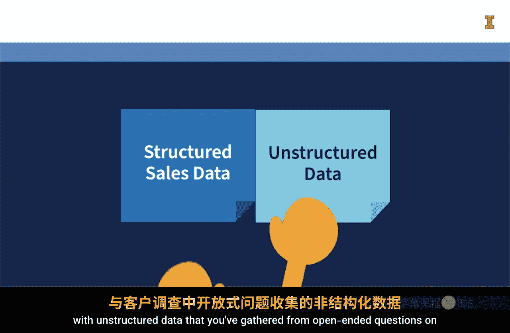
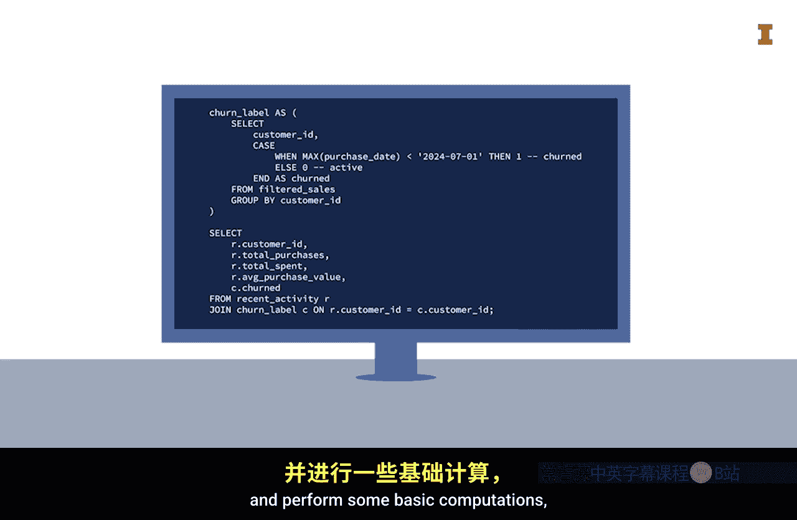
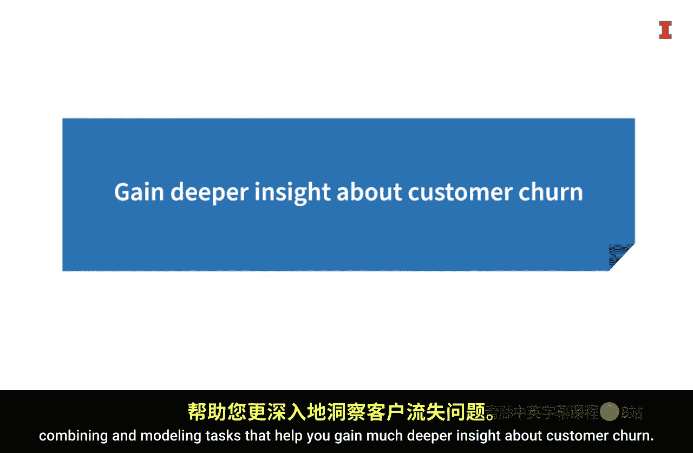

#  114：为什么我们需要SQL和Python 🧩

在本节课中，我们将探讨为何将SQL与Python结合使用是数据分析领域的一项强大技能。我们将通过一个具体场景来理解这两种技术如何互补，并听取资深开发者的实践经验。

---

有些事物天生就适合结合在一起，例如沙子和水。结合沙子和水，你可以创造出沙堡或其他沙雕等非常酷的作品。

另一个强大的组合是Python和SQL。在本节中，我们将讨论为何掌握同时使用Python和SQL的技能会如此强大。

请想象以下场景：你已经拥有丰富的实践经验，并成为了一名SQL专家。你需要获取上个季度的销售数据，或是某个特定区域、特定产品的客户列表吗？这不成问题，因为你闭着眼睛都能写出查询语句来获取这些数据。

有一天，你面临一个新的挑战。你的团队希望理解客户流失的原因，不仅仅是哪些客户离开了，更重要的是他们为何离开。

因此，你需要将结构化的客户购买历史销售数据，与从客户调查开放式问题中收集的非结构化数据结合起来。

接着，你希望创建一个模型，用于预测客户在未来一年内继续留存的可能性。

虽然你的SQL技能可以让你读取结构化数据并进行一些基本计算，但它们无法让你从非结构化数据中获取洞察。

于是，你向数据科学团队求助，他们向你展示了如何使用Python从这两组数据中获得更深入的见解。

例如，他们向你展示了几行Python代码如何清理和结构化杂乱的调查数据、理解文字背后的情感、量化这种情感并将其可视化。

然后他们询问，你是否愿意将这些数据与你用SQL技能检索到的数据结合起来，以便创建一个预测客户流失可能性的模型。你感到非常兴奋。

然而，当你想到整个工作流程将变得多么复杂时，你的兴奋感逐渐消退。你询问是否必须在一个文件中编写SQL代码，在另一个文件中编写Python代码，然后安排一个平台运行SQL，另一个平台运行Python。

但随后你了解到，仅需几个pandas函数，你就可以执行SQL查询并将数据保存为DataFrame。

这几乎让你喜极而泣，因为你意识到现在可以在Python环境中轻松运用你的SQL技能，从而极大地简化了数据清洗、合并和建模的流程，帮助你更深入地理解客户流失问题。

---

那么，你对这个场景有何感想？它的一个目的是强调，将SQL技能与Python技能结合，能极大地提升你从数据中获取洞察的能力。

SQL是用于检索结构化数据的可靠、知名且经过验证的语言，而Python则更加通用，可用于数据清洗、合并以及进行更高级的数据计算。

该场景的另一个目的是强调，你可以在Python代码中嵌入SQL查询，这使得整个过程变得更加容易，因为所有步骤都可以存储在一个文件中，并通过一个平台运行。

既然你可以使用SQL查询和Python命令来筛选和汇总数据，那么下一个问题是：应该在多大程度上使用SQL进行数据筛选和汇总，又该在多大程度上使用Python？

我与资深软件开发者Jeff Campbell进行了交流，他在所开发的应用程序中使用SQL方面拥有丰富的经验。让我们听听他关于在何处清洗和汇总数据的观点。

> 我叫Jeff Campbell。我在软件工程领域工作了大概30多年。我目前为耶稣基督后期圣徒教会工作，担任移动团队的首席软件开发者，负责移动应用程序开发。
>
> 在我的职业生涯中，我曾在非营利和营利性机构工作过。我做过Novell网络、QuickBooks相关的工作，也为州政府工作过，还曾在初创公司任职。可以说，我经历了从大型企业到初创公司，再到个人项目等各种类型的工作。
>
> 因此，我拥有丰富的编程经验，并为许多不同类型的公司服务过。这些公司业务各异，我做过Web开发、桌面开发，现在在做移动开发。自从第一款移动应用问世以来，我已经做了大约15、16年的移动开发，还包括后端服务、数据库、API端点等。
>
> 在这个过程中，我也使用过多种编程语言。
>
> **关于数据清洗或数据准备工作，你会进行哪些类型的任务，甚至是数据合并？**
>
> 我尽可能在数据源处完成尽可能多的工作。因为通常数据源的处理速度要快得多。例如，如果我有一个来自SQL数据库的大型数据集，在SQL查询中尽可能多地完成数据修剪和合并工作，然后再交给我，这样会更快、性能更好。而不是让我获取海量数据，然后手动解析和合并。
>
> 首先，我一开始就会得到远超所需的数据量。其次，这些数据库的性能远比我进行后处理要高，特别是因为后处理需要占用更多内存，因为我必须在处理过程中保持状态。
>
> 不过，有一点我们必须小心，那就是无论数据来自数据库还是API，如果你不是提供API或数据库数据的人，你根本不知道会得到什么。所以你必须格外谨慎。
>
> 你可能会说：“嘿，我刚看了这个数据库，发现每个人都有名字。”但你不知道的是，在数据库往下10万行，有一批人的名字是缺失的，它们就是`NULL`。这可能会完全搞垮你的程序，因为你没有预料到会有空值。
>
> 因此，除非数据提供者与我们签订了硬性合同，保证“我们保证返回的任何个人记录都不会有空的名字字段”，并且我们对此达成一致，否则我们通常会对获取的数据持过度谨慎的态度。如果我们没有得到这种确认和合同，那么我们通常会认为，任何时候数据都可能是`NULL`。
>
> 所以你必须提前思考数据中可能存在的问题，要么确保它们不会发生，要么构建一些机制使其不会导致程序崩溃。但当你进入现实世界，处理数十万、数百万乃至数十亿行数据时，我的信条是：**可能发生的事情，就一定会发生**。你应该为此做好计划。
>
> 是的，你只需要添加一点点额外的代码来处理这些情况，但这最终会拯救你。所以，要么在源头进行批量处理，要么有时你不得不自己进行后处理，因为你还需要处理空值或意外情况，但这应保持在最低限度。这对于高性能应用程序和/或处理海量数据（尤其是在分析和数据分析等领域）将大有裨益。

正如Jeff所指出的，尽可能在靠近数据源的地方进行计算是合理的。这意味着，如果你能用SQL查询完成计算，那么通常最好这样做，因为这样会更快。

然而，在初学阶段，只要读取的数据量没有超过你计算机的处理能力，不必过分纠结是用SQL还是用Python来筛选和汇总数据。

同样，正如Jeff指出的，你应该预料到数据中会存在一些错误，即使它来自关系数据库中的结构化表。因此，即使从数据库读取数据，你已掌握的用Python组装数据的技能仍然会派上用场。

---

现在你已经更好地理解了为什么我们需要SQL和Python，接下来让我们通过实践来练习如何将这两种语言结合使用。