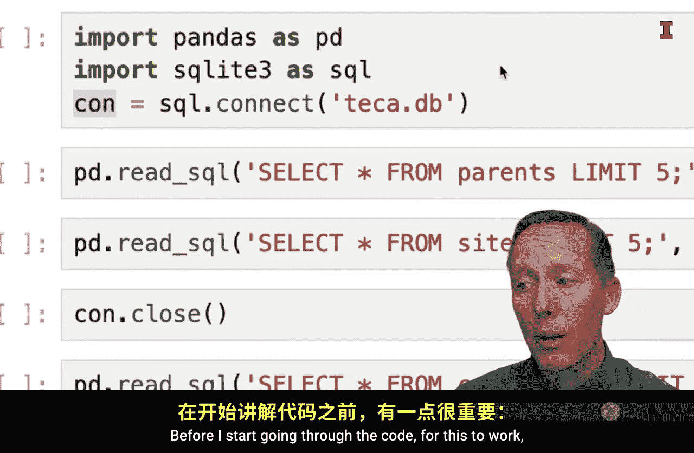
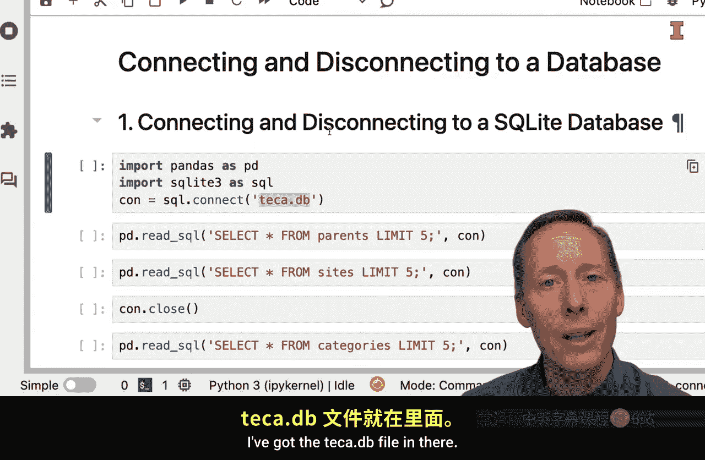
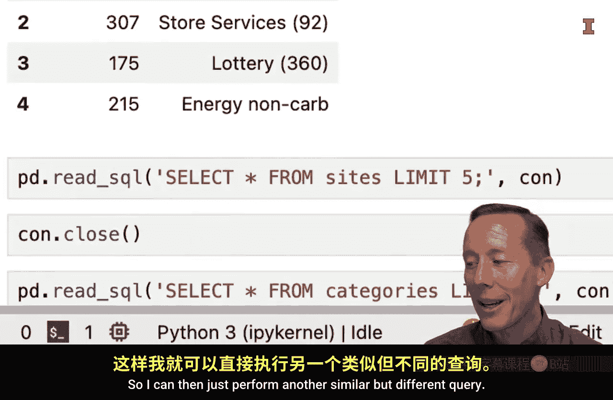
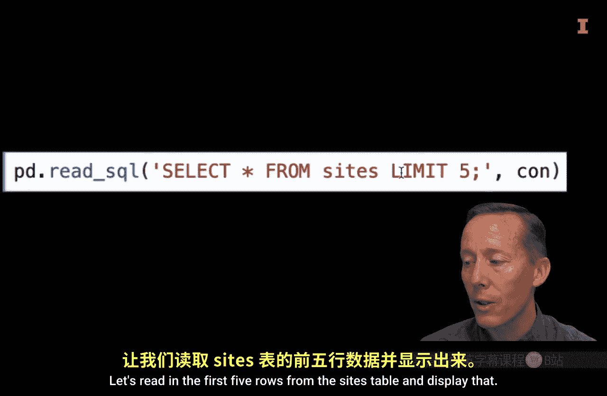
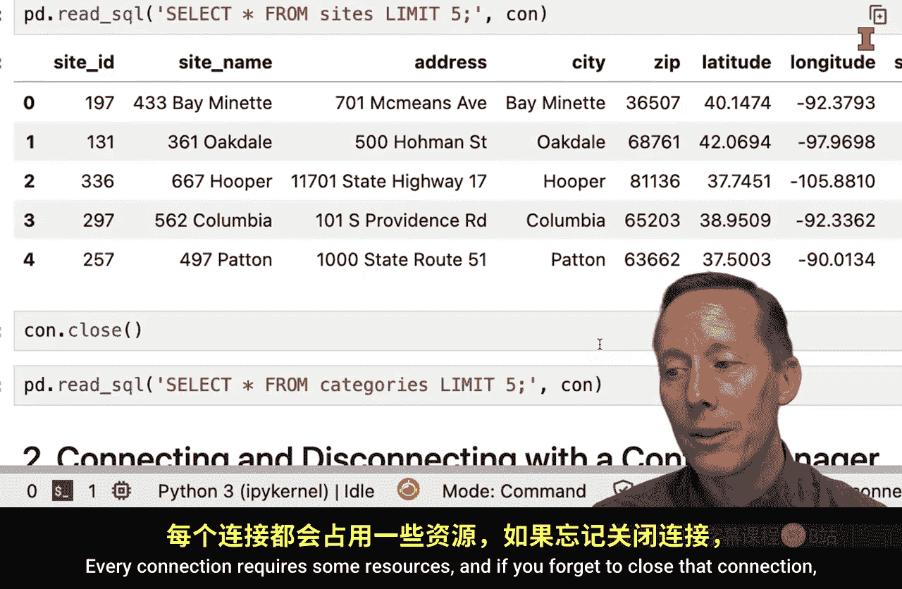
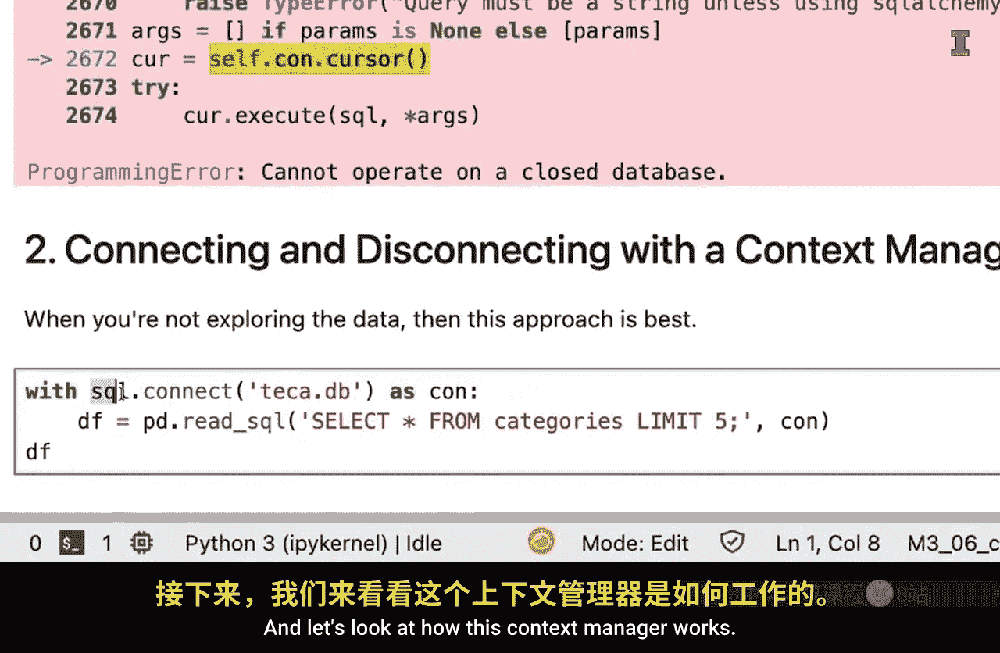
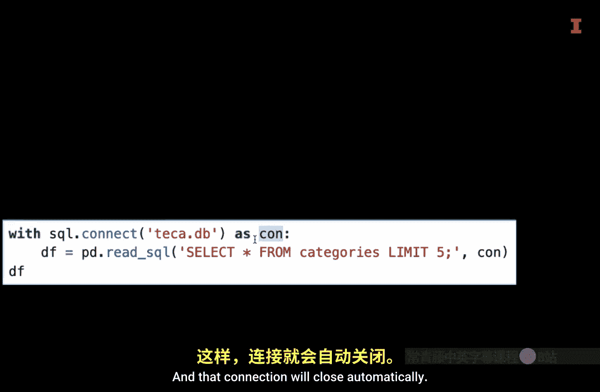
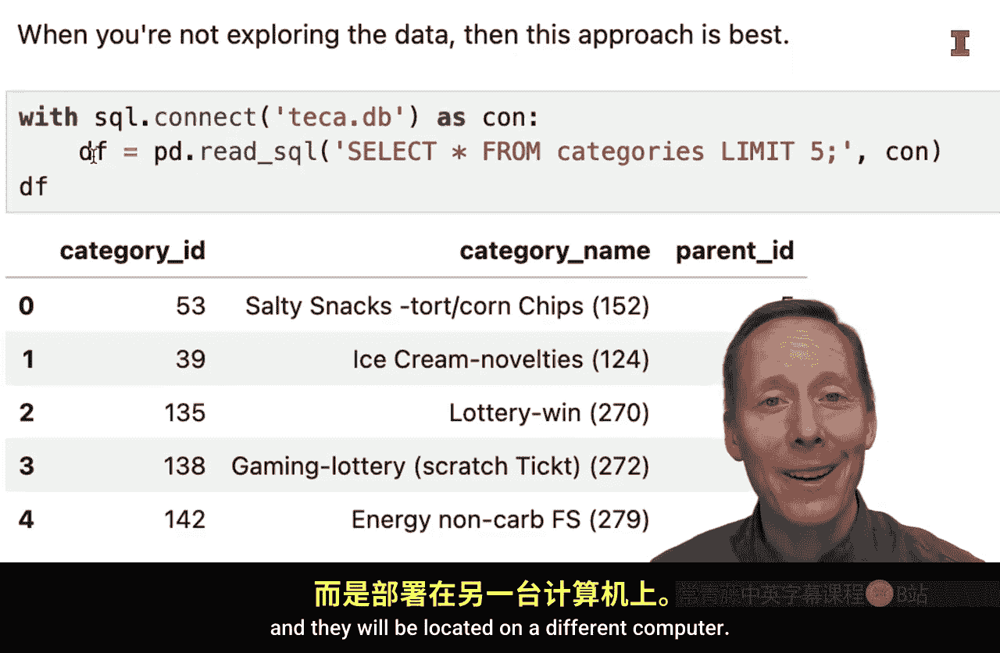
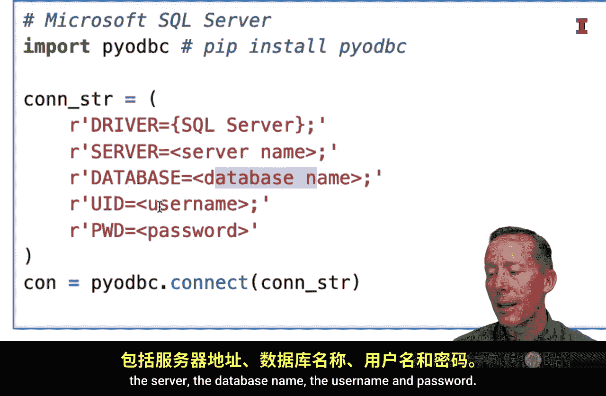
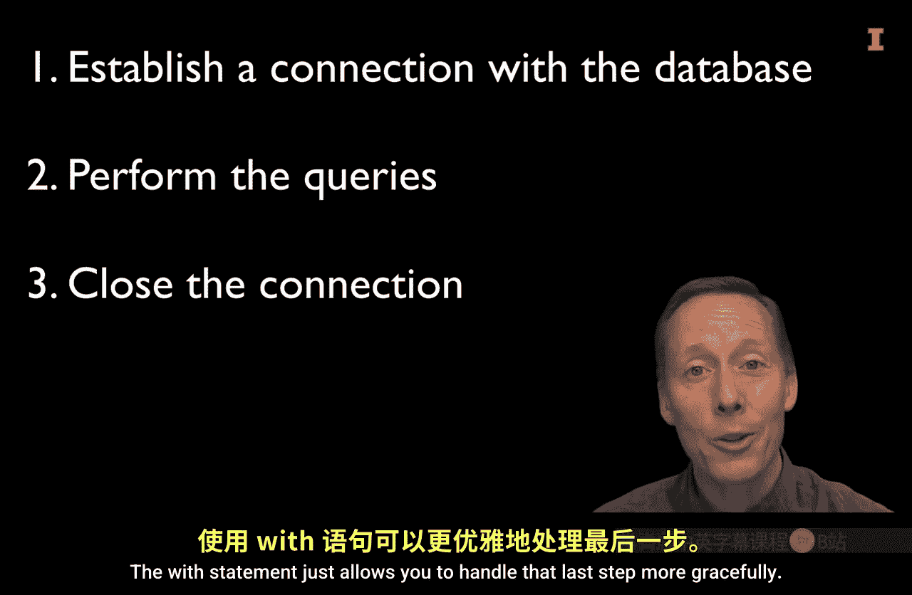

#  115：在Python中连接和断开数据库 📊


在本节课中，我们将学习如何在Python环境中连接和断开数据库。我们将重点介绍连接SQLite数据库的两种方法，并简要说明连接其他类型的关系型数据库管理系统（如MySQL或Microsoft SQL Server）时的差异。

---

## 准备工作

在开始编写代码之前，需要确保数据库文件与你的Python脚本位于同一文件夹中。例如，我们有一个名为 `techca.db` 的SQLite数据库文件。






## 连接SQLite数据库

首先，我们需要导入必要的模块。我们将使用 `pandas` 来处理数据，并使用 `sqlite3` 模块来连接数据库。

```python
import pandas as pd
import sqlite3
```

`sqlite3` 是Python标准库的一部分，通常无需额外安装。

### 方法一：手动管理连接

上一节我们介绍了需要导入的模块，本节中我们来看看如何手动建立和关闭数据库连接。

使用 `sqlite3.connect()` 函数连接数据库，并将连接对象存储在一个变量中。


```python
con = sqlite3.connect('techca.db')
```

运行这行代码后，连接就已建立，尽管界面上可能没有明显提示。

连接建立后，我们可以使用 `pandas` 的 `read_sql()` 函数来执行查询。这个函数非常方便，因为它能自动将查询结果转换为 `DataFrame`。



以下是该函数的参数示例：



```python
df = pd.read_sql("SELECT * FROM parent LIMIT 5", con)
```

在这个查询中，我们从 `parent` 表中选择所有列，并限制返回前5行。重要的是，必须将连接对象 `con` 作为参数传递给函数。



执行后，结果会以 `DataFrame` 的形式返回。

我们可以执行另一个查询，例如读取 `sites` 表的前5行：

```python
df_sites = pd.read_sql("SELECT * FROM sites LIMIT 5", con)
```

完成所有查询后，必须手动关闭数据库连接以释放资源。忘记关闭连接可能会导致问题。


```python
con.close()
```



关闭连接后，如果尝试再次使用该连接对象执行查询，将会收到错误提示，指出无法在已关闭的数据库上操作。

### 方法二：使用上下文管理器自动管理连接

如果你只需要执行一个查询，推荐使用上下文管理器（`with` 语句）。这种方法可以自动处理连接的打开和关闭。



以下是使用上下文管理器的代码结构：

```python
with sqlite3.connect('techca.db') as con:
    df = pd.read_sql("SELECT * FROM parent LIMIT 5", con)
```

在这段代码中：
*   `with sqlite3.connect('techca.db') as con:` 这一行建立了数据库连接，并将连接对象命名为 `con`。
*   缩进块内的代码（即查询语句）在连接有效期内执行。
*   当代码执行离开缩进块时，连接会自动关闭，无需手动调用 `close()` 方法。

你可以根据需求选择上述任一方法。如果计划执行多个查询进行数据探索，手动管理连接可能更灵活。如果只是执行单一查询，使用上下文管理器是更简洁和安全的选择。



## 连接其他类型的数据库

在实际生产环境中，数据库可能不是SQLite，而是MySQL、PostgreSQL或Microsoft SQL Server等，并且通常位于远程服务器上。


连接这些数据库的基本步骤是相似的，但具体代码会有所不同。

以下是连接不同类型数据库时的主要区别：

1.  **识别数据库类型**：首先确定你要连接的关系型数据库管理系统（RDBMS）的类型。
2.  **安装对应的Python驱动库**：你需要安装能够与目标数据库交互的特定Python模块。
    *   例如，连接MySQL可能需要安装 `mysql-connector-python` 库。
    *   连接Microsoft SQL Server可能需要安装 `pyodbc` 或 `pymssql` 库。
3.  **修改连接参数**：连接字符串需要包含更多信息，通常包括：
    *   数据库所在的服务器地址（URL或主机名）
    *   数据库名称
    *   用户名和密码

以下是连接MySQL数据库的示例代码框架：

```python
# 假设已安装并导入 mysql.connector
import mysql.connector

con = mysql.connector.connect(
    host="服务器地址",
    user="用户名",
    password="密码",
    database="数据库名"
)
```



对于Microsoft SQL Server，代码框架可能类似，但使用的库和关键字参数会不同。无论使用哪种数据库，在成功建立连接后，使用 `pandas.read_sql()` 执行查询的代码都是相同的。

---

## 总结

本节课中我们一起学习了在Python中连接和断开数据库的核心方法。

我们重点探讨了两种连接SQLite数据库的方式：手动管理连接和使用上下文管理器自动管理。我们也了解到，连接其他数据库（如MySQL、PostgreSQL）的主要区别在于需要安装特定的驱动库，并在连接字符串中提供服务器地址、用户名和密码等信息。

关键步骤始终是：**建立连接 -> 执行查询 -> 关闭连接**。上下文管理器（`with` 语句）能帮助我们更优雅地处理最后一步。




通过不断练习，你将能更熟练地从Python环境中连接和操作各种关系型数据库。