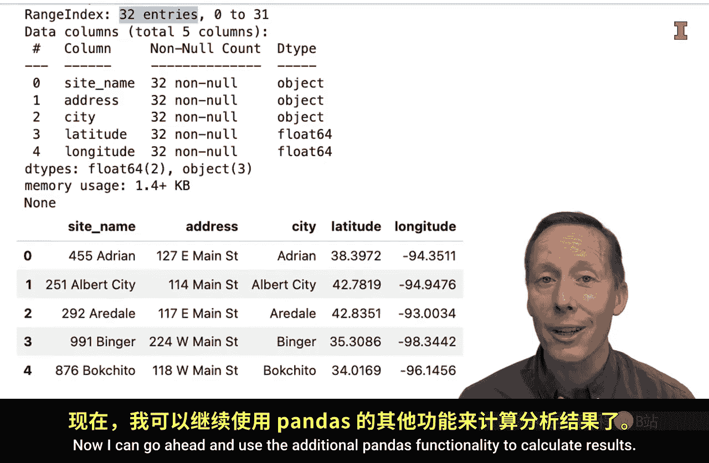

#  116：Python 中的基本 SQL 工作流程 🗺️


在本节课中，我们将学习一个简单的工作流程，该流程展示了在 Python 环境中访问 SQL 数据库数据的价值。我们将遵循 FACT 框架的四个步骤，完成从提出问题到可视化结果的完整分析过程。

---

## 第一步：提出问题（Frame）


上一节我们介绍了 FACT 框架，本节中我们来看看如何具体应用。首先，我们需要明确分析的问题。

我的问题是：**地址中包含“Main”一词的门店位于何处？**


换句话说，我希望在地图上可视化这些门店的位置。

---

## 第二步：收集数据（Assemble）

既然数据存储在 SQL 数据库中，我需要连接到数据库并将数据导入当前环境。

以下是实现此步骤的代码：

```python
import pandas as pd
import sqlite3


query = """
SELECT site_name, address, city, latitude, longitude
FROM site
WHERE address LIKE '%Main%'
ORDER BY city
"""
```

关于这段查询代码，有几点需要说明：
*   这是一个较长的查询语句。为了便于阅读，我将其分成了多行。
*   我使用了三组引号（`"""`）来包裹字符串，这允许我在代码中跨多行书写，而 Python 会将其视为同一个字符串。
*   查询语句保存为变量 `query`。
*   查询逻辑是：从 `site` 表中选择特定的列（`site_name`, `address`, `city`, `latitude`, `longitude`），然后筛选出 `address` 列中包含“Main”字符串的记录，最后按 `city` 列进行字母排序。

现在，我无需打开终端或 SQL 集成开发环境（如 DBeaver），可以直接在 Python 中执行查询。

```python
with sqlite3.connect(‘teched.db’) as con:
    df = pd.read_sql(query, con)
```

这段代码使用上下文管理器连接到本地的 `teched.db` 数据库文件。如果连接的是 MySQL 或 PostgreSQL 数据库，连接方式会略有不同。

然后，我使用 pandas 的 `read_sql` 函数，传入之前定义的查询变量 `query` 和连接对象 `con`。这个函数非常强大，它一次性完成了连接数据库、读取数据并将其转换为 pandas DataFrame 的多个步骤，我们将结果保存为变量 `df`。

代码块结束后（没有缩进），上下文管理器会自动关闭数据库连接。


接着，我使用 pandas 的函数来查看数据的基本信息和前几行。


```python
df.info()
df.head()
```

运行单元格后，可以看到数据有 32 行，并能初步了解数据的结构。

---

## 第三步：计算分析（Calculate）



现在，我可以利用 pandas 和其他库的更多功能来计算和展示结果。

具体来说，我将使用 plotly Express 模块中的函数来创建地图。首先需要安装这个库：`pip install plotly-express`。安装后，即可导入并使用。

```python
import plotly.express as px

fig = px.scatter_geo(df,
                     lat=‘latitude’,
                     lon=‘longitude’,
                     projection=‘natural earth’,
                     title=‘Stores with “Main” in Address’)
fig.update_traces(hovertemplate=‘<b>%{text}</b>’,
                  text=df[‘address’])
fig.show()
```

我使用了 `scatter_geo` 函数来创建一个散点图，并将点绘制在地图上。需要指定的参数包括：
*   `df`：数据来源。
*   `lat` 和 `lon`：经纬度对应的列名。
*   `projection`：地图投影类型，这里使用“natural earth”。
*   `title`：图表标题。
*   我还通过 `update_traces` 添加了悬停信息，使地图具有交互性。当鼠标悬停在点上时，会显示该点的地址，以便验证所有观察点地址中都包含“Main”。

运行这两段代码后，会生成一个交互式地图。


---

## 第四步：传达见解（Tell）

最后一步是向他人传达分析得出的见解。虽然本次分析没有重大发现，但可以总结出一些观察。

例如，我可以这样描述：**共有 32 家门店的地址中包含“Main”一词，它们都大致位于美国中西部地区。**

---

## 总结

本节课中我们一起学习了一个完整的 Python 与 SQL 结合的工作流程。我们从提出问题开始，通过在 Python 中编写 SQL 查询来收集数据，利用 pandas 进行数据处理，并借助 plotly 进行结果可视化，最后总结并传达发现。


这个流程的美妙之处在于，我们无需切换不同的集成开发环境或使用终端，所有编码和分析都可以在一个统一的 Python 环境中完成。这使得分析过程易于复制和调整，充分体现了在 Python 环境中操作 SQL 数据库的价值。